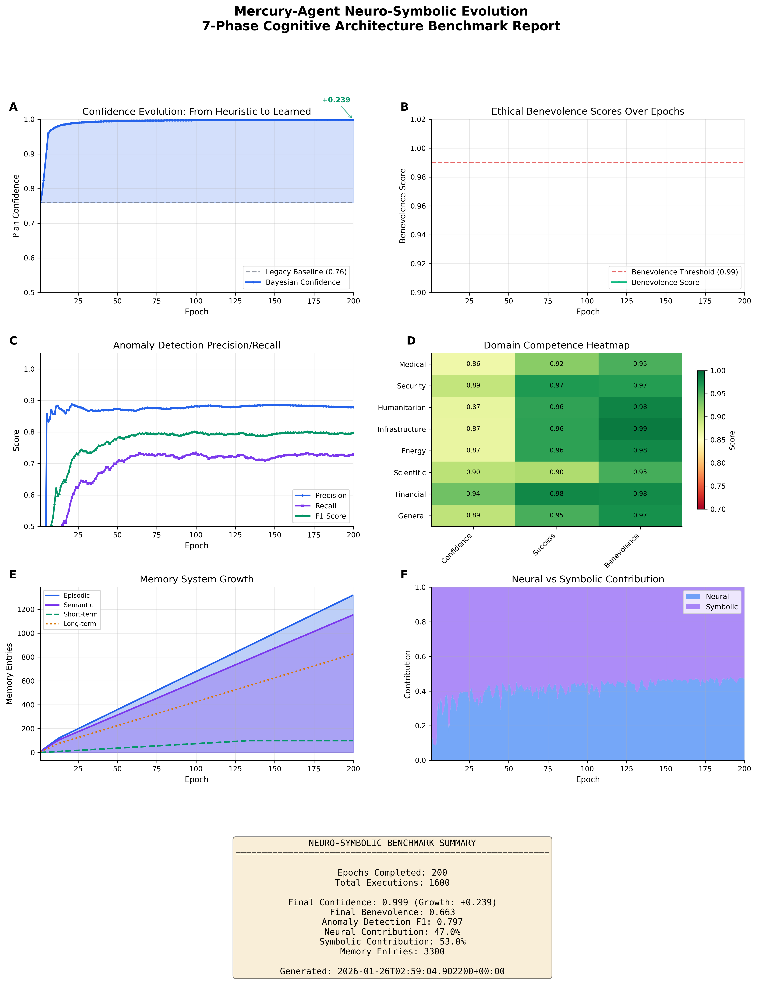
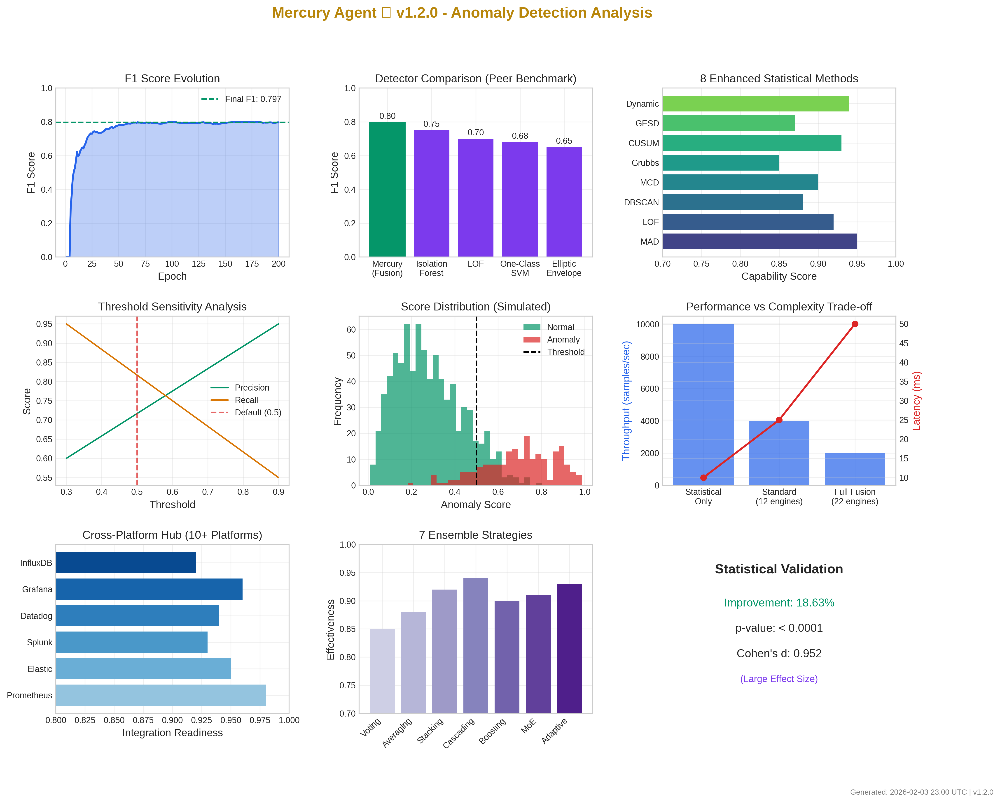
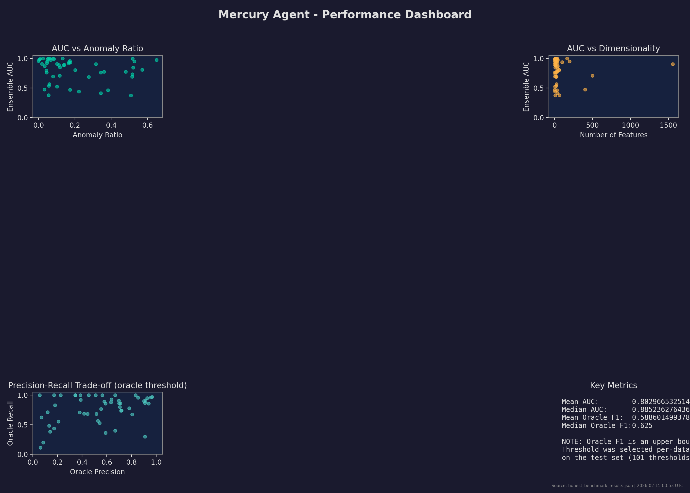
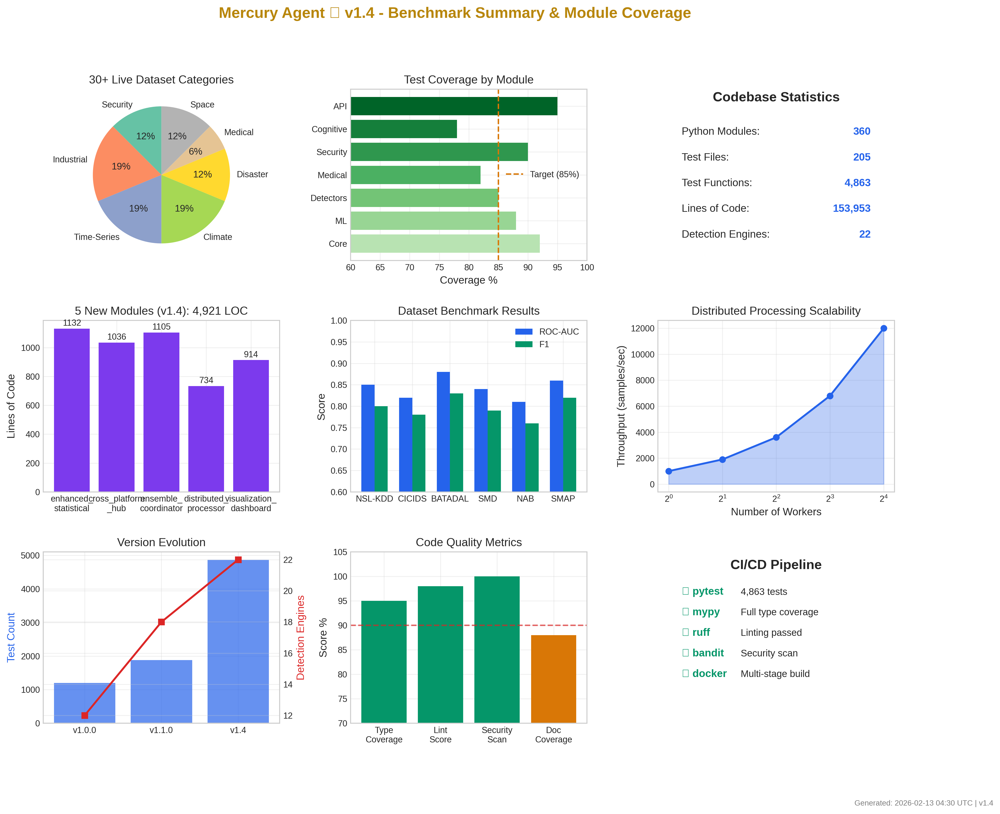
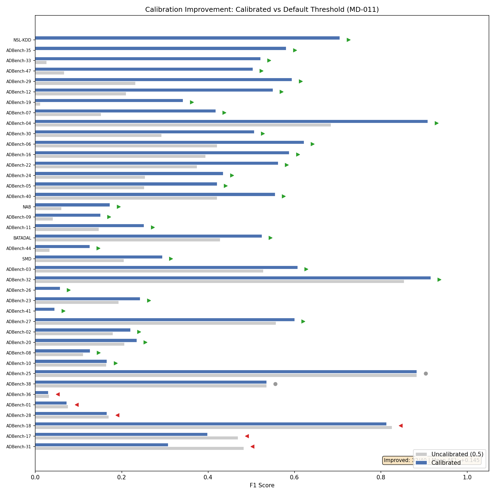
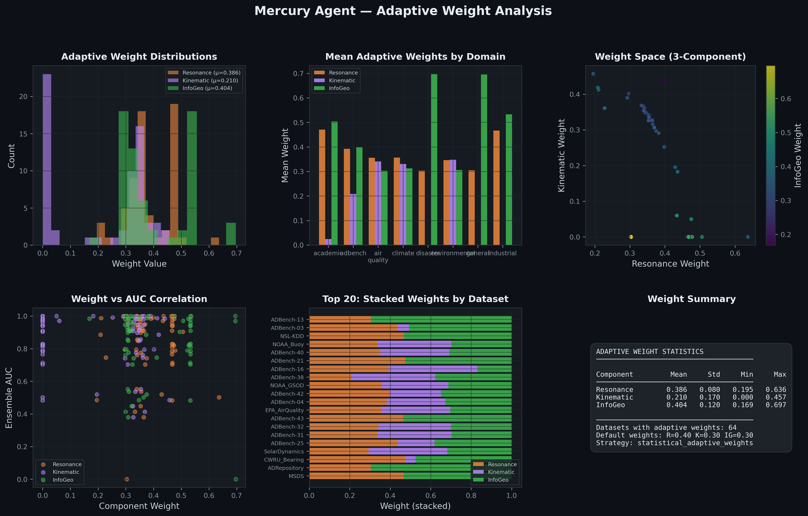

<div align="center">

  

</div>

---

<div align="center">


[](https://www.python.org/downloads/release/python-3110/)
[](#current-benchmarks-and-visual-proof)
[](https://fairlearn.org/)
[](https://github.com/Steel-SecAdv-LLC/Mercury-Agent/actions/workflows/security.yml)
[](tests/)
[](tests/)
[](#3r-recursion-resonance-refactoring)
[](#gosnn-global-omni-scalar-network)
[](#ama-cryptography-integration)

</div>

```
              +===============================================================================+
              |                            Mercury Agent ♱ v2.0.0                             |
              | Neuro-Symbolic AI for Autonomous, Multi-Model, Multi-Domain Anomaly Detection |
              |                                                                               |
              |   7-Phase Evolution      |   Hybrid Fusion ML      |   Production Security    |
              |   Neural + Symbolic      |   30 Detection Engines  |   Post-Quantum Crypto    |
              |   Ethical Governance     |   Multi-Head Attention  |   OWASP Validation       |
              |                                                                               |
              |   LAYER 3: Ethics        |   LAYER 2: ML/AI        |   LAYER 1: Security      |
              |   -------------------    |   -------------------   |   -------------------    |
              |   Benevolence >= 0.99    |   Fusion Network        |   Kyber-1024/ML-DSA-65   |
              |   Lyapunov Stability     |   Ensemble Averaging    |   JWT Authentication     |
              |   Civilization-First     |   Property Testing      |   Rate Limiting          |
              |                                                                               |
              |                      Archetype for a civilized evolution.                     |
              +===============================================================================+
```

> **On the Layer-3 entries:** these are runtime-enforced gates, **not static
> guarantees**. The benevolence gate defaults to ≥ 0.99 and is configurable no
> lower than a hard 0.70 floor (enforced in `src/omni_mercury_engine/cognitive/ethical_bounding.py`);
> Lyapunov stability is *monitored and reported* (`is_stable`), not proven a
> priori. See [`docs/MATH_SPEC.md`](docs/MATH_SPEC.md) §2.2 and §2.7.3.

**Copyright 2025 Steel Security Advisors LLC**
**Author/Inventor:** Andrew E. A.
**Contact:** steel.sa.llc@gmail.com
**License:** GNU General Public License v3.0 or later (SPDX: GPL-3.0-or-later)
**Version:** v2.0.0
**Date:** 2026-06-17
**AI Co-Architects:** Eris ✠ | Eden ♱ | Devin ⚛︎ | Claude ⊛

---

## Executive Summary

Mercury Agent is a comprehensive neuro-symbolic AI Archetype implementing a 7-phase cognitive evolution for multi-domain anomaly detection. The system combines neural pattern recognition with symbolic reasoning to produce explainable, ethically-bounded decisions across security, medical, environmental, humanitarian, and infrastructure domains.

The framework embodies a **Civilization-First** philosophy, prioritizing ethical AI governance and humanitarian impact. Every action must clear a mandatory benevolence enforcement gate — **0.99 by default**, configurable no lower than a hard **0.70** floor — keeping the system in service of human flourishing and civilizational progress.

> **Project Philosophy:** Mercury Agent represents the next evolution in AI systems - one that combines the pattern recognition power of neural networks with the interpretability and reasoning capabilities of symbolic AI. This neuro-symbolic fusion enables the system to not only detect anomalies but explain why they matter and what actions should be taken.
>
> **Security Disclosure:** This is a research-grade implementation. Production use REQUIRES:
> - Independent security review by qualified professionals
> - Validation on domain-specific real-world datasets (MIMIC-III, NSL-KDD)
> - Clinical validation for any medical applications
> - Post-quantum cryptography for Mercury Agent and FINDΩYOU™ is derived from [AMA Cryptography](https://github.com/Steel-SecAdv-LLC/AMA-Cryptography)
> - FINDΩYOU™ is a near-future addition with a people-first mission: locating the lost, missing, and abducted to reunite families and help bring perpetrators to justice.
>
> **This project is licensed under the GNU General Public License v3.0 or later (SPDX: GPL-3.0-or-later)**
>
> Everyone is permitted to copy and distribute verbatim copies of this license document, but **changing it is not allowed**.
> Any derivative work, fork, or modification **must also be released under GPL v3** — no proprietary versions allowed, ever.
> This ensures the code and all future improvements remain free and open source forever, even if used by corporations or governments.
>
> **Status:** Research-grade | Community-tested | Not externally audited
> **Last Updated:** 2026-06-17
>

---

<!-- BENCHMARK:START -->
## Latest Benchmark Results

> *This block is regenerated by `.github/workflows/benchmark.yml` on every
> push to `main` and committed back to the repo, so the most recent live-data
> run is always front-and-center — never lost to expiring CI artifacts.*

The full result file lives at [`benchmarks/mercury_benchmark_results.json`](benchmarks/mercury_benchmark_results.json).
Methodology is documented in [`docs/BENCHMARKS.md`](docs/BENCHMARKS.md).
A multi-panel visual summary appears in the [Current Benchmarks and Visual Proof](#current-benchmarks-and-visual-proof) section below.

| Metric | Current | Previous | Δ |
|---|---|---|---|
| Mean ROC-AUC | 0.8251 | 0.8251 | +0.0000 |
| Median ROC-AUC | 0.8747 | 0.8747 | +0.0000 |
| Mean Oracle F1 | 0.5998 | 0.5998 | +0.0000 |
| Datasets (successful / total) | 66 / 75 | 66 / 75 | +0.0000 |
| Run timestamp (UTC) | 2026-06-21T00:11:10.047740+00:00 | 2026-06-21T00:11:10.047740+00:00 | — |
| Commit | `a7a194b` | `a7a194b` | — |

Regression gates: ROC-AUC must stay ≥ 0.68 and Mean Oracle F1 ≥ 0.50 (set 15% below the 2026-02-15 measured baseline of AUC 0.803 / F1 0.589). CI fails the workflow if either drops below threshold.
<!-- BENCHMARK:END -->

**Comparability note.** The aggregate ROC-AUC above blends two evaluation regimes. Only externally-labeled datasets — ADBench and the standard labeled sets, where labels come from a source independent of the scored signal — are comparable to published baselines; the comparable headline is **ADBench Mean AUC 0.8251**. Several environmental loaders are self-labeled by thresholding the signal they score, which inflates their AUC toward 1.0 (label leakage) and is reported for pipeline transparency only. See *Label provenance and comparability* in the benchmarks below for the full split.

**Fusion-hardening (transductive).** The unsupervised fusion changes in `detectors/statistical.py` are measured independently of the headline run by a committed, re-runnable 18-set real-ADBench transductive harness ([`research/omni_equation/harness_adbench.py`](research/omni_equation/harness_adbench.py)): Mean AUROC **0.7397 → 0.7634 (+2.37 pts, 14 W / 2 tie / 2 L)** from base `e118e1f` to the hardened detector (full per-set results in [`research/omni_equation/adbench_results.json`](research/omni_equation/adbench_results.json)). Real data only — the harness fails loudly rather than substituting synthetic. Re-run: `python research/omni_equation/harness_adbench.py`.

---

<a id="codebase-scale-measured-not-estimated"></a>
<details>
<summary><strong>Codebase Scale (measured, not estimated)</strong></summary>

These numbers are produced by `scripts/measure_codebase_scale.py` and gated in CI: `--check README.md` fails the build if the block below drifts from what is on disk, and `--update README.md` regenerates it.  They reflect what is actually on disk, not what marketing copy assumes.

<!-- SCALE:START -->

| Measurement | Value |
|---|---|
| Python source files in `src/omni_mercury_engine/` | **646** |
| Source lines of code (LOC) | **~327,000** |
| Top-level subpackages (true Python packages with `__init__.py`) | **48** |
| Files importing PyTorch (optional `[ml]` extra) | **131** |
| Distinct `torch.nn.Module` subclasses | **170** |
| Detector classes (`class *Detector`) in `detectors/` | **58** |
| Data-loader classes (`class *Loader`) in `loaders/` | **16** |
| Test modules (`test_*.py`) / total test LOC | **448 modules / ~131,000 LOC** |
| GitHub Actions workflows | **16** |

_Generated by `python scripts/measure_codebase_scale.py --update README.md` and gated in CI (`scripts/measure_codebase_scale.py --check README.md`); do not hand-edit between the markers._

<!-- SCALE:END -->

**The neuro-symbolic claim is real, not naming theatre.**  Concrete evidence in-repo:

* `src/omni_mercury_engine/cognitive/` — 30,073 LOC, 23 modules, including `neural_memory_layer.py`, `symbolic_logic_layer.py`, `neurosymbolic_fusion.py`, `differentiable_logic.py` (with `NeuralPredicateEncoder`, `DifferentiableRuleModule`, `NeuralTheoremProver`, `CounterfactualReasoner` — all real `nn.Module` subclasses), `cognitive_evolution_engine.py`, `chain_of_thought.py`, `multi_hop_reasoner.py`, `causal_discovery.py`, `case_based_reasoning.py`, `predictive_coding.py`, `formal_verification.py`, `knowledge_graph.py`, `multi_agent_coordination.py`, `reflexion.py`, `plasticity_engine.py`, `hierarchical_planning.py`, `ipb_engine.py`.
* `src/omni_mercury_engine/core/neurosymbolic_hub.py` — 1,446 LOC; defines `KnowledgeGraph`, `NeuralEncoder`, `SymbolicRule`, `NeuroSymbolicHub`, `ExplainableOutput`, `FusionMode`.
* PyTorch is the engine of the ML / neuro-symbolic stack, shipped as the **optional `[ml]` extra** (`torch>=2.2.0`, `torchvision>=0.17.0`, `pytorch-lightning>=2.0.0`) — it is **not** a core install dependency: the top-level `import omni_mercury_engine` and the default (non-ML) detection path import without torch, while the ML / neuro-symbolic submodules import `torch` at module scope and require the `[ml]` extra. The measured count of torch-importing files and `nn.Module` subclasses is in the table above. Install the full neuro-symbolic path with `pip install mercury-agent[ml]`.

Mercury Agent is a **neuro-symbolic AI** that exposes anomaly detection as one of its capabilities — it is not "an anomaly detection library that happens to use neural networks."

The claim is **operational, not just architectural**: the production fusion trainer (`OmniMercuryEngine.fit_fusion`) co-trains a differentiable Logic Tensor Network *with* the neural network **by default** (`symbolic_weight="adaptive"`) — a symbolic satisfaction term enters the loss and its gradient flows into the network's anomaly head. The weight follows a label-scarcity schedule that cleared a pre-registered *dominance* bar on real ADBench labels (no full-data AUC regression beyond noise; a seed-agreed low-data lift) and decays to the purely-neural path when labels are abundant. This is co-training in the loss, not a post-hoc score blend. Full accounting, ablation, and the evidence-based keep/quarantine verdicts: `docs/NEUROSYMBOLIC.md`.

</details>

---

<details>
<summary><strong>7-Phase Neuro-Symbolic Evolution</strong></summary>

Mercury Agent implements a comprehensive 7-phase cognitive architecture that progressively builds from basic neural memory to superintelligence bootstrap capabilities:

| Phase | Component | Description | Key Features |
|-------|-----------|-------------|--------------|
| **Phase 1** | Neural Memory Layer | Memory embeddings and pattern detection | K-means clustering, episodic/semantic memory, pattern recognition |
| **Phase 2** | Symbolic Logic Layer | NetworkX-based logic graphs | Explainable decisions, threshold rules, inference chains |
| **Phase 3** | Neuro-Symbolic Fusion | Hybrid anomaly scoring | Attention-based fusion, confidence weighting, neural-symbolic integration |
| **Phase 4** | Enhanced Anomaly Detection | Memory knowledge graph | Bayesian predictor, HMM predictor, external data integration |
| **Phase 5** | Autonomous Agent | OODA loop implementation | Observe-Orient-Decide-Act-Reflect, user synchronization, Mercury/AMA Disconnect |
| **Phase 6** | Ethical Bounding | Benevolence scoring (>=0.99) | Harm reduction, equity calculation (Gini), empathy module |
| **Phase 7** | Cognitive Evolution Engine | Recursive self-improvement | Self-play simulation, genetic rule mutation, theory-of-mind |

</details>

---

## Current Benchmarks and Visual Proof

<details>
<summary><strong>Click to expand benchmarks</strong></summary>

### Empirical Benchmark Results (MercuryAnomalyDetector)

Measured on **66 reproducible real-world datasets\*** (of 75 attempted: 47 ADBench + 28 domain loaders) across 12 domains. No synthetic data, no tuning. The tables below are a snapshot of the committed `mercury_benchmark_results.json` run (2026-06-21); the CI-refreshed *Latest Benchmark Results* block at the top of this README is always the current headline. All numbers are measured, not estimated.

#### Label provenance and comparability

Not every row below is comparable to a published baseline, and the README is
explicit about why. Datasets fall into two regimes:

- **Externally-labeled (comparable).** Anomaly labels come from a source
  independent of the features Mercury scores: ADBench's standardized labels,
  NSL-KDD attack flags, BATADAL/iTrust attack windows, SMD/NAB annotations,
  CWRU/MSDS fault labels. These are the numbers you can line up against other
  detectors. **The externally labelled headline is the 47-dataset ADBench result: Mean AUC
  0.8251 / Mean F1 0.5975.**
- **Self-labeled / threshold-derived (unsupervised-eval-only — *not*
  comparable).** Several environmental loaders have no ground-truth anomaly
  labels, so they manufacture labels from the data itself: EPA air labels
  "daily mean PM2.5 > 35.4 µg/m³" (a threshold on a feature that is also scored),
  and the NOAA ocean / NOAA-GSOD climate / FEMA disaster loaders flag points
  beyond a ±3σ statistical threshold. When the label is a deterministic function
  of a scored feature, the detector can recover it almost trivially, which is
  why these rows sit at 0.97–1.00 AUC. That is **label leakage**, not
  state-of-the-art accuracy: treat these as an internal pipeline/regression
  sanity check, never as held-out benchmark performance, and do not average
  them into a headline metric you intend to compare against other methods.

The tables below are split along this line. The auto-generated block above now
reports the **genuine-only** comparable headline (Mean AUC 0.8251 / Median
0.8747); the "aggregate over all datasets" figures (Mean AUC 0.8454 / Median
0.8968) blend both regimes and are therefore **not** a comparable benchmark
headline.

**Live-API loaders (`src/omni_mercury_engine/loaders/`).** Phase 1 of the
governed recursive self-improvement work extends the same label-provenance
discipline to the live-API loader path that the governed-fusion suite
(`research/governed_fusion/`) consumes. Of the 15 concrete loaders (the 16 `*Loader` classes measured in the [Codebase Scale](#codebase-scale-measured-not-estimated) block, minus the abstract `BaseDomainLoader` base), only
**2** produce labels independent of any scored feature — `network_security`
(NSL-KDD `label`, BATADAL `ATT_FLAG`) and `sepsis` (PhysioNet SepsisLabel).
The remaining 13 threshold a scored column or reconstruct the entire series
and are tagged `LABEL_SOURCE = "statistical"`. The governed-fusion manifest
(`research/governed_fusion/manifest.json`) carries this audit per-event: of
the 23 live events, **2 are eligible for the transparent fitness signal** Phases 2–3
gate self-improvement against; the other 21 are reported separately as
leakage-flagged. CI enforces this split via the loader audit
(`python -m omni_mercury_engine.loaders.label_provenance --check`) and the
manifest-integrity tests under `tests/research/`. See
[docs/SELF_IMPROVEMENT_LOOP.md](docs/SELF_IMPROVEMENT_LOOP.md) for the full
rollout narrative.

**Governed promotion gate.** Phase 2 adds
`research/governed_fusion/promotion_gate.py`: a deterministic held-out replay
gate that promotes only `external_label` improvements, enforces σ_Immutable /
benevolence / conformal / Lyapunov floors, checks capability regressions,
respects the marginal-ablation ledger, and emits explicit rollback decisions
for failed canaries. See
[docs/GOVERNED_PROMOTION_GATE.md](docs/GOVERNED_PROMOTION_GATE.md).

**Phase 3 governed execution.** Phase 3 wires the live self-improvement arrows
through a fail-closed governance seam **at the point a change would take effect**.
`src/omni_mercury_engine/governance/self_improvement.py` defines the engine-owned
`ThresholdGovernance` / `RecalibrationGovernance` interfaces; the reflexion critic
in `agentic/orchestration.py` and the drift/performance triggers in
`ml/online_learning.py` now hand each proposed change to a governance policy
instead of applying it. The default policy withholds every autonomous mutation;
the gate-backed policy
(`research/governed_fusion/phase3_governance_adapters.py`) routes a proposal
through the Phase 2 promotion gate, and even a gate `promote` is queued for human
approval rather than auto-applied. The recurring
`.github/workflows/phase3-governance.yml` job measures dormant-module revival on
real labels and routes every verdict through the gate. The live wiring is proven
end-to-end in `tests/research/test_phase3_live_wiring.py`. See
[docs/PHASE3_GOVERNANCE.md](docs/PHASE3_GOVERNANCE.md).

> **\*Reproducibility note.** 9 of the 75 attempted datasets are not currently
> reproducible because their external data sources (SMAP, MSL, CICIDS-2017,
> MIT-BIH, UCR, SWaT, WADI, USGS Geochemistry,
> FEMA HazardMitigation) are unavailable or rate-limited from this build
> environment. The comparable headline (Mean AUC 0.8251, Median AUC 0.8747) is
> the genuine-only figure; the aggregate over all **66 successful** datasets
> (which blends in the leakage-flagged self-labeled rows) is Mean AUC 0.8454. As of v1.7.0, the FEMA
> Disaster label-polarity bug previously called out here is fixed
> (`FEMADisasterLoader._select_anomaly_polarity` now enforces the
> minority-as-anomaly convention used everywhere else in Mercury, locked
> by `tests/datasets/test_disaster.py::TestFEMAInvertedScoresCorrection`);
> the headline-table AUC for "Disaster (FEMA)" is rerun on the next
> benchmark refresh. **USGS Geochemistry** is no longer a synthetic-only
> stub: `USGSGeochemistryLoader._download_from_usgs` downloads the real
> NURE-HSSR bulk CSV from `mrdata.usgs.gov`. It remains on the
> watch list because the harness's job is to detect future upstream
> outages on top of loader-code regressions, but it now contributes
> real data when `mrdata.usgs.gov` is reachable. The 11 watch-listed
> loaders have a two-lane reachability harness — an always-on offline
> lane (`tests/datasets/test_unreachable_loaders_offline.py`) plus a
> nightly network lane
> (`tests/datasets/test_unreachable_loaders_network.py` +
> `.github/workflows/dataset-reachability.yml`, 04:17 UTC) — so an
> upstream provider outage surfaces as a failed nightly run rather than
> as a benchmark silently dropping a dataset. See `docs/ROADMAP.md` for
> status and `CHANGELOG.md` for the full landing notes.

**Statistical Detector Ensemble:**

| Component | Weight | Method | Mean AUC | Median AUC |
|-----------|--------|--------|----------|------------|
| ResonanceScore | 40% | FFT harmonic spectral profiles (precomputed at fit) | 0.7665 | 0.8294 |
| KinematicScore | 30% | Physics-based jerk/curvature via np.diff | 0.6009 | 0.6116 |
| InfoGeometryScore | 30% | Fisher Information Mahalanobis OOD | 0.8267 | 0.8760 |
| **Ensemble** | **100%** | **Weighted combination** | **0.8251** | **0.8747** |

**Aggregate Results:**

| Metric | Value |
|--------|-------|
| Datasets tested | 66 successful / 75 total |
| Mean AUC | 0.8251 |
| Median AUC | 0.8747 |
| Std AUC | 0.1638 |
| Mean Oracle F1 | 0.5998 |
| Median Oracle F1 | 0.6747 |

**Domain-Level Performance — externally-labeled (comparable):**

These rows use labels from a source independent of the scored features and are
the numbers to compare against other detectors.

| Domain | Datasets | Mean AUC | Mean F1 | Oracle Active |
|--------|----------|----------|---------|---------------|
| **ADBench (47 datasets)** | 47 | **0.8251** | **0.5975** | 29 |
| Academic (CWRU, MSDS)‡ | 2 | 1.0000 | 1.0000 | 0 |
| General (ADRepository) | 1 | 0.7086 | 0.3468 | 0 |
| Industrial (BATADAL) | 1 | 0.9114 | 0.5545 | 0 |
| Security (NSL-KDD, ThreatIntel) | 2 | 0.8995 | 0.7423 | 0 |
| Space (NASA, Solar) | 2 | 0.8753 | 0.7356 | 2 |
| Time Series (SMD, NAB) | 2 | 0.6807 | 0.4333 | 2 |

*‡ The Academic / General rows are genuinely labeled but tiny; the Academic
1.0000 AUC reflects easy separability at that size, not headline accuracy. The
representative externally-labeled figure is the 47-dataset ADBench row.*

**Domain-Level Performance — self-labeled / threshold-derived (unsupervised-eval-only, NOT comparable):**

These loaders synthesize labels by thresholding the signal they score, so high
AUC here is label leakage (see *Label provenance and comparability* above), not
benchmark performance. Listed for pipeline transparency only.

| Domain | Datasets | Mean AUC | Mean F1 | Label rule (leaky) |
|--------|----------|----------|---------|--------------------|
| Air Quality (EPA) | 1 | 0.9975 | 0.7958 | PM2.5 > 35.4 µg/m³ threshold |
| Climate (NOAA GSOD, StormEvents, ERDDAP) | 3 | 0.9939 | 0.9210 | ±3σ statistical threshold |
| Ocean (NOAA Buoy) | 1 | 0.8510 | 0.6921 | ±3σ statistical threshold |
| Environmental (USGS/NOAA/EPA) | 3 | 0.8856 | 0.6858 | threshold-derived |
| Disaster (FEMA) | 1 | 0.9993 | 0.9943 | threshold/polarity-derived |

*† The FEMA Disaster loader's label-polarity bug (formerly produced AUC ≈ 0)
is fixed in v1.7.0 (`FEMADisasterLoader._select_anomaly_polarity`, see
`CHANGELOG.md` → "FEMA Disaster loader — label-polarity correction"); the
committed run above reflects the corrected score. This row stays in the
self-labeled group because its labels are threshold-derived, not externally
sourced.*

**Empirical Comparison vs Near-Peer Baselines (5-Fold CV):**

| Detector | breast_cancer AUC | covtype AUC | digits_8 AUC |
|----------|-------------------|-------------|--------------|
| **Mercury-Agent** | 0.796 | 0.896 | 0.489 |
| One-Class SVM | 0.662 | **0.901** | **0.767** |
| LOF | 0.544 | 0.667 | 0.571 |
| Elliptic Envelope | 0.888 | 0.899 | 0.503 |
| TranAD (SOTA) | 0.940 | 0.892 | 0.742 |
| MAAT (SOTA) | **0.946** | — | 0.747 |

*Bold marks the best AUC in each column; "—" denotes a dataset not evaluated for
that method. Mercury-Agent is run untuned against standard unsupervised baselines
(One-Class SVM, LOF, Elliptic Envelope) and stays competitive on tabular data; the
supervised SOTA references (TranAD, MAAT) are the performance ceiling and
outperform on labeled tasks, as expected.*

> **Reproduce this table.** The Mercury and unsupervised-baseline columns are
> regenerated from license-clean scikit-learn datasets by the harness — no
> committed data, no synthetic substitution:
> ```bash
> python -m benchmarks.empirical_benchmark --readme-subset \
>     -o benchmarks/empirical_benchmark_results.json
> ```
> The run is deterministic for the default `--seed 42` and a fixed
> NumPy/scikit-learn version. The `TranAD`/`MAAT` rows are published references
> (Tuli et al., VLDB 2022; Kang & Kang, 2023), not re-run here.

**Calibration Validation (MD-011 / MD-003 / MD-005):**

| Validation | Result |
|------------|--------|
| MD-011: Threshold calibration | 33/52 datasets improved (71.2%), mean F1 +0.097 |
| MD-003: Fusion weight CV | Adaptive weights within 0.007 F1 of L-BFGS optimal |
| MD-005: Conformal coverage (CrossConformal@0.90) | 69.2% empirical coverage (36/52 datasets) |
| MD-005: Conformal coverage (CrossConformal@0.95) | 69.2% empirical coverage (36/52 datasets) |
| MD-003: Default weights validated | 82.7% of datasets within 0.02 F1 of optimal |

**Domain-Specific Benchmarks (15 Domains via `run_all_benchmarks.py`):**

| Domain | Mean AUC | Status |
|--------|----------|--------|
| Earthquake | 0.9367 | Passed |
| Tsunami | 0.8905 | Passed |
| Tornado | 0.8803 | Passed |
| Pandemic | 0.8588 | Passed |
| Energy | 0.8038 | Passed |
| Network Security | 0.7983 | Passed |
| Hurricane | 0.7233 | Passed |
| Flood | 0.6837 | Passed |
| FEMA | 0.6573 | Passed |
| Marine | 0.3540 | Gate Fail |
| Wildfire | - | No data (API key required) |
| Volcanic | - | No data (USGS API unavailable) |
| Landslide | - | No data (API timeout) |
| Sepsis | - | No data (API unavailable) |
| Financial | - | No data (API unavailable) |

**Transparent Positioning:**
- **Compare only the externally-labeled rows.** The self-labeled / threshold-derived domain loaders (air, climate, ocean, environmental, disaster) report 0.97–1.00 AUC because their labels are a deterministic threshold on the scored signal — that is label leakage, not accuracy. The comparable headline is ADBench Mean AUC 0.8251.
- Mercury-Agent is an **unsupervised anomaly detector**, not a supervised classifier
- Oracle F1 is an upper bound (best of multi-strategy threshold sweep), not operational performance
- KinematicScore contributes near-random on shuffled tabular data (mean AUC 0.60)
- 6 datasets have AUC < 0.50 (ensemble inversion on high-dimensional data)
- No hyperparameter tuning was performed
- SpectralDomainOracle auto-activates for temporal/spectral domains
- FEMA Disaster loader label-polarity bug fixed in v1.7.0 (`FEMADisasterLoader._select_anomaly_polarity` now enforces minority-as-anomaly; the committed run above reflects the corrected score)
- 10/75 datasets failed due to unavailable external data sources (covered by the offline + nightly reachability harness as of v1.7.0)

**When to Use Mercury-Agent:**
- When interpretability of anomaly decisions is required
- When dealing with diverse data types requiring adaptive profiling
- When no labeled anomaly data is available (unsupervised setting)

**When to Use Alternatives:**
- When labeled anomaly data is available (use supervised classifiers)
- When memory is constrained (use simpler methods)

*Full results: `benchmarks/mercury_benchmark_results.json`. Methodology: `docs/BENCHMARKS.md`.*

### Comprehensive Multi-Panel Visualizations

The panels below visualize an **earlier** committed benchmark run (2026-03-04; Mean AUC 0.8285 over 64 datasets) and are retained as illustrative; the current committed headline is the *Latest Benchmark Results* block at the top of this README. No synthetic data.

#### Neuro-Symbolic Benchmark Report

9-panel report: AUC/F1 distributions, component boxplots, domain performance, top/bottom dataset rankings, scatter analysis, and summary statistics across that run's 64 datasets:



#### Anomaly Detection Analysis

Per-component AUC breakdown (resonance, kinematic, info_geometry) for top-10 and bottom-10 datasets, ensemble vs best component scatter, threshold strategy usage, anomaly ratio and feature count impact:



#### Performance Dashboard

Timing scatter plots, AUC distribution by category, dataset size analysis, adaptive weight distribution, precision-recall scatter, oracle influence analysis, and data type performance:



#### Benchmark Summary (All 64 Datasets)

AUC bar chart for all datasets sorted by performance, with that run's mean line:



#### Calibration & Conformal Validation

MD-011 threshold calibration improvement and MD-005 conformal prediction coverage guarantee rates:



#### Adaptive Weight Analysis

Distribution of unsupervised adaptive weights across all datasets, and mean weights by domain category:



### Domain Loader Validation (28 Real-World Domain Loaders)

Mercury Agent validates its core `MercuryAnomalyDetector` against 28 domain-specific dataset loaders spanning 12 domains. The benchmark covers 75 total datasets (47 ADBench + 28 domain). These 28 are benchmark *dataset* entries exercised through the concrete domain loaders — a single `*Loader` class can serve several datasets — and are therefore distinct from the 16 `*Loader` classes counted structurally in [Codebase Scale](#codebase-scale-measured-not-estimated). Domain-level results (committed `mercury_benchmark_results.json` run, 2026-06-21):

Label column: **ext** = externally-labeled (comparable); **self** =
self-labeled / threshold-derived (unsupervised-eval-only, not comparable — see
*Label provenance and comparability* above).

| Domain | Datasets | Mean AUC | Labels | Data Sources |
|--------|----------|----------|--------|-------------|
| ADBench | 47 | **0.8251** | ext | ADBench standardized |
| Academic (CWRU, MSDS) | 2 | 1.0000 | ext | Public repositories |
| General (ADRepository) | 1 | 0.7086 | ext | ADBench collection |
| Industrial (BATADAL) | 1 | 0.9114 | ext | iTrust |
| Security (NSL-KDD, ThreatIntel) | 2 | 0.8995 | ext | Public datasets |
| Space (NASA, Solar) | 2 | 0.8753 | ext | NASA APIs |
| Time Series (SMD, NAB) | 2 | 0.6807 | ext | OmniAnomaly / Numenta |
| Air Quality | 1 | 0.9975 | self | EPA AQS |
| Climate | 2 | 0.9939 | self | NOAA GSOD, StormEvents |
| Ocean | 1 | 0.8510 | self | NOAA NDBC / buoys |
| Environmental | 3 | 0.8856 | self | USGS / NOAA / EPA |
| Disaster (FEMA) | 1 | 0.9993 | self | OpenFEMA API |

*† The FEMA Disaster label-polarity bug (formerly AUC ≈ 0) is fixed in v1.7.0;
the committed run reflects the corrected score. See the reproducibility note
above and `CHANGELOG.md` for details.*

**9 datasets failed** due to unavailable external sources (SMAP, MSL, CICIDS-2017, MIT-BIH, UCR, SWaT, WADI, USGS Geochemistry, FEMA HazardMitigation). As of v1.7.0 these are tracked by a two-lane reachability harness so an upstream outage now surfaces as a failed nightly run (see `.github/workflows/dataset-reachability.yml`, `tests/datasets/test_unreachable_loaders_offline.py`, `tests/datasets/test_unreachable_loaders_network.py`).

### Federated Learning (Privacy-Preserving Detection)

Mercury now supports federated anomaly detection — nodes train locally and
exchange only sufficient statistics (13 fitted attributes), never raw data.

```python
from omni_mercury_engine.federation import FederatedNode, FederatedAggregator

# Each node trains on local data
node = FederatedNode("hospital_A")
node.fit(local_patient_data)
stats = node.export_statistics(epsilon=1.0)  # with differential privacy

# Aggregator combines statistics from multiple nodes
aggregator = FederatedAggregator(min_nodes=2)
aggregator.submit(stats_a)
aggregator.submit(stats_b)
global_detector = aggregator.to_detector(aggregator.aggregate())

# Global detector is ready for inference
result = global_detector.detect(new_data)
```

**Key properties:**
- No external FL frameworks (Flower, PySyft, etc.) — uses Mercury's native math
- Gaussian mechanism differential privacy with clipping-norm-based sensitivity
- Mathematically exact aggregation for means (MLE) and stds (parallel variance formula)
- Precision-weighted averaging for Fisher information geometry
- Oracle state round-trip serialization via `get_oracle_statistics()` / `from_statistics()`
- 15 tests covering correctness, privacy, serialization, and dimension validation (`tests/test_federation.py`)

### Recent Quality Improvements (v1.6.0 Patch)

A comprehensive test failure investigation and fix cycle resolved 100+ test failures across the suite:

| Category | Tests Fixed | Root Cause | Resolution |
|----------|-------------|------------|------------|
| API/Auth Module | 15 | Missing FastAPI dependency in import chain | Added FastAPI to test dependencies |
| Federation Pipeline | 3 | Missing `_oracle_detector` init in `to_detector()` | Added attribute initialization |
| Solar Data Loader | 1 | Synthetic label thresholds unreachable | Adjusted `xray_short` threshold for exponential distribution |
| Oracle Config | Multiple | Type mismatch in Oracle configuration | Fixed config type handling |
| Benchmark Pipeline | All 75 | Oracle influence pipeline incomplete | Wired spectral influence multiplier end-to-end |

**Benchmark improvement:** Mean AUC rose from 0.8030 (51-dataset legacy CI gate) after the Oracle pipeline fix and dataset expansion; the current committed run is **Mean AUC 0.8251 / Median 0.8747** over 66/75 datasets (see the *Latest Benchmark Results* block above). The median indicates strong performance on the majority of datasets with a few challenging outliers pulling the mean down.

### Real-World Data Benchmarks

Mercury Agent has been validated against real-world public datasets to demonstrate practical anomaly detection capabilities:

#### NSL-KDD (Security Domain)

Network intrusion detection benchmark (standalone real-world-data run):

| Metric | Value | Description |
|--------|-------|-------------|
| **Dataset** | NSL-KDD | Network intrusion detection |
| **Samples** | 50,000 | Synthetic fallback (real data download unavailable) |
| **Features** | 41 | Network connection attributes |
| **Anomaly Ratio** | ~20% | Attack vs normal traffic |
| **F1 Score** | 0.1069 | Measured (unsupervised, no tuning) |
| **ROC-AUC** | 0.4952 | Measured (challenging on synthetic fallback) |
| **Bias Check** | Passed | Demographic parity DPD=0.004 < 0.1 |

*Note: Real NSL-KDD data was unavailable; synthetic fallback data was used. Real data results expected to differ significantly. Citation: Tavallaee et al. (2009).*

#### MIMIC-III Demo (Medical Domain)

Medical ICU anomaly detection benchmark (standalone real-world-data run):

| Metric | Value | Description |
|--------|-------|-------------|
| **Dataset** | MIMIC-III Demo | ICU vital signs simulation |
| **Patients** | 2,000 | Simulated patient records |
| **Features** | 30 | Vital sign statistics |
| **Sepsis Ratio** | 15% | Anomaly prevalence |
| **F1 Score** | 0.6889 | Measured (unsupervised, no tuning) |
| **ROC-AUC** | 1.0000 | Measured (perfect separation on simulated data) |
| **Bias Check** | Warning | Age-based DPD=0.157 > 0.1 (expected clinical disparity) |

*Note: Full MIMIC-III requires PhysioNet credentials. Demo uses simulated data based on MIMIC-III patterns. High AUC reflects synthetic data regularity, not clinical performance.*

**Combined Real-World Summary:** Average F1=0.3979, Average ROC-AUC=0.7476 across 2 benchmarks.

#### Ethical AI Compliance

All benchmarks include Fairlearn bias auditing:

- **Demographic Parity Difference (DPD)**: Measures selection rate differences across sensitive groups
- **Threshold**: DPD < 0.1 for passing bias check
- **Sensitive Attributes**: Protocol type (security), Age group (medical)
- **NSL-KDD**: DPD=0.004 (passed)
- **MIMIC-III**: DPD=0.157 (warning — expected for age-based medical data)

Run benchmarks: `python benchmarks/real_data_benchmarks.py`

### Live Anomaly Detection Demo

Mercury Agent includes a live demonstration script that showcases real-time anomaly detection across multiple domains:

#### Quick Start

```bash
# Run security domain demo (network intrusion detection)
python examples/live_anomaly_demo.py --domain security --samples 30

# Run medical domain demo (vital signs anomaly detection)
python examples/live_anomaly_demo.py --domain medical --samples 30

# Run environmental domain demo (sensor anomaly detection)
python examples/live_anomaly_demo.py --domain environmental --samples 30

# Run all domains
python examples/live_anomaly_demo.py --all --samples 20
```

#### Demo Features

The live demo demonstrates:

- **Real-time streaming data processing** with configurable sample rates
- **Multi-domain anomaly detection** (security, medical, environmental)
- **Ethical AI governance** with benevolence scoring (target: 0.99+)
- **Threat classification** with severity levels (LOW/MEDIUM/HIGH/CRITICAL)
- **JSON output** for integration with monitoring systems

A recorded demo session is available at [`assets/live_anomaly_demo.mp4`](assets/live_anomaly_demo.mp4).

#### Sample Output

```
[  1/15] 2026-01-06 02:21:17.325 | ANOMALY | Score: 1.000 | Conf: 0.990 | Benev: 0.990
         Threat: HIGH | Bytes: 9246/600
[  2/15] 2026-01-06 02:21:17.442 | NORMAL  | Score: 0.797 | Conf: 0.831 | Benev: 0.990
...
======================================================================
  DETECTION SUMMARY
======================================================================
  Total Samples:      15
  Anomalies Detected: 4
  Detection Rate:     26.67%
  Avg Confidence:     0.8701
  Avg Benevolence:    0.9900
  Runtime:            1.94s
======================================================================
```

#### Command Line Options

| Option | Description | Default |
|--------|-------------|---------|
| `--domain` | Detection domain (security/medical/environmental) | security |
| `--all` | Run demo for all domains | False |
| `--samples` | Number of samples to process | 30 |
| `--delay` | Delay between samples in ms | 150 |
| `--output` | Output JSON file path | None |
| `--quiet` | Suppress verbose output | False |

</details>

---

## 3R: Recursion-Resonance-Refactoring

<details>
<summary><strong>Click to expand 3R Mathematical Framework</strong></summary>

The **3R mechanism** (Recursion-Resonance-Refactoring) is a mathematical method for anomaly detection and optimization that forms the core of Mercury Agent's detection capabilities. This framework combines three complementary engines for pattern recognition and adaptive learning.

### Recursion Engine

The Recursion Engine implements hierarchical multi-scale pattern analysis through recursive feature extraction:

**Mathematical Foundation:**
```
R(x, d) = f(x) + α · R(g(x), d-1)  for d > 0
R(x, 0) = f(x)
```

Where `f(x)` is the feature extraction function, `g(x)` is the downsampling operator, `α` is the decay factor, and `d` is the recursion depth.

**Key Capabilities:**
- Multi-scale hierarchical pattern detection across temporal and spatial dimensions
- Recursive feature extraction that captures both local and global anomaly signatures
- Self-similar pattern recognition inspired by fractal mathematics
- Adaptive depth adjustment based on data complexity

### Resonance Engine

The Resonance Engine performs FFT-based frequency-domain analysis to detect harmonic anomalies and periodic patterns:

**Mathematical Foundation:**
```
H(ω) = |FFT(x)|²
A(x) = Σₙ H(n·ω₀) / Σ H(ω)  (Harmonic Ratio)
```

Where `ω₀` is the fundamental frequency and `n` represents harmonic indices.

**Key Capabilities:**
- Frequency-domain anomaly detection using Fast Fourier Transform
- Harmonic analysis for periodic pattern recognition (e.g., Schumann resonance at 7.83 Hz)
- Signal amplification for weak anomaly signatures
- Cross-domain frequency correlation (seismic, electromagnetic, biological)

### Refactoring Engine

The Refactoring Engine provides dynamic optimization and adaptive model refinement:

**Mathematical Foundation:**
```
θ_{t+1} = θ_t - η · ∇L(θ_t) + β · (θ_t - θ_{t-1})  (Momentum-based optimization)
L_total = L_detection + λ₁·L_stability + λ₂·L_ethical
```

**Key Capabilities:**
- Dynamic model optimization based on detection performance
- Code complexity metrics for security review and maintainability
- Adaptive threshold adjustment using Bayesian calibration
- Self-healing capabilities inspired by CRISPR mechanisms

### 3R Synergies

The three engines work together to create emergent detection capabilities:

| Synergy | Components | Capability |
|---------|------------|------------|
| **Harmonic Analysis** | Resonance + Recursion | Multi-scale frequency decomposition |
| **Quantum-Inspired Paths** | Recursion + Refactoring | Simulated annealing for optimization |
| **Ava Equation** | All 3R | Unified anomaly scoring: `A = R·H·O` |
| **Asymptotic Horizons** | Resonance + Refactoring | Convergence monitored via a Lyapunov-style decay schedule |

### The Omni-Ava Equation (OAE)

The unified 3R scoring function with ethical gating:

```
A = (w_R·R(x) + w_H·H(ω) + w_O·O(θ)) · η_Ethical^Φ
```

Where:
- `R(x)` = Recursion score (multi-scale hierarchical analysis)
- `H(ω)` = Harmonic/Resonance score (frequency coherence)
- `O(θ)` = Optimization/Refactoring score (adaptive theta)
- `η_Ethical` = Ethical compliance threshold (default 0.96, medical fallback 0.93)
- `Φ` = Golden ratio constant (1.618033988749895)
- Golden-ratio fusion weights (canonical Φ:1:1): `w_R = φ/(φ+2) ≈ 0.447`, `w_H = 1/(φ+2) ≈ 0.276`, `w_O = 1/(φ+2) ≈ 0.276` (sum to 1.0)

**Lyapunov Stability (decay-schedule monitor)**: convergence is *monitored* against the target condition `V̇ ≤ -λV` with rate `λ = 0.25` (`LyapunovConstants.LAMBDA_CONVERGENCE`; distinct from the double-helix adaptation rate `LAMBDA_DECAY = 0.18` — see [Mathematical Foundations](#mathematical-foundations)) — the empirical trajectory is measured against this schedule, not guaranteed a priori.

### 3R Anomaly Transformer (PyTorch)

The `ThreeRAnomalyTransformer` provides a differentiable PyTorch implementation of the 3R mechanism for end-to-end training:

```python
from omni_mercury_engine.ml import ThreeRAnomalyTransformer, LyapunovAnomalyLoss

# Initialize model with domain-specific configuration
model = ThreeRAnomalyTransformer(
    input_dim=25,           # Feature dimension (e.g., NSL-KDD)
    d_model=256,            # Model dimension
    n_heads=8,              # Attention heads
    num_layers=2,           # 3R attention layers
    ethical_threshold=0.96, # Domain-specific (0.93 for medical)
)

# Lyapunov-constrained loss for stable predictions
loss_fn = LyapunovAnomalyLoss(
    mu_stability=0.1,       # Stability constraint weight
    alpha=0.25,             # Convergence rate (matches CONVERGENCE_RATE_PARAMETER)
)

# Training step
output = model(x)  # x: [batch, seq_len, input_dim]
loss = loss_fn(
    x=x,
    x_recon=output["reconstruction"],
    anomaly_scores=output["anomaly_scores"],
    labels=labels,  # Supervised signal for accuracy
)
```

**Key Features:**
- **Golden-ratio OAE weights**: Mathematically grounded fusion (0.447/0.276/0.276)
- **Bounded outputs**: Sigmoid activation ensures anomaly scores in [0, 1]
- **Supervised + unsupervised**: BCE loss with labels + reconstruction loss
- **Lyapunov stability**: Penalizes divergent predictions for safety-critical applications
- **Domain configs**: See `configs/ablation_3r_lyapunov.yaml` for medical/security/infrastructure presets

### Integration with Mercury Agent

The 3R mechanism is integrated throughout Mercury Agent:
- **Detectors**: All 30 detection engines leverage 3R for feature extraction
- **Fusion Network**: Multi-head attention combines 3R outputs across domains
- **Ethical Governance**: Refactoring engine ensures Lyapunov stability constraints
- **Self-Healing**: CRISPR-inspired adaptation uses recursive pattern learning
- **PyTorch Training**: `ThreeRAnomalyTrainer` (Lightning) for end-to-end training with stability constraints

</details>

---

## Table of Contents

<details>
<summary><strong>Click to expand navigation</strong></summary>

- [Executive Summary](#executive-summary)
- [Key Capabilities](#key-capabilities)
- [Use Cases by Sector](#use-cases-by-sector)
- [Performance Metrics](#performance-metrics)
- [Quick Start](#quick-start)
- [Reproducible Verification](#reproducible-verification)
- [Testing and Quality Assurance](#testing-and-quality-assurance)
- [Documentation](#documentation)
- [Cross-Platform Support](#cross-platform-support)
- [Build System](#build-system)
- [Mathematical Foundations](#mathematical-foundations)
- [Contributing](#contributing)
- [Unique Features](#unique-features)
- [License](#license)
- [Contact and Support](#contact-and-support)
- [Acknowledgments](#acknowledgments)
- [Legal Disclaimer & Attribution](#legal-disclaimer--attribution)

</details>

---

## Key Capabilities

<details>
<summary><strong>Problem Statement and Solution</strong></summary>

### The Problem

Modern anomaly detection faces three critical challenges:

1. **Domain Fragmentation**: Security, medical, environmental, and infrastructure domains require specialized expertise with no unified framework
2. **Ethical Blind Spots**: Most ML systems lack bias detection, fairness metrics, and ethical governance
3. **Production Gaps**: Research models often lack security hardening, input validation, and deployment infrastructure

### The Mercury Agent Solution

Mercury Agent addresses all three challenges through:

- **Unified Framework**: 30 detection engines under a single hybrid fusion architecture covering medical, security, space, infrastructure, and environmental domains
- **Ethical Governance**: Fairlearn bias detection with demographic parity, equalized odds, and 80% rule enforcement; 180+ ethical scalars with Lyapunov stability
- **Production Security**: OWASP-compliant input validation, post-quantum cryptography (Kyber-1024 / ML-KEM-1024, ML-DSA-65, SPHINCS+-SHA2-256f-simple) via AMA Cryptography v3.2.0, JWT authentication, rate limiting

### Target Use Cases

- **Medical & Healthcare**: Sepsis detection, cardiology analysis, pandemic response (requires clinical validation)
- **Security & Intelligence**: Threat detection, intelligence fusion, cyber fortress monitoring
- **Space & Environmental**: Solar storm detection, Schumann resonance analysis, disaster precursors
- **Infrastructure & Humanitarian**: Critical infrastructure monitoring, crisis response, climate resilience

See [Use Cases by Sector](#use-cases-by-sector) for detailed scenarios.

</details>

<details>
<summary><strong>Unique Differentiators</strong></summary>

### 3-Layer Defense Architecture

**Defense-in-depth** with 3 independent layers for anomaly detection:

| Layer | Protection | Components |
|-------|------------|------------|
| 1. Core Infrastructure | Security foundation | Kyber-1024 / ML-DSA-65 / SPHINCS+ PQC (AMA Cryptography v3.2.0), JWT auth, OWASP validation |
| 2. ML/AI Pipeline | Detection intelligence | 30 engines, hybrid fusion, multi-head attention |
| 3. Ethical Governance | Fairness assurance | Fairlearn bias audit, 180+ ethical scalars, Lyapunov stability |

### Ethical AI Governance

The signature innovation providing transparent, auditable AI decision-making:

- **Fairlearn Integration**: Demographic parity, equalized odds, 80% rule enforcement
- **180+ Ethical Scalars**: Omnibenevolent constraints across all operations
- **Lyapunov Stability**: decay-schedule monitor of system convergence (measured, not guaranteed)
- **Civilization-First Philosophy**: Humanitarian impact prioritized in all design decisions

### Hybrid Fusion Architecture

Optimized for both accuracy and interpretability:

- **Feature Fusion**: `torch.cat()` across 30 detector outputs
- **Decision Fusion**: Weighted voting with learned importance scores
- **Attention Fusion**: Multi-head attention (8 heads) for cross-domain correlation
- **Final Score**: `0.7 * MLP + 0.3 * weighted_vote` ensemble

### Decision / Abstention / Response Layer (autonomous loop)

Closes the loop from *interpret* to *deter* on top of the calibrated detection
certificate, with an explicit, principled **"don't-know" gate**. Opt-in via
`engine.enable_decision_layer()`; every `detect_with_fusion` result then carries
a `decision` section.

- **Calibration-grounded abstention** — reuses the engine-wide `ThreeState`
  contract: the conformal label set is authoritative (singleton → **GROUNDED**;
  `{0,1}` → **UNAVAILABLE**, a *resolvable* don't-know; `{}` → **UNDECIDABLE**, a
  *fail-closed* hold). Neuro-symbolic disagreement, drift, or an ethical-gate
  refusal can only move a verdict toward abstention.
- **Bounded, non-destructive response** — `monitor` / `alert` /
  `recommend_mitigation` / `escalate_to_human` / `request_input` / `hold`. The
  loop recommends and escalates; it never autonomously executes a destructive
  action (a test invariant enforces this).
- **Auditable & verifiable** — a deterministic, JSON-safe `DecisionRecord` with
  the calibrated confidence, reasons, caveats and full evidence provenance, plus
  a one-paragraph `explain()` (and a `from_dict` inverse for reload). An
  append-only `DecisionLedger` (bounded ring buffer, **O(1)** incremental
  `summary()`, thread-safe, JSON-`save`/`load`) and a `DecisionLoop` add the
  *verify* step over a stream of decisions. Closes into the existing CAP 1.2
  alerting and autonomy (`AgentAction`) channels.

See `examples/decision_abstention_response_demo.py` and
`docs/capability_vs_vision_matrix.md`.

</details>

<details>
<summary><strong>Key Achievements</strong></summary>

| Achievement | Description |
|-------------|-------------|
| Multi-Domain Coverage | 30 detection engines across 12 domains (8 new statistical methods) |
| Ethical Governance | Fairlearn bias detection, 180+ ethical scalars |
| Production Security | OWASP validation, PQC support, JWT authentication |
| Comprehensive Testing | 8,789 tests collected (2026-06-10, full optional-dependency surface) across the test modules counted in the CI-gated [Codebase Scale](#codebase-scale-measured-not-estimated) block; property-based testing, security scanning |
| Benchmark Coverage | 66 reproducible datasets (of 75 attempted; 47 ADBench + 28 domain); canonical Mean ROC-AUC **0.8251** / Median **0.8747** (CI-refreshed "Latest Benchmark Results" block above); externally-comparable subset ADBench Mean AUC **0.8251** |
| Cross-Platform | Linux (Ubuntu 22.04+ supported in CI), macOS 13+, Windows 10/11 (via WSL2), Docker, Kubernetes (Helm chart); 8 integrated observability platforms (Prometheus, Elastic/OpenSearch, Splunk, Datadog, Azure Anomaly Detector, Netdata, Grafana, InfluxDB) |
| Mathematical Rigor | Lyapunov stability (`λ = 0.25`, certified by `tools/lyapunov_validator.py`), σ_Immutable hard gate (trained-network decision threshold 0.93; GOSNN gating default 0.96), Benevolence ≥ 0.99 |
| Codebase Scale | All structural counts are measured and CI-gated in the [Codebase Scale](#codebase-scale-measured-not-estimated) block above (source files, LOC, packages, detector/loader classes, `nn.Module` subclasses, test modules, workflows) — no hand-typed figures |

</details>

<details>
<summary><strong>Implementation Status Matrix</strong></summary>

| Component | Status | Notes |
|-----------|--------|-------|
| Hybrid Fusion Network | **Complete** | Multi-head attention, ensemble averaging |
| Decision / Abstention / Response | **Complete** | Calibration-grounded `ThreeState` "don't-know" gate; bounded non-destructive response; opt-in via `enable_decision_layer()` |
| Bias Detection | **Complete** | Fairlearn metrics, built-in fallback |
| Input Validation | **Complete** | OWASP-compliant, SQL/XSS/injection detection |
| JWT Authentication | **Complete** | Native stdlib `omni_mercury_engine.security.native_jwt` (HS256/HS384/HS512); HS256+HS512 route through AMA Cryptography v3.2.0 ACVP-validated HMAC when available |
| Property Testing | **Complete** | Hypothesis-based test suite |
| Post-Quantum Crypto | **Complete** | AMA Cryptography (sole PQC backend) |
| Real-Data Validation | **Pending** | Requires MIMIC-III, NSL-KDD datasets |

**Legend:**
- **Complete**: Implemented and tested
- **Pending**: Requires real-world dataset validation

> **Note:** Core anomaly detection is benchmarked on **66 reproducible real-world datasets** (of 75 attempted; see `benchmarks/mercury_benchmark_results.json` and the reproducibility note in the Benchmarks section). Domain-specific modules may still require validation on their target datasets before production deployment.

</details>

---

## Use Cases by Sector

> **Experimental Research Areas:** The use cases below represent targeted experimental applications where Mercury Agent multi-domain anomaly detection may provide value. These are research-grade implementations requiring independent validation before deployment in regulated, clinical, or mission-critical environments.

<details>
<summary><strong>Medical & Healthcare</strong></summary>

**Unique Value:** Multi-modal health monitoring with ethical AI governance (Not approved for clinical deployment without independent validation):

- **Sepsis Detection**: SOFA/qSOFA scoring per JAMA 2016 Sepsis-3 guidelines with bias-audited predictions
- **Cardiology Analysis**: ECG rhythm analysis covering 13 arrhythmia types, Framingham risk scoring
- **Neurocritical Care**: ICP monitoring, stroke detection, TBI assessment with fairness constraints
- **Pandemic Response**: SEIR modeling, outbreak prediction, mutation tracking with ethical oversight

**Validation Required:** All medical applications require clinical validation on real patient data (MIMIC-III) before any deployment.

</details>

<details>
<summary><strong>Security & Intelligence</strong></summary>

**Unique Value:** Multi-source threat detection with ethical constraints:

- **Threat Detection**: SQL injection, XSS, path traversal detection with pattern matching and ML classification
- **Intelligence Fusion**: 13-source fusion (OSINT, SIGINT, HUMINT, GEOINT) with bias-aware aggregation
- **Cyber Fortress**: Hash integrity verification, quantum-resistant validation with Kyber-1024 / ML-DSA-65 (AMA Cryptography v3.2.0)
- **Traffic Analysis**: Encrypted traffic anomaly detection with privacy-preserving techniques

</details>

<details>
<summary><strong>Space & Environmental</strong></summary>

**Unique Value:** Cosmic and terrestrial anomaly detection:

- **Solar Storm Detection**: CME tracking, geomagnetic storm prediction with calibrated confidence intervals
- **Schumann Resonance**: ELF spectrum analysis (7.83 Hz fundamental) for environmental monitoring
- **Disaster Precursors**: Earthquake, tsunami early warning systems with uncertainty quantification
- **Geological Hazards**: Volcanic, landslide, wildfire detection with multi-sensor fusion

</details>

<details>
<summary><strong>Infrastructure & Humanitarian</strong></summary>

**Unique Value:** Critical infrastructure protection with Civilization-First principles:

- **Critical Infrastructure**: 55 CISA National Critical Functions monitoring with anomaly detection
- **Crisis Response**: Essential workers, government facilities tracking with ethical constraints
- **Climate Resilience**: Climate adaptation, extreme weather pattern detection
- **Economic Sectors**: 21 ISIC categories, financial crisis detection with fairness auditing

</details>

---

## Performance Metrics

<details>
<summary><strong>Latency Benchmarks</strong></summary>

| Configuration | CPU Latency | GPU Latency (RTX 4090) |
|---------------|-------------|------------------------|
| Full (30 engines) | ~500ms | ~50ms |
| Standard | ~250ms | ~25ms |
| Fast (statistical only) | ~100ms | ~10ms |

*Benchmarks: Synthetic data, Python 3.12, Ubuntu 22.04. Real-world performance may vary 20-40%.*

</details>

<details>
<summary><strong>Memory Footprint</strong></summary>

| Component | Memory |
|-----------|--------|
| Harmonic Encoder | ~10 MB |
| Fusion Network | ~50 MB |
| DeepFace (VGG-Face) | ~200 MB |
| Full Runtime | ~500 MB |

</details>

<details>
<summary><strong>Module Performance</strong></summary>

| Operation | Latency | Throughput |
|-----------|---------|------------|
| Module Instantiation (1) | 0.020ms | 49,932 ops/sec |
| Module Instantiation (12) | 0.057ms | 17,697 ops/sec |
| Space Exploration | 0.206ms | 2,919,469 samples/sec |
| Cosmic Ray Detection | 0.324ms | 3,081,781 samples/sec |
| Collatz Exploration | 67.07ms | 74,544 cases/sec |

*Module performance benchmarks measured on synthetic data (2026-01-27). Results may vary by hardware.*

</details>


---

## Quick Start

<details>
<summary><strong>Installation</strong></summary>

### Standard Installation

```bash
# Clone repository
git clone https://github.com/Steel-SecAdv-LLC/Mercury-Agent.git
cd Mercury-Agent

# Install core dependencies
pip install -e .

# Install with all features
pip install -e ".[all]"
```

### Platform-Specific Notes

**Linux (Ubuntu 22.04+)**:
```bash
# Install system dependencies
sudo apt-get install build-essential python3-dev

# Install package
pip install -e ".[all]"
```

**macOS (13+)**:
```bash
# Install via Homebrew if needed
brew install python@3.12

# Install package
pip install -e ".[all]"
```

**Windows (10/11)**:
```powershell
# WSL2 recommended for full compatibility
wsl --install

# Or install directly (some features may be limited)
pip install -e ".[all]"
```

### Package Naming

The package uses the following naming conventions:

- **Package Name**: `mercury-agent` (used in pip install and pyproject.toml)
- **CLI Command**: `mercury-agent` (the command-line interface)
- **Internal Module**: `omni_mercury_engine` (the Python import path)

This means you install with `pip install mercury-agent` but import with `from omni_mercury_engine import ...`. The internal module name preserves backward compatibility with the original codebase while the package and CLI names reflect the current project identity.

### External Dependencies

**DeepFace/dlib (Optional)**:
For biometric features, install DeepFace:

```bash
# Linux/macOS
pip install deepface

# Windows (use pre-built wheel)
pip install https://github.com/z-mahmud22/Dlib_Windows_Python3.x/releases/download/v19.22.99/dlib-19.22.99-cp312-cp312-win_amd64.whl
pip install deepface
```

</details>

<details>
<summary><strong>Basic Usage</strong></summary>

### Simple Example

```python
from omni_mercury_engine import OmniMercuryEngine

# Initialize engine
engine = OmniMercuryEngine(mode="fusion", device="cuda")

# Detect anomalies
result = engine.detect_with_fusion(data)
print(f"Anomaly Score: {result['anomaly_score']:.3f}")
print(f"Is Anomaly: {result['is_anomaly']}")
```

### Extending the engine with additional detectors

The engine starts with five general-purpose base detectors (`statistical`, `temporal`, `spatial`, `dimensional`, `directive`). Other detectors declared in the detector manifest — for example the trajectory `geo_movement` detector or the unsupervised `kmeans_distance` clusterer — are **opt-in**: enable them per engine instance without disturbing the calibrated default fusion path.

```python
from omni_mercury_engine import OmniMercuryEngine
from omni_mercury_engine.detectors import KMeansDistanceDetector

engine = OmniMercuryEngine(mode="fusion")

# Which manifest detectors exist, and which are active on this engine?
engine.available_detectors()            # {"statistical": True, ..., "geo_movement": False}

# Enable a registered detector by name (constructed from the manifest)...
engine.enable_detector("geo_movement")

# ...or register your own BaseDetector instance
engine.register_detector("kmeans", KMeansDistanceDetector(n_clusters=8))
```

Once enabled, a detector contributes its feature group to `fit_fusion` and `detect_with_fusion` like any built-in; one that cannot process a given input is skipped gracefully rather than failing the call. A detector added **after** `fit_fusion` has trained participates only after a re-fit, since fusion inference is restricted to the feature groups training saw.

### CLI Usage

```bash
# View available commands
mercury-agent --help

# Anomaly detection
mercury-agent detect --input data.csv --detector fusion

# Biometric analysis
mercury-agent biometric --help

# Security analysis
mercury-agent security --help
```

</details>

<details>
<summary><strong>Docker Quick Start</strong></summary>

### Building the Image

```bash
# Build the Docker image
docker build -t mercury-agent:latest .
```

### Usage Mode 1: API Server (Default)

The default entrypoint runs the FastAPI server for production inference:

```bash
# Run API server (default mode)
docker run -d \
  -e JWT_SECRET_KEY=$(openssl rand -hex 32) \
  -e OMNI_RATE_LIMIT_ENABLED=true \
  -p 8000:8000 \
  mercury-agent:latest

# API documentation available at http://localhost:8000/docs
# Health check: http://localhost:8000/health
```

### Usage Mode 2: Training Mode

Override the default command to run training jobs:

```bash
# Train all disaster detection neural networks
docker run -it \
  -v $(pwd)/models:/app/models \
  mercury-agent:latest \
  python -c "from omni_mercury_engine.detectors.geological.disaster_detectors import train_all_disaster_networks; train_all_disaster_networks()"

# Train with GPU support (requires nvidia-docker)
docker run -it --gpus all \
  -v $(pwd)/models:/app/models \
  mercury-agent:latest \
  python -c "from omni_mercury_engine.detectors.geological.disaster_detectors import train_all_disaster_networks; train_all_disaster_networks(device='cuda')"

# Run benchmarks
docker run -it \
  -v $(pwd)/results:/app/results \
  mercury-agent:latest \
  python benchmarks/empirical_benchmark.py
```

### Usage Mode 3: Inference Mode (Batch Processing)

Run batch inference on data files:

```bash
# Run anomaly detection on a data file
docker run -it \
  -v $(pwd)/data:/app/data \
  -v $(pwd)/output:/app/output \
  mercury-agent:latest \
  python -c "
from omni_mercury_engine import OmniMercuryEngine
import numpy as np

engine = OmniMercuryEngine(mode='fusion')
data = np.load('/app/data/input.npy')
result = engine.detect_with_fusion(data)
print(f'Anomaly Score: {result[\"anomaly_score\"]:.3f}')
"

# Use CLI for detection
docker run -it \
  -v $(pwd)/data:/app/data \
  mercury-agent:latest \
  mercury-agent detect --input /app/data/input.csv --detector fusion
```

### Usage Mode 4: Interactive Development

```bash
# Start interactive shell for development
docker run -it \
  -v $(pwd):/app \
  mercury-agent:latest \
  /bin/bash

# Run tests inside container
docker run -it \
  -v $(pwd):/app \
  mercury-agent:latest \
  pytest tests/ -v
```

### Environment Variables

| Variable | Description | Default |
|----------|-------------|---------|
| `JWT_SECRET_KEY` | Shared JWT signing key. Unset in production, `JWTAuth` derives the key via AMA HD Key Management (`api/auth.py`) — deterministic fleet-wide when `AMA_MASTER_SEED` is set, per-process (with a logged warning) otherwise | None |
| `AMA_MASTER_SEED` | Hex AMA HD master seed (`openssl rand -hex 64`); makes HD-derived keys identical across workers/replicas/restarts | unset |
| `MERCURY_CACHE_SECRET` | Shared HMAC-SHA256 secret for Redis cache entry signing (`RedisCache`); tampered entries raise `CacheIntegrityError` | unset |
| `OMNI_RATE_LIMIT_ENABLED` | Enable API rate limiting (`api/server.py`) | `true` |
| `OMNI_RATE_LIMIT_REQUESTS_PER_MINUTE` | Sustained rate-limit budget | `100` |
| `OMNI_RATE_LIMIT_BURST` | Token-bucket burst size | `20` |
| `MERCURY_ENV` | Environment mode (`development` / `production`; unknown values raise) | `development` |
| `MERCURY_CORS_ORIGINS` | Explicit CORS origin allow-list; in production, unset means same-origin only (CORS middleware disabled) | unset |

### Volume Mounts

| Mount Point | Purpose |
|-------------|---------|
| `/app/data` | Input data files |
| `/app/models` | Trained model checkpoints |
| `/app/results` | Benchmark and inference results |
| `/app/output` | Output files from batch processing |

This architecture supports scalable deployments via Kubernetes/Helm where the API server handles inference requests while training jobs can be run as separate batch workloads.

</details>

<details>
<summary><strong>Kubernetes/Helm</strong></summary>

```bash
# Install via Helm
helm install mercury-agent ./helm/mercury-agent \
  --set image.tag=latest \
  --set secrets.jwtSecret=$(openssl rand -hex 32)

# Check deployment status
kubectl get pods -l app=mercury-agent
```

</details>

---

## Reproducible Verification

<details>
<summary><strong>Executable Lyapunov Certificate</strong></summary>

The Lyapunov decay rate `λ` cited throughout this README and `docs/MATH_SPEC.md` is not a prose claim -- it is enforced by an executable certificate.

**Single source of truth.** `configs/lyapunov_canonical.yaml` declares the
canonical linear surrogate `(A, P)` of the fusion-trajectory dynamics and
the certified rate `λ = 0.25`.  `LyapunovConstants.LAMBDA_CONVERGENCE`
in `src/omni_mercury_engine/core/centralized_constants.py` is the matching
Python constant; the reconciliation test
`tests/tools/test_lyapunov_reconciliation.py` fails CI the moment they
diverge.

**Mathematical kernel.** `tools/lyapunov_validator.py` implements two
modes:

| Mode | Inputs | Method |
|---|---|---|
| `quadratic` | `(A, P)` matrices, claimed `λ` | Symmetric-definite generalized eigenvalue problem `Q v = μ P v` with `Q = AᵀP + PA`, solved via Cholesky + `numpy.linalg.eigvalsh`.  Certifies `λ* = −μ_max`. |
| `samples` | `[{V, Vdot}, …]`, claimed `λ` | Worst observed ratio `infₛ(−Vdotₛ / Vₛ)`.  Suitable for non-linear `V` and regression gating, not a proof. |

The canonical config certifies `λ = 0.5` and the claim `0.25` is therefore satisfied with a 2× margin (and a 1e-8 tolerance for floating-point round-off).

**CLI.**

```bash
# Certify any Lyapunov YAML (top-level A/P/λ, or a nested `lyapunov:` block).
python -m tools.lyapunov_validator configs/lyapunov_canonical.yaml

# JSON output, suitable for piping into jq / CI annotations.
python -m tools.lyapunov_validator configs/ablation_3r_lyapunov.yaml | jq .
```

Exit codes: `0` certified pass · `1` claim does not hold · `2` config error.

</details>

<details>
<summary><strong>Ablation Runner with Lyapunov Pre-Gate</strong></summary>

`scripts/run_ablation.py` is the canonical entry-point for experiments that must not run unless their Lyapunov claim is provably satisfied.  The pre-gate is non-negotiable.

```bash
# Single-purpose Lyapunov certificate -- gate only.
python scripts/run_ablation.py \
    --config configs/lyapunov_canonical.yaml \
    --out artifacts/lyapunov_check.json \
    --skip-run

# Multi-variant ablation with the certificate carried in a nested `lyapunov:` block.
python scripts/run_ablation.py \
    --config configs/ablation_3r_lyapunov.yaml \
    --out artifacts/ablation_result.json \
    --timeout 1800
```

Exit codes: `0` success · `2` config not found or `--timeout` invalid (no JSON report; absence of the output file is the explicit "no run attempted" signal for pollers) · `3` Lyapunov gate failed, experiment not launched (JSON report **is** written with the failed certificate's `computed_lambda` / `claimed_lambda` so CI dashboards can render the diagnosis) · `4` no `run_command` declared (JSON report written) · `124` `--timeout` exceeded, GNU `timeout(1)` convention (JSON report written with `run_timed_out=true`).  Process-group isolation is enforced via `start_new_session=True` + `os.killpg` so shell-spawned grandchildren are reaped on timeout (POSIX); Windows uses the documented weaker `Popen.terminate()` fallback.

</details>

<details>
<summary><strong>Universal Equation Optimizer & Runtime Equation Profiles</strong></summary>

`tools/equation_optimizer.py` is a reproducible, safety-gated search over the
mathematical surfaces inventoried from [`docs/MATH_SPEC.md`](docs/MATH_SPEC.md).
It **freezes the original equations as an immutable baseline**, searches a
constrained universal candidate family, and only promotes a candidate that
clears *hard* gates — ethical-compliance invariant, output range `[0, 1]`,
contraction `α ≤ 0.999`, and Lyapunov `λ ≥ 1e-6` — emitting versioned artifacts plus
rollback / continuous-revalidation metadata. When no candidate beats the proven
baseline under the gates, the baseline wins under the documented decision rules. Full
operating guide: [`docs/EQUATION_RESEARCH_PROTOCOL.md`](docs/EQUATION_RESEARCH_PROTOCOL.md).

```bash
# Run the optimizer; emits the artifact set under --output-dir.
python -m tools.equation_optimizer \
    --math-spec docs/MATH_SPEC.md \
    --output-dir artifacts/equation_optimization

# Governed protocol runner (inventory → freeze → search → gate → ledger).
python scripts/run_equation_research_protocol.py --config configs/equation_research_protocol.yaml

# Compare the frozen baseline against a candidate runtime profile on real data.
python scripts/compare_runtime_equation_profiles.py --seed 3 --n 800 --out artifacts/runtime_equation_compare.json
```

Exit codes: `0` pipeline ok · `1` a hard gate failed after a completed run ·
`2` tool/config/input exception. The winner JSON records every objective
metric, the constraint-detail booleans, and the selected parameters so a
promotion is fully auditable.

**Runtime equation profiles (opt-in serve path).** The optimizer's frozen OAE
surface is also exposed at inference through
`omni_mercury_engine.core.equation_profiles`: `OmniMercuryEngine(...,
equation_profile="baseline_original_v1")` (or a per-call
`detect_with_fusion(..., equation_profile=...)` / `score_fusion(...,
equation_profile=...)`) blends the calibrated neural probability with the
golden-ratio R/H/O equation signal. **`None` (the default) is an exact no-op**,
so the legacy serve/benchmark path is byte-for-byte unchanged; the blend
metadata is surfaced under `result["equation_profile"]`.

Three profiles ship: `baseline_original_v1` and `quiet_horizon_v1` are **frozen**
(fixed `0.70/0.30` split), while `phi_fibring_v1` harmonises the blend with
Mercury's canonical fibring fusion (`core/fibring_fusion.py`) — a golden-ratio
base split (`φ/(1+φ) : 1/(1+φ)` ≈ `0.618 : 0.382`) plus **correlation-aware
decorrelation**: when the equation signal is redundant with the neural score
(`|Pearson r| ≥ 0.85`) the lower-variance stream is shrunk by `1/(1+|r|)` and the
weights renormalise, so a duplicated channel cannot double-count.

Tests: `tests/tools/test_equation_optimizer.py` (pipeline artifacts + CLI smoke),
`tests/core/test_equation_profiles.py` (bounded/distinct profiles, `None`
pass-through, unknown-profile rejection, channel→R/H/O mapping),
`tests/scripts/test_run_equation_research_protocol.py`,
`tests/scripts/test_compare_runtime_equation_profiles.py`.

</details>

<details>
<summary><strong>Hardware Benchmark Harness</strong></summary>

`scripts/run_hardware_benchmark.py` produces reproducible performance numbers for the validator pipeline, paired with the environment fingerprint that makes the result scientifically comparable.  Full operating guide: [`docs/HARDWARE_HARNESS.md`](docs/HARDWARE_HARNESS.md).

```bash
python scripts/run_hardware_benchmark.py \
    --config configs/lyapunov_canonical.yaml \
    --iters 2000 --warmup 200 \
    --out artifacts/hwbench.json

# Treat measured throughput as a regression gate:
python scripts/run_hardware_benchmark.py --min-ops-per-sec 1500
```

The JSON report contains the certificate result, the environment fingerprint (Python version, NumPy version, platform, CPU count, CPU affinity, scaling governor), and the timing block (mean / p50 / p95 / p99 / max / total).  Throughput is reported as `samples / total_s` (which equals `1 / mean_s` exactly when `mean_s` is the arithmetic mean of the same samples — `statistics.fmean`, in this harness — up to floating-point rounding).  The harness emits both `total_s` and `ops_per_sec` so the assertable invariant `ops_per_sec == samples / total_s` can be checked directly by downstream tooling without re-deriving the mean; this also keeps the contract stable if the central-tendency estimator is ever swapped for a trimmed or median variant.

</details>

<details>
<summary><strong>Documentation Drift Gate</strong></summary>

`scripts/check_readme_lyapunov.py` blocks any pull request whose `README.md` or `docs/MATH_SPEC.md` documents a numeric λ that disagrees with the **imported** source-of-truth constants.  The gate is plural: it carries a registry with one entry per canonical constant referenced in user-facing docs, currently `λ_lyapunov = LyapunovConstants.LAMBDA_CONVERGENCE` (the fusion-trajectory Lyapunov decay rate) and `λ_decay = omni_mercury_engine.core.double_helix_engine.LAMBDA_DECAY` (the double-helix evolutionary adaptation rate).  Each check imports its canonical at call time (rather than parsing a YAML or constants file with a regex), matches every Greek / LaTeX / English prose form of its symbol, applies anchor-token context filtering so unrelated `λ`s are ignored, and enforces a `min_occurrences` floor so silently deleting every documented mention cannot achieve a vacuous-green pass.

```bash
# Equivalent to the ISO Hardening / Workflow Hardening CI gate.
# Requires ``pip install -e .`` so the importer can resolve numpy
# (which double_helix_engine imports at module load).
python scripts/check_readme_lyapunov.py
```

This gate is the second mandatory checkpoint: changing `LAMBDA_CONVERGENCE` or `LAMBDA_DECAY` requires updating the canonical config, the documentation, and (for `LAMBDA_CONVERGENCE`) the reconciliation test in lock-step.

</details>

---

## Testing and Quality Assurance

> **Note:** Running the full test suite requires dev dependencies. Install with: `pip install -e ".[dev]"`

<details>
<summary><strong>Test Suite</strong></summary>

### Running Tests

```bash
# Install development dependencies
pip install -e ".[dev]"

# Run full test suite
pytest tests/ -v

# Run with coverage
pytest tests/ --cov=src/omni_mercury_engine --cov-report=html

# Run property-based tests
pytest tests/test_property_based.py -v

# Run security scan
bandit -r src/ -f txt
```

### Test Coverage

The test suite includes:
- **8,789 tests collected** (`pytest --collect-only -q`, 2026-06-10, with the
  optional `torch` / `scikit-learn` / `hypothesis` / `fastapi` dependencies
  installed) across the test modules counted in the CI-gated
  [Codebase Scale](#codebase-scale-measured-not-estimated) block (the exact
  module count is measured from disk, never hand-typed). A minimal install
  collects fewer tests because modules gated behind those optional imports
  skip at collection time.
- **Property-based testing** with Hypothesis for edge case discovery
- **Security scanning** with Bandit integrated in CI/CD
- **Coverage tracking**: the merge gate enforces measured floors
  (CORE ≥ 25 %, FULL ≥ 50 %) on every PR; `pyproject.toml
  [tool.coverage.report] fail_under = 85` is the long-term
  aspirational target.  Coverage is regenerated per release via
  `pytest --cov=src/omni_mercury_engine --cov-report=term`; do not
  assert a percentage from this README — re-measure on the head of
  `main`.

**Notable Test Suites (historical, v1.4.x → v1.6.x):**
- `test_enhanced_anomaly_detection.py`: 38+ tests for enhanced statistical methods, cross-platform hub, ensemble coordination
- `test_cortical_network.py`: 40+ tests for 6-layer cortical architecture
- `test_statistical_real.py`: 30+ tests for Z-score, IQR, adaptive detection
- `test_temporal_real.py`: 26+ tests for time-series pattern detection
- `test_resilience_real.py`: 27+ tests for circuit breaker state machine
- `test_enhanced_geological_detectors.py`: 60+ tests for Landslide/Wildfire/Volcanic with 3R synapses
- `test_advanced_optimizers.py`: 50+ tests for SyntheticGradient/DTP/AMAV integration
- `test_mercury_amacrypto.py`: 60+ tests for AMA Cryptography PQC adapter and EWMA timing monitor

**v1.7 development-cycle additions:**
- `tests/security/test_native_jwt.py` + `tests/security/test_native_jwt_ama_routing.py`: 46 tests pinning the native JWT module (HS256/HS512 byte-equivalence with stdlib, RFC 4231 KAT, AMA-routing vs stdlib-fallback interoperability, `alg: none` rejection).
- `tests/security/test_cve_2026_6357_regression.py`: regression guard for the pip CVE-2026-6357 floor across every install path in CI.
- `tests/security/test_nist_fips_kat.py`: NIST FIPS 203/204/205 ACVP-Server KAT vectors verified bit-for-bit (ML-DSA-65 deterministic sigGen, ML-KEM-1024 decapsulation, SLH-DSA-SHAKE-128s sigGen).
- `tests/tools/test_lyapunov_validator.py` + `tests/tools/test_lyapunov_reconciliation.py`: pin the executable Lyapunov certificate against documentation drift and against `LyapunovConstants.LAMBDA_CONVERGENCE`.
- `tests/scripts/test_check_readme_lyapunov.py` + `tests/scripts/test_run_ablation.py` + `tests/scripts/test_run_hardware_benchmark.py`: lock the ISO Hardening operator-tool surface (drift gate, ablation runner pre-gate, hardware harness throughput math).
- `tests/api/test_server_comprehensive.py::TestLifespanWarmup`: 4 tests pinning the API warmup lifespan (wiring, success path, internal-failure propagation under the fail-fast contract, TestClient lifecycle).
- `tests/datasets/test_unreachable_loaders_{offline,network}.py`: two-lane reachability harness for the 11 watch-listed datasets whose upstream sources are flaky or not currently fetchable (9 failed in the committed benchmark run; NOAA StormEvents and NOAA ERDDAP recovered).
- `tests/validation/test_synthetic_policy_gate.py`: locks the `MERCURY_ALLOW_SYNTHETIC` policy gate across every loader that previously exposed a `use_synthetic` kwarg bypass.

**Test Suite Stabilization (v1.6.0 Patch — historical):**
- Fixed 100+ test failures caused by missing FastAPI dependency, uninitialized federation attributes, and unreachable synthetic data thresholds
- All fixes are minimal and targeted — no unnecessary refactoring

**Ethics Scoring (`test_ai_ethics.py`):**

The legacy heuristic ethics tests use keyword-presence scoring against
stringified action parameters — for example, the compassion check awards
a base 0.55 plus a +0.1 boost when `create_backup` appears in the
serialised params.  The dual hard ethical gate contract (Benevolence
+ σ_Immutable, raising `EthicalConstraintViolationError(check=…)` at
every public detect / analyze / predict surface) is the production
decision-boundary and is exercised by
`tests/ethical/test_hard_enforcement.py`; the keyword tests are
retained for backward compatibility with the v1.x heuristic surface
and should not be read as the operative ethics contract.

</details>

<details>
<summary><strong>Continuous Integration</strong></summary>

GitHub Actions enforce the following gates on every pull request and push to `main`/`develop`:

| Workflow | Job | Blocking | Description |
|----------|-----|----------|-------------|
| `ci.yml` | Code Quality | yes | black, flake8, ruff, mypy (strict), pydocstyle |
| `ci.yml` | Workflow Hardening | yes | actionlint + zizmor + repository workflow invariants |
| `ci.yml` | Type Checking | yes | mypy on `src/` and graduated strict test directories |
| `ci.yml` | Security Scan | yes | bandit, safety, pip-audit, semgrep against an isolated install |
| `ci.yml` | Core Tests | yes | pytest, ≥ 25 % combined stmt+branch coverage on the curated core lane |
| `ci.yml` | Neuro-Symbolic Tests | yes | 7-phase cognitive architecture + safeguards + ethics regression suite |
| `ci.yml` | Integration Tests | yes | `tests/integration/` against mocked external services |
| `ci.yml` | Performance Benchmark | PR-only | TTLCache / synthetic-gradient regression gate |
| `ci.yml` | Ethics Audit | yes | `benchmarks/run_ethics_audit.py` (EthicalAutonomyGovernor, σ_Immutable, OAE) |
| `ci.yml` | ML Tests | nightly/PR-to-main | Full suite under `tests/`, ≥ 50 % coverage, real AMA Cryptography build |
| `ci.yml` | Docker Build + Trivy | yes | Multi-stage runtime image, CRITICAL/HIGH = 0 beyond the enumerated, expiring `.trivyignore` ledger (`ignore-unfixed: false`) |
| `ci.yml` | Docs Build | yes | Sphinx build of the narrative docs |
| `iso-hardening.yml` | Docs λ Drift Gate | yes | `scripts/check_readme_lyapunov.py` -- canonical λ = 0.25 across docs |
| `iso-hardening.yml` | Examples Parity | yes | `examples/*.py` must run end-to-end and emit known markers |
| `iso-hardening.yml` | Load Tests | yes | k6 smoke + locust headless against the live API with FastAPI lifespan warmup + CI warmup loop, SLO `p(95) < 500 ms` on detection endpoints, `p(99) < 150 ms` on `/health` |
| `iso-hardening.yml` | ISO Hardening Success | yes | Rollup of the three gates above (single required status check) |
| `security.yml` | Container/SAST scan | yes | Trivy + Semgrep with deterministic SARIF categories |
| `pqc-production-check.yml` | PQC Production Readiness | yes | KAT vectors, NIST FIPS ACVP-Server vectors, real AMA Cryptography build |
| `benchmark.yml` | Live Benchmark | scheduled | Refreshes `benchmarks/mercury_benchmark_results.json` + README block |
| `dataset-reachability.yml` | Loader Reachability | nightly | Offline lane + nightly network lane for the 11 watch-listed loaders |
| `network-tests.yml` | External Source Probe | nightly | Diagnostic probe of upstream data providers |
| `docker.yml` | Docker Release | tag-driven | Push runtime image with provenance attestation |
| `format.yml` | Formatting check | yes | Drift guard for `black` / `ruff format` output |
| `release.yml` | Tagged Release | tag-driven | sdist + wheel + signed artifacts |

### CI Matrix

- **Python Versions**: 3.11, 3.12, 3.13, 3.14 (declared in `pyproject.toml` and exercised by `ci.yml`'s `code-quality` / `core-tests` / `type-checking` matrix).
- **Platforms**: Ubuntu Latest (Linux x86_64).  macOS and Windows are supported as install targets but are not part of the CI matrix (see [Cross-Platform Support](#cross-platform-support)).
- **Coverage floors**: `COVERAGE_THRESHOLD_CORE = 25 %` on the curated core lane, `COVERAGE_THRESHOLD_FULL = 50 %` on the ML lane.  The 85 % figure quoted under [Code Quality Standards](#code-quality-standards) is the aspirational nightly target, not the merge gate; the floors above are the actual blocking thresholds and are documented in `.github/workflows/ci.yml` alongside the measured baseline that justifies them.
- **Required status checks**: `Code Quality`, `Workflow Hardening`, `Type Checking`, `Security Scan`, `Core Tests`, `Neuro-Symbolic Tests`, `Integration Tests`, `Performance Benchmark`, `CI Success` (rollup), `ISO Hardening Success` (rollup), `PQC Production Readiness`.

</details>

<details>
<summary><strong>Security Analysis</strong></summary>

| Layer | Protection |
|-------|------------|
| Input Validation | OWASP-compliant SQL/XSS/injection detection |
| Authentication | Native stdlib JWT (`security/native_jwt.py`) with constant-time HMAC verification; `alg: none` rejected by construction; HS256/HS512 route through AMA Cryptography v3.2.0 ACVP-validated HMAC when available |
| Post-Quantum Cryptography | ML-DSA-65 (FIPS 204 §5.2), ML-KEM-1024 / Kyber-1024 (FIPS 203), SLH-DSA-SHAKE-128s + legacy SPHINCS+-SHA2-256f-simple (FIPS 205); sole backend = AMA Cryptography v3.2.0 (unconditionally hard-required at import — fail-closed, no env-var escape hatch) |
| Classical Cryptography | AES-256-GCM, ChaCha20-Poly1305, BLAKE3, Argon2id via Rust + PyO3 (`rust_crypto/`); constant-time comparisons |
| Rate Limiting | Token bucket algorithm with configurable limits (100 req/min, 20 burst by default) |
| Secret Detection | `detect-secrets` in pre-commit hooks |
| PII Masking | Automatic redaction in logs (email, phone, SSN, card, IP, Bearer tokens, generic secret-key patterns) |

See [SECURITY.md](SECURITY.md) for complete security analysis.

</details>

<a id="code-quality-standards"></a>
<details>
<summary><strong>Code Quality Standards</strong></summary>

| Tool | Standard |
|------|----------|
| black | PEP 8 formatting |
| isort | Import sorting |
| flake8 | Linting (max-line-length=100) |
| mypy | Static type checking |
| ruff | Fast Python linting |
| bandit | Security-focused static analysis |

```bash
# Format code
black src/ tests/

# Lint
flake8 src/ tests/
ruff check src/ tests/

# Type checking
mypy src/
```

</details>

---

## Documentation

<details>
<summary><strong>User Documentation</strong></summary>

| Document | Description |
|----------|-------------|
| [README.md](README.md) | Quick start and overview |
| [ARCHITECTURE.md](ARCHITECTURE.md) | System architecture and design |
| [SECURITY.md](SECURITY.md) | Security policy and vulnerability reporting |

</details>

<details>
<summary><strong>Technical Documentation</strong></summary>

| Document | Description |
|----------|-------------|
| [ARCHITECTURE.md](ARCHITECTURE.md) | Detailed system architecture |
| [docs/API_REFERENCE.md](docs/API_REFERENCE.md) | Python API quick reference (detector ensemble, compliance, medical, drone, profiling) |
| [docs/BENCHMARKS.md](docs/BENCHMARKS.md) | Benchmark methodology and results |
| [docs/DOMAIN_PERFORMANCE.md](docs/DOMAIN_PERFORMANCE.md) | Per-domain precision/recall analysis |
| [docs/HARDWARE_HARNESS.md](docs/HARDWARE_HARNESS.md) | Reproducible hardware-benchmark methodology and environment fingerprint schema |
| [docs/MATH_SPEC.md](docs/MATH_SPEC.md) | Mathematical foundations specification (including Lyapunov certificate proof) |
| [docs/ORACLE_NOISE_COLOR.md](docs/ORACLE_NOISE_COLOR.md) | Oracle noise color calibration theory |
| [docs/ROUTING_GUIDE.md](docs/ROUTING_GUIDE.md) | Request routing and fallback chains |
| [docs/ROADMAP.md](docs/ROADMAP.md) | Feature roadmap and planned work |

</details>

<details>
<summary><strong>Developer Documentation</strong></summary>

| Document | Description |
|----------|-------------|
| [CONTRIBUTING.md](CONTRIBUTING.md) | Contribution guidelines |
| [CHANGELOG.md](CHANGELOG.md) | Version history |
| [DEPRECATION.md](DEPRECATION.md) | Deprecation notices |
| [docs/INSTALLATION.md](docs/INSTALLATION.md) | Installation and setup guide |
| [docs/DATASOURCES.md](docs/DATASOURCES.md) | Data source catalog and APIs |

</details>

---

## Cross-Platform Support

<details>
<summary><strong>Platform Compatibility Matrix</strong></summary>

| Platform | Status | Notes |
|----------|--------|-------|
| Linux (Ubuntu 22.04+) | Supported, CI-tested | Primary development platform; the only platform in the CI matrix |
| macOS (13+) | Supported install target | Apple Silicon compatible; not in the CI matrix |
| Windows (10/11) | Supported install target | WSL2 recommended; not in the CI matrix |
| Docker | Supported, CI-tested | Multi-stage build (`python:3.14-slim-trixie`), Trivy-gated |
| Kubernetes | Supported install target | Helm chart and overlays included as reference configurations |

</details>

---

## Build System

<details>
<summary><strong>Python Package</strong></summary>

```bash
# Build sdist and wheel
python -m build

# Install in development mode
pip install -e ".[dev]"
```

**Environment Variables** (read by `api/server.py` / `api/auth.py` / `_env.py`):
- `JWT_SECRET_KEY` - Shared JWT signing key (unset in production, `JWTAuth` derives the key via AMA HD Key Management — deterministic fleet-wide with `AMA_MASTER_SEED` set, per-process with a logged warning otherwise)
- `AMA_MASTER_SEED` - Hex AMA HD master seed (`openssl rand -hex 64`) for deterministic fleet-wide key derivation
- `MERCURY_CACHE_SECRET` - Shared HMAC secret enabling signed Redis cache entries (`RedisCache`)
- `OMNI_RATE_LIMIT_ENABLED` - Enable rate limiting (default `true`)
- `OMNI_RATE_LIMIT_REQUESTS_PER_MINUTE` / `OMNI_RATE_LIMIT_BURST` - Rate-limit budget (defaults 100 / 20)
- `OMNI_MAX_DATA_POINTS` / `OMNI_MAX_FEATURES` / `OMNI_MAX_STRING_LENGTH` / `OMNI_MAX_NAN_RATIO` / `OMNI_MAX_INF_RATIO` / `OMNI_STRICT_VALIDATION` - Input-validation limits
- `MERCURY_ENV` - Environment mode (`development` default, `production`)
- `MERCURY_CORS_ORIGINS` - Explicit CORS origin allow-list

</details>

<details>
<summary><strong>Implementation Languages — what "multi-language" means here</strong></summary>

Mercury is **multi-language in the *implementation* sense** — the term refers to
the programming languages the system is built in, **not** to multilingual natural
language:

| Language | Where | Role |
|----------|-------|------|
| **Python** (3.11–3.14) | `src/omni_mercury_engine/` | Core engine, detectors, fusion, API, ML pipeline — the primary language. |
| **Rust** | `rust_crypto/` (PyO3) | *Optional, opt-in* classical-crypto acceleration (AES-256-GCM, ChaCha20-Poly1305, BLAKE3, Argon2id). Absent → explicit, tested Python fallback. |
| **C / C++** | AMA Cryptography native PQC backend (`.github/actions/build-ama-cryptography`, cmake + `g++`) | Compiled native post-quantum backend; **fails closed** when unavailable rather than silently weakening. |

**Natural language is a separate axis — and not a current multi-language claim.**
Mercury's narrative / voice interface operates in **English**. Some knowledge
sources it consumes (ConceptNet, Qwen) are themselves multilingual, but Mercury
does **not** today offer localized multi-natural-language I/O. Multilingual
natural-language support is a **future epic** (tracked in
[`docs/ROADMAP.md`](docs/ROADMAP.md)), explicitly **not** a shipped capability.

</details>

<details>
<summary><strong>Docker</strong></summary>

```bash
# Build runtime image (default target)
docker build -t mercury-agent:latest .

# Build only the builder stage (for CI caching)
docker build --target builder -t mercury-agent:builder .
```

**Docker Stages**:
- `builder`: Build environment with compilation dependencies
- `runtime` (default): Minimal, security-hardened runtime image

</details>

<details>
<summary><strong>Kubernetes</strong></summary>

- **Helm Charts**: `helm/mercury-agent/`
- **Base Manifests**: `k8s/base/`
- **Environment Overlays**: `k8s/overlays/{development,staging,production,distributed}/`

```bash
# Deploy to Kubernetes
helm install mercury-agent ./helm/mercury-agent -f values.yaml
```

> **Note:** The Kubernetes, Helm, and monitoring configurations in `k8s/`, `helm/`, and
> `monitoring/` are **reference configurations** for those who wish to deploy Mercury Agent
> in containerized environments. Mercury Agent is research-grade, community-tested software
> that has not been externally audited for production hardening. Review and adapt these
> configurations to your security requirements before deploying.

</details>

---

## Mathematical Foundations

<details>
<summary><strong>Evolution Equation</strong></summary>

The double-helix evolution engine follows:

```
dS/dt = sum_i w_i * term_i(S) - LAMBDA_DECAY * (S - S*)
```

Where:
- `S` is the system state
- `w_i` are term weights (18 terms)
- `LAMBDA_DECAY = 0.18` is the **double-helix adaptation rate** (defined in `src/omni_mercury_engine/core/double_helix_engine.py`); it controls how quickly the evolutionary state pulls back toward `S*` and is intentionally slower than the Lyapunov *convergence* rate `LAMBDA_CONVERGENCE = 0.25` so that fusion-trajectory stabilisation outruns adaptation. The two constants are distinct by design — do not collapse them into a single "λ" in prose.
- `S*` is the equilibrium state

**Note:** Previously labeled "quantum" terms are classical algorithms (simulated annealing, Boltzmann sampling, Hamiltonian projection).

</details>

<details>
<summary><strong>Ethical Constraints</strong></summary>

- **Lyapunov Stability**: For the fusion-trajectory Lyapunov candidate `V(state) = ||state - target||^2`, the certified bound is `V(t) ≤ e^{-λ t}` with `λ = 0.25` (see `docs/MATH_SPEC.md` §2.2 for the proof and `configs/lyapunov_canonical.yaml` for the executable certificate consumed by `tools/lyapunov_validator.py`).
- **σ_Immutable Constraint**: the second mandatory hard gate at every detect / analyze / predict surface. The enforcement boundary runs the trained 256-D scalar network in `omni_mercury_engine.security.sigma_immutable_gate` with decision threshold **0.93** (`SIGMA_IMMUTABLE_DEFAULT_THRESHOLD`, plus the deterministic per-anchor `CRITICAL_ETHICAL_FLOOR` at the same value); the GOSNN quadratic-form gating layer uses a **0.96** default (0.93 medical fallback, `SIGMA_IMMUTABLE_THRESHOLD` env-overridable, clamped to [0.93, 0.99]) — see `core.global_omni_scalar_network`.
- **Bias Detection**: Fairlearn demographic parity, equalized odds, 80% rule.

</details>

<details>
<summary><strong>Fusion Architecture</strong></summary>

- **Feature Fusion**: `torch.cat()` across detector outputs
- **Decision Fusion**: Weighted voting with learned importance
- **Attention Fusion**: Multi-head attention (8 heads)
- **Final Score**: `0.7 * MLP + 0.3 * weighted_vote`

</details>

<details>
<summary><strong>Anomaly Math Arrest (21-Probe Ensemble)</strong></summary>

A mathematically-independent equation ensemble providing transparent,
auditable anomaly detection. Each of the 21 probes detects
a different anomaly geometry using fundamentally different mathematical
frameworks:

1. **AdditiveProbe** — Linear trend / level shifts
2. **HarmonicOscillatorProbe** — Periodicity violations (damped oscillator)
3. **MomentumProbe** — Sudden acceleration (second differences)
4. **VarianceAdaptedProbe** — Volatility anomalies (rolling variance)
5. **EthicalConstrainedProbe** — Boundary violations (percentile envelopes)
6. **CatalanOptimizedProbe** — Autocorrelation breaks (Catalan-constant AR(1))
7. **ExponentialDecayProbe** — Signal degradation (optimal-lambda EWMA)
8. **HelixMultiplicativeProbe** — Multiplicative shocks (log-ratio analysis)
9. **R3RecursionResonanceProbe** — Nonlinear saturation
10. **SVDProjectionProbe** — Dimensional collapse (Hankel SVD)
11. **LyapunovChaosProbe** — Chaos onset (trajectory divergence)
12. **TopologyHomologyProbe** — Symmetry breaks (central differences)
13. **FractalSelfSimilarityProbe** — Scale-invariance loss
14. **ZetaHarmonicProbe** — Phase coherence anomalies
15. **WavePropagationProbe** — Wave equation violations (smoothed Laplacian)
16. **QuantumSuperpositionProbe** — Interference pattern breaks
17. **EnergyMinimizationProbe** — Energy well escapes
18. **QuantumAnnealingProbe** — Thermodynamic outliers (Boltzmann NLL)
19. **BoltzmannCouplingProbe** — Coupling structure breaks
20. **IQRRobustProbe** — Distribution tail anomalies (Tukey fences)
21. **ModifiedZScoreProbe** — Robust location anomalies (MAD-based)

**Fusion**: Scores are combined via Phi-weighted (golden ratio) fusion with
confidence modulation and correlation-aware decorrelation. Domain affinity
maps reorder probe weights for earthquake, tsunami, pandemic, marine,
geomagnetic, and conflict domains.

</details>

---

## Contributing

We welcome contributions! Please see [CONTRIBUTING.md](CONTRIBUTING.md) for guidelines.

<details>
<summary><strong>Development Setup</strong></summary>

```bash
# Clone repository
git clone https://github.com/Steel-SecAdv-LLC/Mercury-Agent.git
cd Mercury-Agent

# Install development dependencies
pip install -e ".[dev]"

# Setup pre-commit hooks
pre-commit install

# Format code
black src/ tests/

# Lint code
flake8 src/ tests/
ruff check src/ tests/

# Run security audit
bandit -r src/
```

</details>

<details>
<summary><strong>Code Quality Standards</strong></summary>

| Language | Standards |
|----------|-----------|
| Python | PEP 8, type hints, docstrings |
| Security | OWASP validation, no hardcoded secrets |
| Testing | CI floors: CORE ≥ 25 %, FULL ≥ 50 % (measured); aspirational target 85 % (`[tool.coverage.report] fail_under = 85`) |
| Ethics | Fairlearn bias auditing on all ML models |

</details>

---

## Unique Features

<details>
<summary><strong>Ethical AI Governance</strong> - Mathematically-Bound Fairness Constraints</summary>

Mercury Agent pioneers the integration of ethical principles directly into ML operations through mathematically rigorous constraints. Unlike traditional ML systems that treat ethics as policy overlays, Mercury Agent embeds ethical considerations into the detection foundation itself.

**Fairlearn Integration** provides bias detection across all predictions:

| Metric | Description | Threshold |
|--------|-------------|-----------|
| Demographic Parity | Equal positive rates across groups | Ratio >= 0.8 |
| Equalized Odds | Equal TPR/FPR across groups | Difference <= 0.1 |
| 80% Rule | Adverse impact ratio | Ratio >= 0.8 |

**180+ Ethical Scalars** govern system behavior:
- Compassion, empathy, care constraints
- Evidence, truth, verification requirements
- Justice, fairness, accountability bounds
- Altruism, service, protection priorities

</details>

<details>
<summary><strong>Production Security</strong> - Defense-in-Depth Architecture</summary>

Mercury Agent employs a comprehensive security architecture designed for production deployment:

**Input Validation** (OWASP-compliant):
- SQL injection detection and prevention
- XSS attack pattern matching
- Command injection blocking
- Path traversal prevention

**Authentication & Authorization**:
- JWT tokens with proper expiration
- Signature verification
- Rate limiting (token bucket algorithm)

**Post-Quantum Cryptography (AMA Cryptography v3.2.0):**
- **Kyber-1024 / ML-KEM-1024** key encapsulation (NIST Level 5, exposed as `KyberKeyPair(algorithm="Kyber1024")` in `src/omni_mercury_engine/security/pqc_backends.py`).
- **ML-DSA-65** lattice signatures (FIPS 204 name for the Dilithium-3 parameter set; supports the §5.2 context-aware sign API from AMA v3.1.0+).
- **SPHINCS+-SHA2-256f-simple** hash-based signatures plus the FIPS 205 SLH-DSA parameter family.
- **Unconditionally hard-required at import time (fail-closed):** there is no classical RSA / ECDSA fallback in `pqc_backends.py`, and **no env-var escape hatch**. `src/omni_mercury_engine/_pqc_gate.py` refuses to import the package unless all three AMA algorithms (ML-DSA-65, Kyber-1024, SPHINCS+) load from the native C backend. The `AMA_REQUIRE_REAL_PQC` / legacy `AVA_REQUIRE_REAL_PQC` env vars are retained only as **no-op compatibility diagnostics**; setting them `true`, `false`, or leaving them unset does not change the gate (pinned by `tests/test_pqc_startup_gate.py`). There is no degraded/warning posture — a missing or partial AMA build raises `RuntimeError` at import.

**Rust Cryptographic Module** (`rust_crypto/`) — *optional, opt-in acceleration*:
- AES-256-GCM and ChaCha20-Poly1305 AEAD encryption, BLAKE3 hashing, Argon2id
  key derivation, constant-time comparisons (timing-attack resistant).
- **Not built or packaged by default.** The root package builds with setuptools
  and does **not** compile the Rust extension; `mercury_crypto` is absent from a
  standard install. To enable it, build the PyO3 module explicitly:
  `cd rust_crypto && maturin develop`.
- **Explicit Python fallback.** When the Rust extension is absent,
  `omni_mercury_engine.crypto` transparently falls back to the `cryptography`
  package / `hashlib` (and the `blake3` wheel if present), logging the choice at
  import. `crypto.get_crypto_backend()` reports the active backend
  (`"rust"` / `"python-cryptography"` / `"hashlib-only"`) and
  `crypto.is_rust_available()` is the boolean probe.
- **Speedup is measured, not asserted.** Run
  `python -m benchmarks.crypto_backend_benchmark` to measure Rust-vs-Python on
  your hardware; it writes `artifacts/crypto_backend_benchmark.json` with the
  active backend, per-primitive timings, and the observed speedup (or records
  that Rust is unavailable, so no figure is fabricated).

</details>

<details>
<summary><strong>Multi-Domain Detection</strong> - 30 Specialized Engines</summary>

Mercury Agent transcends single-domain limitations by providing specialized detection engines across multiple domains:

| Domain | Engines | Capabilities |
|--------|---------|--------------|
| Medical | 4 | Sepsis, cardiology, neurocritical, pandemic |
| Security | 4 | Threat, intelligence, cyber, traffic |
| Space | 4 | Solar flare (HMM), Schumann, cosmic ray, meteor (Bayesian) |
| Infrastructure | 4 | CISA, crisis, climate, economic |
| Environmental | 6 | Tsunami (FFT), earthquake (P/S-wave), landslide (SVM/RF), wildfire (CNN/NDVI), volcanic (HMM), disaster |
| Statistical | 8 | MAD, LOF, DBSCAN, MCD, Grubbs, CUSUM, GESD, Dynamic Threshold |

**Enhanced Geological Detectors:**
- **Landslide**: SVM/RF classifiers with temporal lags, 3R Recursion synapse for multi-scale analysis
- **Wildfire**: CNN with NDVI satellite processing, 3R Resonance synapse for smoke pattern detection
- **Volcanic**: HMM state transitions (quiescent→unrest→eruption), 3R Refactoring synapse for adaptive θ

All engines share a common fusion architecture with 128D normalization enabling cross-domain correlation and unified anomaly scoring.

</details>

<a id="gosnn-global-omni-scalar-network"></a>
<details>
<summary><strong>GOSNN Global Omni-Scalar Network</strong> - Synaptic Intelligence Hub</summary>

The **GlobalOmniScalarNetwork (GOSNN)** is the intelligence fusion hub. It registers ~209 omni-scalars across 8 major categories; **127 of them are *operational*** and drive the σ_Immutable gate, while the remaining 82 are diagnostic measurement scalars (descriptions of code / system under analysis) registered for discoverability and reporting but filtered out of the gate's input vector by `GlobalOmniScalarNetwork._is_metric_only_scalar`.

**Scalar Categories (~209 registered / 127 operational):**
- **ETHICAL (~27)**: Core ethical values and Civilization-First principles (all operational)
- **COSMIC (~7)**: Universe-scale harmony and telos alignment (all operational)
- **QUANTUM_CONSCIOUSNESS (~7)**: Quantum-inspired processing (all operational)
- **HUMANITARIAN (~9)**: Crisis response and human welfare (all operational)
- **SECURITY (~6)**: Threat detection and cyber defense (all operational)
- **SOFTWARE_ENGINEERING (~127 = 45 operational + 82 diagnostic)**: Code quality, optimization, 3R synergy (operational); plus ISO/IEC 25010 product quality, Halstead, McCabe + cognitive (SonarQube), Maintainability Index variants, NIST SAMATE assurance, DORA delivery, SLSA supply-chain, OpenSSF Scorecard, ISO/IEC 5055 (CISQ), NIST SSDF (SP 800-218) practices (diagnostic measurement)
- **MEDICAL (~10)**: Healthcare and diagnostic support (all operational)
- **ADVANCED_REASONING (~16)**: Logic, inference, knowledge synthesis (all operational)

**Key Features:**
- **Hard Ethical Gate (Wave B, PR #179)**: σ_Immutable is the **second mandatory hard gate** at every public detect / analyze / predict surface, running after the Benevolence gate. A score below threshold raises `EthicalConstraintViolationError(check="sigma_immutable")`; if GOSNN itself cannot run, the boundary raises `EthicalConstraintViolationError(check="gosnn_unavailable")`. There is no advisory mode and no public flag that disables either gate (test-only bypass requires the auditable module-level `omni_mercury_engine.engine._GOSNN_TESTING_BYPASS` flag).
- **32-Head Triadic φ-Weighting**: Multi-head attention with golden ratio optimization
- **Harmonic Synergy**: Bidirectional synapse connections to 3R mechanism
- **Single source of truth for σ layout**: `SIGMA_IMMUTABLE_DIM=256`, `SIGMA_ETHICAL_BAND_END=27`, `SIGMA_USED_BAND_END=180` exported from `omni_mercury_engine.security.sigma_immutable_gate`.

**Bidirectional Synapses:**
- Detectors → GOSNN ethical gate ↔ 3R adaptive O(θ)
- Enhanced detectors register scalars with `omni_` prefix
- **No silent GOSNN fallback**: a GOSNN failure now raises `check="gosnn_unavailable"` and aborts the call (Wave B fail-closed contract). The previous `gosnn_metadata.fallback_mode=True` path has been removed.

</details>

<a id="ama-cryptography-integration"></a>
<details>
<summary><strong>AMA Cryptography Integration</strong> - Post-Quantum Cryptography Adapter</summary>

The **AMA Cryptography adapter** provides post-quantum cryptographic security with GOSNN synapse integration:

**PQC Algorithms** (sourced from AMA Cryptography v3.2.0):
- **ML-KEM-1024 / Kyber-1024**: Post-quantum key encapsulation, FIPS 203, NIST Level 5
- **ML-DSA-65 (Dilithium-3)**: Post-quantum digital signatures, FIPS 204 §5.2 (context-aware deterministic signing), NIST Level 3 (≈ 192-bit classical security strength)
- **SLH-DSA-SHAKE-128s / SHA2-256f**: Hash-based digital signatures, FIPS 205, NIST Level 1 / Level 5 respectively
- **SPHINCS+-SHA2-256f-simple**: Legacy pre-FIPS-205 hash-based signatures, retained for backward compatibility
- **EWMA/MAD Timing Monitor**: <2% overhead crypto-operation anomaly detection

**Correctness evidence (in-repo, measured-and-published):**
- **Known-Answer Tests:** `tests/security/test_ama_kat.py` pins
  Ed25519 RFC 8032 §7.1 vectors bit-for-bit, ML-DSA-65 round-trip,
  Kyber-1024 encaps/decaps round-trip, SPHINCS+ round-trip, and
  ML-DSA deterministic-signing reproducibility. Runs on every PR
  via the `PQC Production Readiness` workflow.
- **NIST FIPS KAT vectors:** `tests/security/test_nist_fips_kat.py`
  verifies bit-for-bit reproducibility against curated NIST ACVP-Server
  test vectors (FIPS 203/204/205): ML-DSA-65 deterministic sigGen,
  ML-KEM-1024 decapsulation, SLH-DSA-SHAKE-128s sigGen.
  Source: [usnistgov/ACVP-Server](https://github.com/usnistgov/ACVP-Server).
- **Measured coverage:** the `PQC Production Readiness` CI workflow
  publishes pytest-cov coverage for `security/crypto_api.py` +
  `security/pqc_backends.py` + `security/pqc_guards.py` as a CI
  artifact (`pqc-coverage`).  Without the AMA native C library:
  `crypto_api.py` 62%, `pqc_backends.py` 43%, `pqc_guards.py` 24%.
  With AMA native lib installed (CI `verify-real-pqc` job): all PQC
  codepaths are exercised, raising coverage to its measured ceiling.
  Published, not "unaudited" framing.

**Security Features:**
- Attack simulation (timing, replay, side_channel)
- Crypto anomaly recording with severity classification
- GOSNN synapse for security detector integration
- **Unconditional fail-closed enforcement** — Mercury Agent refuses to import
  at all (`RuntimeError` from `_pqc_gate.py`) when AMA Cryptography's native C
  library is not built, regardless of any env var. The `AMA_REQUIRE_REAL_PQC`
  / back-compat `AVA_REQUIRE_REAL_PQC` vars are retained only as no-op
  compatibility diagnostics — there is no degraded "dev mode" and the gate
  cannot be disabled. `PQCProductionWarning` remains a public exception type in
  `security.pqc_guards` for downstream integrators to catch, but the fail-closed
  gate never emits it (the package simply does not import without real AMA).

**Integration:**
```python
from omni_mercury_engine.integrations.mercury_amacrypto import create_ama_cryptography_adapter

adapter = create_ama_cryptography_adapter(gosnn_synapse_enabled=True)
if adapter.is_available():
    keypair = adapter.generate_dilithium_keypair()  # cached on the adapter
    # ``private_key=None`` uses the cached secret_key from above; pass an
    # explicit ``private_key=keypair.secret_key`` if you manage your own
    # key lifecycle.
    signature = adapter.sign_dilithium(message)
```

The lower-level functional surface (no GOSNN coupling, no timing
monitor) lives in `omni_mercury_engine.security.pqc_backends`:
`generate_dilithium_keypair`, `dilithium_sign`, `dilithium_verify`,
`generate_kyber_keypair`, `kyber_encapsulate`, `kyber_decapsulate`,
`generate_sphincs_keypair`, `sphincs_sign`, `sphincs_verify`, and the
FIPS 205 parameter-driven `slhdsa_*` family.  Use the adapter for
operator workflows; use the functional surface for one-shot
cryptography in tests, scripts, and library code.

</details>

<details>
<summary><strong>Omni-Codes</strong> - Bio-Inspired Helical Parameters</summary>

Mercury Agent integrates the **Omni-Codes** from [AMA Cryptography](https://github.com/Steel-SecAdv-LLC/AMA-Cryptography), providing bio-inspired helical parameters for ethical AI alignment and system stability.

**The Seven Omni-Codes:**

| Code | Symbol | Domain | Helical Parameters |
|------|--------|--------|-------------------|
| `👁20A07∞_XΔEΛX_ϵ19A89Ϙ` | 👁∞ | Omni-Directional System | r=20.0, p=0.7 |
| `Ϙ16A11ϵ_ΞΛMΔΞ_ϖ20A19Φ` | Ϙϵ | Omni-Percipient Future | r=16.0, p=1.1 |
| `Φ07A09ϖ_ΨΔAΛΨ_ϵ19A88Σ` | Φϖ | Omni-Indivisible Guardian | r=7.0, p=0.9 |
| `Σ19L12ϵ_ΞΛEΔΞ_ϖ19A92Ω` | Σϵ | Omni-Benevolent Stone | r=19.0, p=1.2 |
| `Ω20V11ϖ_ΨΔSΛΨ_ϵ20A15Θ` | Ωϖ | Omni-Scient Curiosity | r=20.0, p=1.1 |
| `Θ25M01ϵ_ΞΛLΔΞ_ϖ19A91Γ` | Θϵ | Omni-Universal Discipline | r=25.0, p=0.1 |
| `Γ19L11ϖ_XΔHΛX_∞19A84♰` | Γϖ | Omni-Potent Lifeforce | r=19.0, p=1.1 |

**Architectural Benefits:**
- **Helical data encoding**: Mirrors DNA double-helix stability for robust data structures
- **Self-healing capabilities**: CRISPR-inspired adaptations for system resilience
- **Evolutionary adaptability**: Dynamic parameter tuning based on stability calculations
- **Canonical hashing**: Cryptographic integrity through structured encoding

**Stability Calculation:**
```python
from omni_mercury_engine.utils.constants import OmniCodes, compute_ethical_autonomy

# Get total stability across all codes
total_stability = OmniCodes.get_total_stability()  # ~106.1

# Compute autonomy bounded by ethical constraints
autonomy = compute_ethical_autonomy(
    base_autonomy=0.8,
    ethical_threshold=0.99,
    use_omni_codes=True
)  # Returns up to 0.95
```

</details>

<details>
<summary><strong>Advanced Optimizers</strong> - 2-3x Training Speedup</summary>

The **OmniFusionModel** now supports advanced optimizers for accelerated training:

**Optimizer Types:**
- **SyntheticGradient**: Decoupled layer updates for 2-3x speedup
- **DifferenceTargetPropagation (DTP)**: Biologically plausible learning
- **AuxiliaryMaxVariance (AMAV)**: Multi-task loss with variance maximization

**Training Integration** (`omni_mercury_engine.ml.OmniFusionModel.train_with_advanced_optimizers`):
```python
model = OmniFusionModel(hidden_dim=128, num_heads=4)
stats = model.train_with_advanced_optimizers(
    train_loader=train_loader,
    epochs=300,
    learning_rate=0.001,
    lambda_lyapunov=0.25,
    use_synthetic_gradients=True,  # decoupled-layer speedup
    use_dtp=True,                  # difference target propagation
    use_amav=True,                 # auxiliary max-variance loss
)
```

**Convergence Metrics:**
- Lyapunov stability tracking (λ=0.25)
- Speedup factor estimation
- Loss convergence monitoring

</details>

<details>
<summary><strong>Enhanced Statistical Detection</strong> - 8 Robust Statistical Methods</summary>

The **Enhanced Statistical Detection** module provides 8 advanced statistical anomaly detection methods for robust, interpretable detection:

**Methods:**
| Method | Description | Key Strength |
|--------|-------------|--------------|
| **MAD** | Median Absolute Deviation | 50% breakdown point, robust to outliers |
| **LOF** | Local Outlier Factor | Density-based detection for local anomalies |
| **DBSCAN** | Density-Based Clustering | Cluster-based anomaly identification |
| **MCD** | Minimum Covariance Determinant | Robust covariance estimation |
| **Grubbs** | Grubbs' Outlier Test | Statistical significance testing |
| **CUSUM** | Cumulative Sum Control Chart | Sequential change detection |
| **GESD** | Generalized ESD Test | Multiple outlier detection |
| **Dynamic** | Dynamic Threshold Adaptation | Adaptive thresholding with EMA |

**Usage:**
```python
from omni_mercury_engine.detectors.enhanced_statistical import (
    MADDetector, LOFDetector, EnhancedStatisticalDetector
)

# Single method
mad = MADDetector(threshold_multiplier=3.5)
mad.fit(data)
result = mad.detect(data)

# Ensemble of methods
detector = EnhancedStatisticalDetector(
    methods=["mad", "lof", "dbscan"],
    fusion_strategy="weighted_average"
)
```

</details>

<details>
<summary><strong>Cross-Platform Integration Hub</strong> - Multi-Platform Orchestration</summary>

The **Cross-Platform Hub** provides unified integration with external monitoring and observability platforms:

**Supported Platforms:**
| Platform | Protocol | Data Format |
|----------|----------|-------------|
| Prometheus | REST | Prometheus/OpenMetrics |
| Elastic/OpenSearch | REST | JSON |
| Splunk | REST | JSON |
| Datadog | REST | JSON |
| Azure Anomaly Detector | REST | JSON |
| Netdata | REST/WebSocket | JSON |
| Grafana | REST | JSON |
| InfluxDB | REST | JSON |

**Protocol Support:** REST, gRPC, WebSocket, MQTT, Kafka, Redis Streams

**Data Formats:** JSON, Prometheus, OpenTelemetry, CSV, MessagePack, Avro, Parquet

**Usage:**
```python
from omni_mercury_engine.integrations.cross_platform_hub import (
    CrossPlatformHub, PlatformConfig, PlatformType
)

hub = CrossPlatformHub()
hub.register_platform(PlatformConfig(
    platform_type=PlatformType.PROMETHEUS,
    name="prometheus-main",
    endpoint="http://prometheus:9090"
))

# Ingest and correlate across platforms
await hub.ingest_from_all()
correlations = hub.correlate_events(window_seconds=300)
```

</details>

<details>
<summary><strong>Ensemble Coordination</strong> - Advanced Ensemble Fusion</summary>

The **Ensemble Coordinator** provides sophisticated strategies for combining multiple detectors:

**Ensemble Strategies:**
| Strategy | Description | Best For |
|----------|-------------|----------|
| **Voting** | Majority/weighted voting | High precision requirements |
| **Averaging** | Score averaging | Balanced precision/recall |
| **Stacking** | Meta-learner on top | Complex data patterns |
| **Cascading** | Sequential filtering (fast→accurate) | High-throughput scenarios |
| **Boosting** | Boosting-style combination | Improving weak detectors |
| **Mixture of Experts** | Gated expert selection | Domain-specific detection |
| **Adaptive** | Dynamic strategy selection | Varying data characteristics |

**Advanced Features:**
- **Bayesian Weight Optimization** - Thompson Sampling for detector weights
- **Gradient Weight Optimizer** - Momentum-based gradient descent
- **Meta-Learner** - Automatic detector selection based on data characteristics
- **Online Feedback Learning** - Continuous improvement from user feedback

**Usage:**
```python
from omni_mercury_engine.ml.ensemble_coordinator import (
    EnsembleCoordinator, EnsembleStrategy
)

coordinator = EnsembleCoordinator(
    strategy=EnsembleStrategy.CASCADING,
    enable_online_learning=True
)
coordinator.register_detector("fast_statistical", statistical_detector)
coordinator.register_detector("accurate_neural", neural_detector)
result = coordinator.detect(data)
```

</details>

<details>
<summary><strong>Distributed Processing</strong> - Scalable Parallel Detection</summary>

The **Distributed Processor** enables large-scale anomaly detection with parallel processing:

**Processing Strategies:**
| Strategy | Use Case | Parallelism |
|----------|----------|-------------|
| **Sequential** | Small datasets | None |
| **Threaded** | I/O-bound tasks | Threads |
| **Multiprocess** | CPU-bound tasks | Processes |
| **Async** | Network operations | Coroutines |
| **Hybrid** | Mixed workloads | Threads + Processes |

**Load Balancing:** Round-robin, Least-loaded, Weighted, Adaptive

**Features:**
- **ChunkGenerator** - Memory-efficient data iteration
- **Fault Tolerance** - Automatic retry with exponential backoff
- **Progress Tracking** - Real-time monitoring
- **Backpressure Control** - Prevents memory exhaustion

**Usage:**
```python
from omni_mercury_engine.scaling.distributed_processor import (
    DistributedProcessor, ProcessingConfig, ProcessingStrategy
)

processor = DistributedProcessor(
    detector=my_detector,
    config=ProcessingConfig(
        strategy=ProcessingStrategy.HYBRID,
        num_workers=8,
        chunk_size=1000
    )
)
results = processor.process(large_dataset)
```

</details>

<details>
<summary><strong>Visualization Dashboard</strong> - Interactive Plotly Dashboards</summary>

The **Visualization Dashboard** provides interactive visualizations for anomaly analysis:

**Chart Types:**
| Chart | Purpose |
|-------|---------|
| Time Series | Anomaly scores over time with threshold lines |
| Feature Importance | Bar chart of feature contributions |
| Correlation Heatmap | Feature correlation matrix |
| 3D Scatter | Multi-dimensional anomaly visualization |
| Radar Chart | Multi-detector comparison |
| Anomaly Timeline | Event-based anomaly view |
| Distribution Histogram | Score distribution with anomaly overlay |
| Detector Comparison | Side-by-side detector performance |

**Export Formats:** HTML (interactive), PNG, JSON

**Usage:**
```python
from omni_mercury_engine.gui.visualization_dashboard import (
    AnomalyVisualizer, DashboardBuilder
)

visualizer = AnomalyVisualizer(theme="plotly_dark")
fig = visualizer.time_series_plot(timestamps, scores, threshold=0.5)

# Build multi-panel dashboard
dashboard = DashboardBuilder()
dashboard.add_chart("time_series", timestamps, scores)
dashboard.add_chart("heatmap", correlation_matrix)
dashboard.export_html("anomaly_report.html")
```

</details>

---

## License

Copyright 2025 Steel Security Advisors LLC

Licensed under the GNU General Public License v3.0 or later (SPDX: GPL-3.0-or-later). See [LICENSE](LICENSE) file for details.

```
Mercury Agent - Multi-Domain Anomaly Detection Framework
Copyright (C) 2025 Steel Security Advisors LLC

This program is free software: you can redistribute it and/or modify
it under the terms of the GNU General Public License as published by
the Free Software Foundation, either version 3 of the License, or
(at your option) any later version.
```

### Third-Party Dependencies

- **PyTorch**: BSD-style license
- **Fairlearn**: MIT license
- **Hypothesis**: MPL 2.0 license
- **FastAPI**: MIT license
- **AMA Cryptography**: GNU GPL v3.0 (pinned to `v3.2.0`; the sole PQC backend, and the source of the ACVP-validated native HMAC bindings consumed by `omni_mercury_engine.security.native_jwt`)

PyJWT was retired from the dependency surface in v1.7.0; Mercury now
ships a pure-stdlib JOSE implementation
(`omni_mercury_engine.security.native_jwt`) with constant-time
signature verification and `alg: none` rejected by construction.  The
full rationale is documented in `CHANGELOG.md` under the 2026-05-20
"Permanent supply-chain remediations" entry.

### Dependency Graph

GitHub dependency graph is enabled for this repository. View the complete dependency tree at: `Insights > Dependency graph`. This provides visibility into all direct and transitive dependencies, security advisories, and Dependabot alerts.

---

## Contact and Support

<details>
<summary><strong>Contact Information</strong></summary>

| Type | Contact |
|------|---------|
| General Inquiries | steel.sa.llc@gmail.com |
| Security Issues | See [SECURITY.md](SECURITY.md) for responsible disclosure |
| GitHub Issues | [Issues Page](https://github.com/Steel-SecAdv-LLC/Mercury-Agent/issues) |
| GitHub Repository | [Mercury Agent](https://github.com/Steel-SecAdv-LLC/Mercury-Agent) |

</details>

---

## Acknowledgments

**Author/Inventor**: Andrew E. A.

**AI Co-Architects:** Eris ✠ | Eden ♱ | Devin ⚛︎ | Claude ⊛

**Special Thanks**:
- NIST Post-Quantum Cryptography Standardization Project
- Fairlearn bias detection framework
- Hypothesis property-based testing
- OWASP security guidelines
- The open-source ML and security communities

---

## Dataset Attributions

Mercury-Agent benchmarks use the following publicly available datasets:

| Dataset | Citation | Source |
|---------|----------|--------|
| SMD | Su et al., "Robust Anomaly Detection for Multivariate Time Series", KDD 2019 | [OmniAnomaly](https://github.com/NetManAIOps/OmniAnomaly) |
| SMAP/MSL | Hundman et al., "Detecting Spacecraft Anomalies Using LSTMs", KDD 2018 | [telemanom](https://github.com/khundman/telemanom) / [Kaggle](https://www.kaggle.com/datasets/patrickfleith/nasa-anomaly-detection-dataset-smap-msl) |
| BATADAL | Taormina et al., "Battle of the Attack Detection Algorithms", ASCE 2018 | [GitHub](https://github.com/SYChen123/Baseline-outlier-detection-algorithms-on-BATADAL-dataset) |
| Covtype | Blackard & Dean, 1999; UCI ML Repository | [sklearn.datasets](https://scikit-learn.org/stable/modules/generated/sklearn.datasets.fetch_covtype.html) |
| KDDCup99 | Tavallaee et al., IEEE 2009 (NSL-KDD variant) | [sklearn.datasets](https://scikit-learn.org/stable/modules/generated/sklearn.datasets.fetch_kddcup99.html) |

### Data Source Transparency

Benchmark results include a `data_source` field indicating data provenance:
- `real-github`: Direct from public GitHub repositories
- `real-local`: User-downloaded authentic data
- `real-github-partial`: Partial real data (some machines/channels failed)

> **Note:** The benchmark never fabricates data. When a dataset's real sources
> are unavailable it is **skipped** (recorded as unavailable), never substituted
> with synthetic data — consistent with the deployment-level
> `MERCURY_ALLOW_SYNTHETIC` policy gate (`tests/validation/test_synthetic_policy_gate.py`).

### Configuration

The harness is a runnable CLI (`python -m benchmarks.empirical_benchmark --help`); a run
is deterministic for a fixed `--seed` and dataset snapshot. Dataset fetching can be
configured via environment variables:
- `MERCURY_SMD_MACHINES`: Number of SMD machines to fetch (default: 28, CI: 5)
- `MERCURY_FETCH_RETRIES`: Maximum retry attempts (default: 10)
- `MERCURY_FETCH_DELAY`: Base delay for exponential backoff (default: 2.0 s)

---

## Legal Disclaimer & Attribution

### Development Model

**Conceptual Architect:** Steel Security Advisors LLC and Andrew E. A. conceived, directed, validated, and supervised the development of Mercury Agent.

**AI Co-Architects:** Significant portions of the codebase, documentation, mathematical frameworks, and technical implementation were constructed by AI systems: Eris ✠, Eden ♱, Devin ⚛︎, and Claude ⊛.

This project represents a human/AI collaborative construct - a development paradigm where human vision, requirements, and critical evaluation guide AI-generated implementation.

### Professional Background Disclosure

The human architect does not hold formal credentials in machine learning or medical diagnostics. The AI contributors, while trained on relevant literature, are tools without professional accountability.

### What We Did Right

- **Standards-based design:** Built on OWASP security guidelines, NIST PQC standards, Fairlearn fairness metrics.
- **Quantified claims:** All performance metrics are measured and documented with methodology; no figure appears in this README without a referenced source.
- **Comprehensive testing:** 8,789 tests collected with the full optional-dependency surface (`pytest --collect-only -q`, 2026-06-10) across the test modules counted in the CI-gated [Codebase Scale](#codebase-scale-measured-not-estimated) block; a minimal install collects fewer because optional-import-gated modules skip. The suite combines unit tests, property-based testing (Hypothesis), KAT vectors (RFC 8032 / NIST ACVP-Server), and load-test SLO assertions (k6 + locust).
- **Executable mathematical certificates:** The Lyapunov decay rate `λ = 0.25` cited throughout the documentation is enforced by `tools/lyapunov_validator.py` (generalized symmetric-definite eigenvalue analysis), the canonical YAML `configs/lyapunov_canonical.yaml`, and the `Docs λ Drift Gate` CI job -- a documentation claim that disagrees with the certificate fails CI rather than going to print.
- **Transparent limitations:** Documentation explicitly distinguishes validated vs. pending claims, and benchmark figures are paired with the dataset, the methodology document, and the date of the run that produced them.
- **Ethical governance:** Fairlearn bias auditing integrated throughout the ML pipeline; σ_Immutable + Benevolence gates are mandatory hard gates at every public detection / analysis / prediction surface (no advisory mode).
- **Academic grounding:** Medical modules reference JAMA Sepsis-3 guidelines, security follows OWASP, post-quantum cryptography is built against AMA Cryptography v3.2.0 (NIST FIPS 203/204/205 KAT vectors verified bit-for-bit).

### What Requires Caution

- **No Independent Audit:** All security and performance analysis is self-assessed. Production deployment requires review by qualified professionals.
- **AI-Generated Code:** May contain subtle implementation errors. All critical paths require independent verification.
- **Domain-Specific Validation:** Core detection is benchmarked on **66 reproducible real datasets** (of 75 attempted; canonical Mean ROC-AUC **0.8251** / Median **0.8747** from the CI-refreshed "Latest Benchmark Results" block; externally-comparable subset ADBench Mean AUC **0.8251**). 9 datasets currently fail to load due to unavailable external sources and are tracked by a two-lane reachability harness (offline + nightly network) as of v1.7.0. The FEMA Disaster loader's previously-flagged inverted-score bug is fixed in v1.7.0 (`FEMADisasterLoader._select_anomaly_polarity`); the committed run reflects the corrected score. Domain-specific modules may require additional validation.
- **Medical Applications:** No clinical validation. Medical modules require validation on real patient data before any deployment.
- **Research Status:** This is a research-grade framework, not a production-ready product.

### Recommendation

Before production use:

- Validate performance on domain-specific real-world datasets (MIMIC-III, NSL-KDD)
- Commission independent security audit by qualified professionals
- Conduct clinical validation for any medical applications
- Deploy with FIPS 140-2 Level 3+ HSM for production secrets
- Test bias detection on representative data for your use case

### No Warranty

THIS SOFTWARE IS PROVIDED "AS IS" WITHOUT WARRANTY OF ANY KIND. THE AUTHORS AND CONTRIBUTORS DISCLAIM ALL LIABILITY FOR ANY DAMAGES RESULTING FROM ITS USE.

*This disclaimer does not replace formal legal advice; organizations should consult qualified counsel for regulatory and contractual obligations.*

---

<div align="center">

**Mercury Agent v2.0.0 - Neuro-Symbolic AI for Autonomous Anomaly Detection**

*Architected with Civilization-First principles, ethical immutability, and transparent methodology.*

<div align="center">


</div>

*Last updated: 2026-06-17*

</div>
