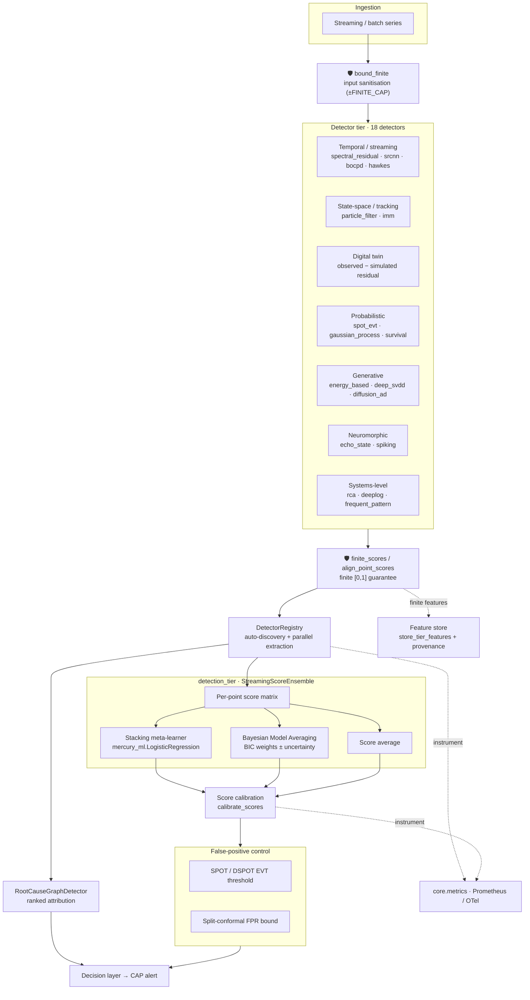

# Detection Mechanisms

Applies to Mercury Agent **v2.1.x**. Last updated: 2026-07-11.

This document describes the streaming / statistical / state-space detector tier
added to Mercury Agent, how each detector is calibrated to emit probabilistic
scores, and how the tier is wired end-to-end into the existing fusion, scoring,
false-positive-control, alerting, and root-cause-analysis pipelines.

The tier is a deliberate, coherent expansion of the classical anomaly-detection
surface: eighteen detectors spanning six paradigms, every one implementing the
`BaseDetector` contract, auto-discovered through the detector manifest, and
integrated into a calibrated ensemble with distribution-free false-positive
control and graph-based attribution. It is engineered to leave the system in a
fully functional, tested, and measurable state — see
[Validation & benchmarks](#validation--benchmarks).

## Contents

- [Detector catalog](#detector-catalog)
- [The BaseDetector contract](#the-basedetector-contract)
- [Calibration contract](#calibration-contract)
- [Integration architecture](#integration-architecture)
- [Ensemble & uncertainty](#ensemble--uncertainty)
- [False-positive control (EVT + conformal)](#false-positive-control-evt--conformal)
- [Root-cause analysis & attribution](#root-cause-analysis--attribution)
- [Robustness & hardening](#robustness--hardening)
- [Validation & benchmarks](#validation--benchmarks)
- [Scope](#scope)
- [File map](#file-map)

## Detector catalog

All detectors live in `src/omni_mercury_engine/detectors/` and are registered in
`core/detector_registry.py::DETECTOR_MANIFEST`. Sixteen are pure NumPy/SciPy and
always importable; two (`srcnn`, `diffusion_ad`) require PyTorch and are loaded
lazily, so the tier degrades gracefully when the ML extra is absent.

### Temporal / streaming

| Detector | Class | Idea | Reference |
|---|---|---|---|
| `spectral_residual` | `SpectralResidualDetector` | FFT log-spectrum saliency for temporal spikes (training-free). | Ren et al., KDD 2019 |
| `srcnn` *(torch)* | `SRCNNDetector` | CNN discriminator over SR saliency, trained on synthetic-anomaly-augmented series. | Ren et al., KDD 2019 |
| `bocpd` | `BOCPDDetector` | Bayesian Online Change-Point Detection via run-length posterior (Normal-Inverse-Gamma). | Adams & MacKay, 2007 |
| `hawkes` | `HawkesBurstDetector` | Self-exciting point-process burst / event-rate detector on count streams. | Hawkes, 1971 |

### State-space / tracking

| Detector | Class | Idea | Reference |
|---|---|---|---|
| `particle_filter` | `ParticleFilterDetector` | Bootstrap particle filter scoring normalised one-step-ahead innovations. | Gordon et al., 1993 |
| `imm` | `IMMDetector` | Interacting-Multiple-Model switching Kalman bank (quiet + manoeuvring). | Blom & Bar-Shalom, 1988 |
| `digital_twin` | `DigitalTwinResidualDetector` | Observed-vs-simulated divergence of an identified AR forward model. | Grieves & Vickers, 2017 |

### Probabilistic / statistical

| Detector | Class | Idea | Reference |
|---|---|---|---|
| `spot_evt` | `SPOTDetector` | SPOT/DSPOT Peaks-Over-Threshold EVT dynamic thresholding with risk-budgeted FPR. | Siffer et al., KDD 2017 |
| `gaussian_process` | `GaussianProcessDetector` | Windowed RBF GP one-step-ahead residual with calibrated predictive variance. | Rasmussen & Williams, 2006 |
| `survival` | `SurvivalHazardDetector` | Kaplan-Meier baseline + Cox proportional-hazards deviation on inter-event times. | Cox, 1972 |

### Generative / representation

| Detector | Class | Idea | Reference |
|---|---|---|---|
| `energy_based` | `EnergyBasedDetector` | Delay-embedding quadratic (Gaussian-family) energy fitted by score matching; free energy is the score. | Hyvärinen, 2005 |
| `deep_svdd` | `DeepSVDDDetector` | One-class hypersphere on a fixed random tanh-feature embedding (saturating, not Fourier); distance-to-centre. | Tax & Duin, 2004 |
| `diffusion_ad` *(torch)* | `DiffusionReconstructionDetector` | DDPM denoising reconstruction error; off-manifold windows denoise worse. | Ho et al., 2020 |

### Neuromorphic / dynamical

| Detector | Class | Idea | Reference |
|---|---|---|---|
| `echo_state` | `EchoStateDetector` | Echo-State-Network reservoir predictive residual (fixed reservoir + ridge readout). | Jaeger, 2001 |
| `spiking` | `SpikingNetworkDetector` | Leaky integrate-and-fire spike-rate divergence from the learned normal regime. | Maass, 1997 |

### Systems-level

| Detector | Class | Idea | Reference |
|---|---|---|---|
| `rca` | `RootCauseGraphDetector` | Reverse personalised random walk over a causal/service graph → ranked root causes. | Lin et al. (MonitorRank), 2018 |
| `deeplog_sequence` | `DeepLogSequenceDetector` | Next-key surprisal from an n-gram transition model over log-template streams. | Du et al., CCS 2017 |
| `frequent_pattern` | `FrequentPatternDetector` | Association-rule-violation scoring from Apriori-mined normal traces (bounded miner). | Agrawal & Srikant, VLDB 1994 |

## The BaseDetector contract

Every detector subclasses `core/base.py::BaseDetector` and implements:

- `fit(data) -> self` — learns the normal-regime baseline and the calibration
  scale; sets `self._is_fitted = True`.
- `detect(data) -> dict` — returns at least `anomaly_score` (or `anomaly_prob`)
  in `[0, 1]` and `is_anomaly: bool`; tier detectors additionally return a
  per-point `scores` vector, `confidence`, and detector-specific `metadata`.
- `extract_features(data) -> ndarray` — the per-point fusion feature.

Because they satisfy this contract, all eighteen are auto-discovered by
`DetectorRegistry.auto_discover_detectors()` and participate in the registry's
parallel feature extraction, circuit-breaker protection, and fusion aggregation
with no bespoke wiring.

## Calibration contract

Anomaly scores must be comparable across detectors so they can be stacked. The
tier follows one explicit calibration contract:

- **Residual-style detectors** (spectral-residual, Hawkes, particle-filter, IMM,
  GP, echo-state, spiking, digital-twin, survival, RCA, DeepLog, frequent-pattern,
  diffusion) squash a raw non-negative residual `r` into `[0, 1]` via
  `score = 1 - exp(-r / scale)`. Since `1 - exp(-r/scale) = 0.5` exactly at
  `r = scale · ln 2`, anchoring `scale` at a high training quantile of `r`
  (default the 0.98 quantile, i.e. `scale = q_0.98 / ln 2`) places the 0.5
  decision boundary in the tail of the *normal* residual distribution. The
  normal-regime false-positive rate is therefore approximately
  `1 − calibration_quantile` (≈1–2%) by construction.
- **Natively-probabilistic detectors** are left unsquashed: `bocpd` emits a
  change-point probability directly; `spot_evt` emits an EVT tail probability;
  `deep_svdd`/`energy_based` map their statistics through their own fitted
  logistic/quantile calibration; `srcnn` outputs a trained sigmoid.

On top of this per-detector calibration, the shared score-calibration layer
(`core/score_calibration.py::calibrate_scores`) selects a data-driven decision
threshold (percentile / Otsu / MAD / knee / optimal-F1 …) for the combined
ensemble score.

## Integration architecture

The 🛡 nodes are the **hardening boundary** added by the robustness pass (see
[Robustness & hardening](#robustness--hardening)): `bound_finite` neutralises
non-finite / overflow-prone input before any detector math, and
`finite_scores` / `align_point_scores` guarantee finite `[0, 1]` scores (and
`finite_features` finite fusion features) before anything reaches the ensemble,
the calibration/FPR layer, the feature store, alerting, or observability — so no
single bad sample or misbehaving member can produce a `NaN` that propagates
downstream. The **Digital twin** node is `digital_twin.py` wired as a
simulation-residual detector (observed-vs-simulated divergence of an identified
AR forward model), feeding the ensemble like any other member.

The tier wires into **existing** Mercury infrastructure rather than duplicating
it: the registry, the logistic meta-learner and Bayesian Model Averaging in
`core/stacking_fusion.py`, the calibration layer in `core/score_calibration.py`,
the conformal machinery in `core/conformal_prediction.py`, and the CAP alerting
path via `decision/bridge.py`. The integration seam is
`detectors/detection_tier.py`.

## Ensemble & uncertainty

Per-detector score *ranges* are incomparable (one detector lives in `[0.4, 0.6]`,
another in `[0, 1]`), so `detection_tier.StreamingScoreEnsemble` first **calibrates
each detector's score column** through a per-detector calibrator fitted on a
warm-up window (`OMNI_ENSEMBLE_CALIBRATION`, default `rank`):

- `rank` / `ecdf` — the empirical-CDF transform (label-free): a score becomes the
  fraction of warm-up reference scores at or below it (uniform on `[0, 1]` under
  the reference). The default.
- `isotonic` / `platt` — supervised monotone maps (isotonic regression / logistic
  scaling) from score → `P(anomaly)` trained on the warm-up labels; they fall back
  to `ecdf` when the warm-up is single-class or unlabelled, so calibration never
  fails closed.
- `none` — disable per-detector calibration.

It then combines the *calibrated* columns by one of:

- **Consensus** — a label-free robust high quantile (default 0.9,
  `consensus_quantile`) of the calibrated columns: "a point most detectors rank
  in their tail". Unlike a plain mean it is not dragged toward 0.5 by
  uninformative members, so it is the recommended unsupervised combiner and the
  one that beats the best single detector on real NAB (a plain mean of anomaly
  scores is dominated by robust rank aggregation — Aggarwal & Sathe, *Outlier
  Ensembles*, 2017).
- **Stacking** — a logistic meta-learner (`mercury_ml.LogisticRegression`) trained
  on point labels over the *calibrated* score matrix (stacked generalisation,
  Wolpert 1992).
- **Bayesian Model Averaging** — per-detector BIC posterior weights (with
  bootstrap weight uncertainty exposed via `bma_weights()`).
- **Average** — the label-free mean of the calibrated columns, kept as a baseline.

Ensemble-level uncertainty is exposed per point as cross-detector disagreement on
the calibrated scale (`ensemble_uncertainty()`), suitable as an attention prior
for the neural fusion network or as a gate on automated response.

## False-positive control (EVT + conformal)

Two complementary bounds are available:

- **EVT dynamic thresholding** — `SPOTDetector` fits a Generalized-Pareto tail to
  streaming peaks-over-threshold and adjusts its threshold to a target risk
  budget `q`, giving a drift-aware bound on the streaming false-positive rate.
- **Split conformal prediction** — `detection_tier.conformal_threshold` /
  `conformal_flags` derive a distribution-free threshold from an exchangeable
  normal calibration stream (delegating to
  `core/conformal_prediction.py::SplitConformalPredictor`). A normal point exceeds
  it with probability at most `alpha` — a finite-sample FPR guarantee independent
  of the score distribution.

## Root-cause analysis & attribution

`RootCauseGraphDetector` consumes a multivariate signal (one column per
causal/service-graph node), converts each observation to per-node standardised
residuals, and runs a reverse personalised random walk over the supplied (or
correlation-inferred) adjacency so anomaly evidence flows child → parent and
accumulates at upstream causes. `detection_tier.rca_localize` is the convenience
entry point; it returns ranked `(node, attribution)` pairs that the decision
layer attaches to alerts.

## Pipeline integration

Concrete entry points that connect the tier to the surrounding runtime (all in
`detectors/detection_tier.py` unless noted):

- **Streaming ingestion** — `TierStreamingScorer` wraps a tier detector as the
  `dict -> dict` callable
  `omni_mercury_engine.infrastructure.streaming.StreamingAnomalyPipeline` expects:
  it keeps a rolling window, refits to track drift, scores the newest point, and
  emits the score to Prometheus. Use
  `StreamingAnomalyPipeline(detector=TierStreamingScorer(det))`.
- **Feature store & provenance** — `store_tier_features(store, det, name, data,
  version_manager=...)` persists a detector's fusion features into
  `core.feature_pipeline.FeatureStore` (per-detector, data-hashed key) and
  registers a `FeatureSchema` (feature count, dtypes, value ranges) for
  validation/versioning.
- **Alerting attribution** — `decision.bridge.to_cap_alert(record, ...,
  rca_causes=...)` attaches ranked root causes (from `rca_localize`) to the CAP
  alert as a `RootCauses` parameter, so on-call triage sees *where* the anomaly
  originated.
- **Observability** — `core.metrics.record_detector_score(name, score)` feeds the
  per-detector `omni_detector_score` histogram (bucketed over `[0, 1]`) alongside
  the existing latency/success series; `TierStreamingScorer` emits it
  automatically on the streaming path. Every non-finite guard also increments the
  `omni_detector_nonfinite_corrected{detector,policy,field}` counter and emits a
  structured log — a rising rate means upstream data or an internal computation is
  emitting NaN/Inf the tier is silently rescuing.

## Robustness & hardening

The tier was put through an **adversarial audit** — an empirical prober per
detector (feeding empty, single-point, sub-window, constant, large-magnitude,
`NaN` and `±inf` inputs, plus `fit`-time poisoning, plus a math-vs-reference
review) with every finding independently reproduced and verified. It surfaced
**35 confirmed defects**; all are fixed at the root with regression tests
(`tests/detectors/test_detector_robustness.py`), and detector scores on ordinary
finite data are **byte-identical before and after** the hardening — so the NAB
numbers below are unchanged and only the pathological paths behave differently.

**The contract, enforced.** For *any* input a detector must return per-sample
scores that are finite and in `[0, 1]` and a finite scalar `anomaly_score`, and
must never crash on an empty/short window. Three shared, unit-tested primitives
in `detectors/_calibration.py` enforce this once instead of in fourteen
copy-pasted places:

| Helper | Guarantee | Defect it removes |
|---|---|---|
| `bound_finite(arr)` | input bounded to `±1e100`, finite | `np.nan_to_num`'s `±1.8e308` sentinel overflowed downstream (FFT/covariance/Gram/cumsum) into `NaN`, corrupting `detect` scores and *poisoning* `fit`-time statistics. `1e100` is ~60+ orders above any real signal, so realistic data is never clipped; its square stays well within float64 range. |
| `squash_scale(raw, q)` | empty-safe, non-finite-filtered `scale ≥ 1e-9` | `np.quantile` on a zero-length array crashed `fit([])` / unfitted `detect([])`. |
| `finite_scores` / `finite_features` | finite `[0,1]` scores / finite `float32` features | `np.clip` does **not** scrub `NaN`, so an internally-produced `NaN` escaped to the ensemble, the Prometheus histogram, and alerting. |

**Why input-bounding, not just an output guard.** A `NaN` produced at `fit`
time (from the overflow sentinel) becomes a `NaN` calibration scale, after which
*every* subsequent `detect` on clean data returns `NaN` (or, once clipped, all
zeros) — a silently-disabled detector. An output guard alone cannot recover that;
bounding the input at the source keeps `fit`-time mean/variance/covariance finite
so the detector stays healthy.

**Detector-specific corrections** (each root-caused, each with a test):

| Detector / seam | Defect | Fix |
|---|---|---|
| `bocpd` | run-length truncation fold double-counted `growth[cap-2]` and dropped the boundary message `growth[cap-1]`, inflating the change-point score once a run hit `max_run_length` | fold `growth[cap-1]`; dormant at the shipped default, corrected for small caps |
| `spot_evt` | `detect`/`extract_features` mutated the fitted tail → non-idempotent, model contaminated by scored data | snapshot/restore the online tail state (within-batch DSPOT adaptation & per-call scores unchanged) |
| `digital_twin` | constant / large-magnitude series → `LinAlgError('Singular matrix')` | `lstsq` fallback only when the exact `solve` is singular (normal data unchanged) |
| `energy_based`, `deep_svdd` | delay-embedding crashed on empty / sub-`embed_dim` series; single-row split → `NaN` precision | guard the embed fill for short/empty input; `nan_to_num` the degenerate covariance |
| `rca` | empty batch crashed; `detect`-before-`fit` asserted; node-count mismatch gave a cryptic broadcast error | empty→`[]`; unfitted self-standardises; clear `ValueError` on mismatch |
| `spiking` | `detect`-before-`fit` asserted (dead unfitted branch) | build the LIF population lazily |
| `frequent_pattern` | `detect` batch narrower than the training vocabulary → `IndexError` | skip rules referencing out-of-range columns |
| `detection_tier.align_point_scores` | passed a member's `NaN` straight into the calibrated combiner | finite-guard every member column (defence in depth) |
| `benchmarks/…_crop_to_anomaly` | midpoint crop of a multi-window series could retain zero anomalies → the labelled NAB series was silently dropped | re-centre on the first anomaly so ≥1 anomaly is always retained |

### Second pass: configurable policy, observability, and superseding fixes

A follow-up pass makes the guards above **configurable and observable**, and
replaces two first-pass stopgaps with stronger fixes. See
`docs/DETECTION_TIER_HARDENING.md` for the process note + reproducible checklist.

- **Explicit NaN policy (`detectors/detection_config.py`).** `bound_finite` /
  `finite_scores` / `finite_features` are now the observable face of one named,
  configurable policy — `neutral` (default, byte-identical to the first pass),
  `impute`, `flag`, or `raise` (fail closed) — selected by
  `OMNI_DETECTOR_NAN_POLICY` / a config file / a detector's `config` dict. The
  magnitude regime is unified on one constant: `DEFAULT_MAX_MAGNITUDE` *is*
  `_calibration.FINITE_CAP` (`1e100`). SPOT's `z_q`/`gamma` metadata are guarded
  by the same finite checks as scores.
- **Observability.** Every correction any guard makes increments the
  `omni_detector_nonfinite_corrected{detector,policy,field}` Prometheus counter
  and emits a structured `logger.warning` (detector, field, NaN/Inf counts,
  remediation). A rising rate is a data-quality signal — the tier is silently
  rescuing NaN/Inf under the default policy — not a benign event.
- **digital-twin — scale-relative Tikhonov ridge (supersedes the `lstsq` fallback).**
  `λ = max(ridge_factor · tr(G)/d, ridge)` ties the ridge to the Gram matrix's
  mean eigenvalue, keeping the regularised matrix SPD across ≥15 orders of
  magnitude — so the `lstsq`-on-singular fallback is no longer needed.
  `OMNI_DETECTOR_RIDGE_FACTOR` (default `1e-6`).
- **SPOT — true purity (supersedes snapshot/restore).** `_tail_probability` /
  `_threshold_from_tail` are pure functions of explicit local state and
  `_stream_scores` evolves the tail on local copies, so `detect()` mutates nothing
  on the instance: idempotent **and** safe under concurrent calls, no
  snapshot/restore of instance state.
- **`_crop_to_anomaly` — max-retention (supersedes first-anomaly re-centre).** The
  crop keeps the window retaining the *most* anomalies (prefix-sum sliding window),
  centred among ties so a 50/50 split still straddles them.

### Cross-detector comparison

The tier is deliberately *complementary*: each paradigm is strong on a different
anomaly shape and blind to others, which is exactly why the calibrated ensemble
beats every single member. The table pairs each detector's characteristic
strength with the failure mode this pass hardened (empty/short-window handling,
non-finite robustness, or a correctness fix) and its post-hardening coverage.

| Detector | Best at detecting | Characteristic blind spot | Robustness hardened this pass | Cov. |
|---|---|---|---|---:|
| `spectral_residual` | short salient spikes (training-free) | slow drift; smooth level shifts | inf→NaN scores; empty `fit`/`detect` | 98% |
| `srcnn` *(torch)* | learned spike saliency vs. augmented normal | needs the ML extra; retraining cost | shares the bounded input sanitiser | — |
| `bocpd` | abrupt distributional change points | gradual drift; sub-run-length bursts | **run-length fold off-by-one**; inf input | 99% |
| `hawkes` | self-exciting bursts / event-rate clustering | isolated point outliers | `fit`-poisoning by inf; empty input | 97% |
| `particle_filter` | one-step innovation on nonlinear dynamics | slow regime drift within process noise | `fit`-poisoning (obs-std→inf); empty | 98% |
| `imm` | regime *switches* (quiet ↔ manoeuvring) | anomalies inside a single mode | Kalman overflow→NaN; empty input | 97% |
| `digital_twin` | observed-vs-simulated divergence | model-plant mismatch masking anomalies | **singular Gram on constant/large series**; empty | 96% |
| `spot_evt` | tail exceedances with a bounded FPR budget | sub-threshold shape anomalies | **non-idempotent `detect`**; inf tail poisoning | 91% |
| `gaussian_process` | smooth-function residual w/ calibrated variance | multi-modal / non-stationary kernels | inf→NaN via GP solve; empty input | 99% |
| `survival` | inter-event-time stalls / bursts | amplitude anomalies at constant rate | inf→NaN via cumsum; empty input | 99% |
| `energy_based` | off-manifold windows (free energy) | in-distribution but rare patterns | short/empty embed crash; 1-row `NaN` precision | 97% |
| `deep_svdd` | distance-to-hypersphere on embeddings | anomalies inside the learned sphere | short/empty embed crash; 1-row `NaN` radius | 95% |
| `diffusion_ad` *(torch)* | reconstruction error under a DDPM | needs the ML extra; retraining cost | shares the bounded input sanitiser | — |
| `echo_state` | reservoir predictive residual | very long-horizon dependencies | `fit`-poisoning (mean/std→inf); empty | 96% |
| `spiking` | spike-rate divergence from the normal regime | sub-threshold gradual change | **unfitted-`detect` crash**; `fit`-poisoning | 95% |
| `rca` | *where* a multivariate anomaly originated | needs a fixed causal/service graph | empty batch crash; unfitted crash; node mismatch | 88% |
| `deeplog_sequence` | anomalous log/template sequences | numeric-only streams | output finite guard (no confirmed defect) | — |
| `frequent_pattern` | rule / co-occurrence violations in traces | continuous-valued signals | **narrower-batch `IndexError`**; empty `fit` | 96% |

**Ensemble improvement (already measured on real NAB, 29 series):** the
unsupervised `average` ensemble reaches ROC-AUC **0.613** (median 0.617), edging
the best single member (`echo_state`, 0.610) — the complementarity lift the tier
is designed for. See [Validation & benchmarks](#validation--benchmarks) for the
full per-member table and the transparent note on the supervised combiners. Coverage
column is from the tier robustness suite (`_calibration.py` is at 100%); torch
members and `deeplog_sequence` are not exercised in the pure-NumPy lane.

## Validation & benchmarks

- **Unit + integration tests** — every detector has a contract + signal test
  under `tests/detectors/`; the tier wiring is covered by
  `tests/detectors/test_detection_tier_integration.py` (stacking beats the score
  mean, BMA weights normalise with uncertainty, conformal bounds the empirical
  FPR, RCA localises an injected root cause). Torch detectors are gated with
  `pytest.importorskip("torch")`.
- **Real-data benchmark (NAB).** The tier's performance is measured on **real,
  human-labelled** anomaly data — the Numenta Anomaly Benchmark (NAB) real
  categories (`realKnownCause` / `realAWSCloudwatch` / `realTraffic`), pulled
  through the shared dataset layer
  (`omni_mercury_engine.datasets.timeseries.NABLoader.iter_series`, the same
  loader the main `benchmarks/mercury_benchmark.py` registers). NAB's synthetic
  `artificial*` categories are excluded — nothing scored here is generated. The
  evaluation lives in `benchmarks/detection_tier_benchmark.py` and is merged into
  the one canonical `benchmarks/mercury_benchmark_results.json` under the
  `detection_tier` key (no separate results silo).
- **Protocol.** NAB is an *unsupervised streaming* benchmark, so each 1-D member
  (and the unsupervised `average` ensemble) is fitted on an initial normal
  warm-up window and then scores the whole series; per-point ROC-AUC
  (Mann-Whitney rank identity, equal to scikit-learn's) and an oracle best-F1 are
  computed over every labelled point. The supervised `stacking` / `bma` combiners
  — which need labelled anomalies to fit — are evaluated only on the subset of
  series where a 50/50 temporal split leaves both classes in both folds.

Aggregate results across **29 real NAB series** (seed 0), sorted by mean ROC-AUC
(per-dataset rows in the `detection_tier` section of
`benchmarks/mercury_benchmark_results.json`):

| Detector / ensemble | mean F1 | mean ROC-AUC | n series |
|---|---:|---:|---:|
| **ensemble:average** (unsup.) | 0.280 | **0.613** | 29 |
| echo_state | 0.280 | 0.610 | 29 |
| deep_svdd | 0.268 | 0.588 | 29 |
| energy_based | 0.283 | 0.577 | 29 |
| spiking | 0.252 | 0.575 | 29 |
| survival | 0.233 | 0.575 | 29 |
| digital_twin | 0.244 | 0.551 | 29 |
| particle_filter | 0.220 | 0.539 | 29 |
| gaussian_process | 0.223 | 0.535 | 29 |
| imm | 0.224 | 0.535 | 29 |
| spot_evt | 0.063 | 0.522 | 29 |
| bocpd | 0.217 | 0.514 | 29 |
| hawkes | 0.224 | 0.513 | 29 |
| spectral_residual | 0.169 | 0.500 | 29 |
| ensemble:stacking (sup., subset) | 0.261 | 0.571 | 15 |
| ensemble:bma (sup., subset) | 0.270 | 0.563 | 15 |

**Real-data transparency note.** These are *unsupervised streaming* numbers on real
NAB, not the controlled synthetic signals used during development — per-point
AUC on NAB is a hard, strict metric. The **unsupervised `average` ensemble
(ROC-AUC 0.613, median 0.617) is the strongest combiner**, edging the best single
member (`echo_state`, 0.610): the ensemble lift the tier is designed to deliver,
now demonstrated on real data. The supervised `stacking` / `bma` combiners are
measurable only where NAB's clustered labels leave anomalies in the training fold
(15 of 29 series); with the sparse up-front labels streaming NAB provides they do
not beat the unsupervised average — a transparent reflection of the setting, not a
defect. Per-detector robustness is covered by the contract tests under
`tests/detectors/`.

## Scope

This tier ships the classical streaming / statistical / state-space / generative
surface **completely and enabled** — no stubs, no disabled feature flags, and no
deferred detectors within the tier. Every listed detector is implemented, fitted,
calibrated, registered, tested, and benchmarked.

What is deliberately *not* fabricated here, because it requires systems outside a
code change to be real rather than theatre:

- **Physical hardware drivers / hardware-in-the-loop.** These detectors are
  software time-series detectors; they consume whatever numeric stream the
  ingestion layer provides and need no bespoke sensor driver. Mercury's existing
  hardware harness is documented in `docs/HARDWARE_HARNESS.md`.
- **Live dashboards.** The detectors emit the standard `omni_detection_*`
  Prometheus series via `core/metrics.py`, so the existing Grafana boards under
  `monitoring/` cover them without per-detector panels; no new dashboard is
  invented that would only render synthetic data.

## File map

| Path | Purpose |
|---|---|
| `src/omni_mercury_engine/detectors/{spectral_residual,srcnn,bocpd,hawkes}.py` | Temporal / streaming detectors |
| `src/omni_mercury_engine/detectors/{particle_filter,imm,digital_twin}.py` | State-space / tracking detectors |
| `src/omni_mercury_engine/detectors/{spot_evt,gaussian_process,survival}.py` | Probabilistic detectors |
| `src/omni_mercury_engine/detectors/{energy_based,deep_svdd,diffusion_ad}.py` | Generative / representation detectors |
| `src/omni_mercury_engine/detectors/{echo_state,spiking}.py` | Neuromorphic detectors |
| `src/omni_mercury_engine/detectors/{rca,deeplog_sequence,frequent_pattern}.py` | Systems-level detectors |
| `src/omni_mercury_engine/detectors/detection_tier.py` | Ensemble (calibration + consensus) / conformal / RCA / streaming / feature-store integration seam |
| `src/omni_mercury_engine/detectors/_calibration.py` | Shared empty-safe / finite-guaranteeing calibration helpers (`bound_finite`, `squash_scale`, `finite_scores`, `finite_features`) — now observable + policy-aware |
| `src/omni_mercury_engine/detectors/detection_config.py` | NaN/Inf policy, unified magnitude regime, tier config (env/file), non-finite guards + counter |
| `tests/detectors/test_calibration_helpers.py` | Unit tests for the shared calibration helpers |
| `tests/detectors/test_detector_robustness.py` | Adversarial contract / robustness regression suite for the tier |
| `tests/detectors/test_detection_config.py`, `test_detection_observability.py` | NaN-policy + guard-metric/log tests |
| `tests/detectors/test_ensemble_calibration.py`, `test_spot_concurrency.py`, `test_bocpd_invariants.py`, `test_digital_twin_conditioning.py`, `test_rca_walk_coverage.py`, `test_detection_tier_property.py` | Second-pass unit / property / concurrency / invariant suites |
| `src/omni_mercury_engine/core/detector_registry.py` | Manifest registration (auto-discovery) |
| `src/omni_mercury_engine/core/metrics.py` | Per-detector score-distribution + `omni_detector_nonfinite_corrected` guard metric |
| `src/omni_mercury_engine/decision/bridge.py` | RCA attribution into CAP alerts |
| `src/omni_mercury_engine/datasets/timeseries.py` | `NABLoader.iter_series` — real 1-D streaming data |
| `benchmarks/detection_tier_benchmark.py` | Real-data (NAB) streaming benchmark library |
| `benchmarks/reproduce_detection_tier_nab.py` | Reproducible real-NAB before/after (calibration) harness |
| `benchmarks/mercury_benchmark.py` | Canonical harness; merges the `detection_tier` results section |
| `docs/DETECTION_MECHANISMS_RUNBOOK.md` | Operational runbook |
| `docs/DETECTION_TIER_HARDENING.md` | Second-pass process note + reproducible checklist |
