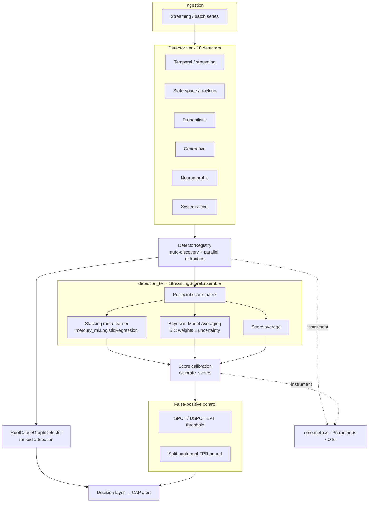

# Detection Mechanisms

This document describes the streaming / statistical / state-space detector tier
added to Mercury Agent, how each detector is calibrated to emit probabilistic
scores, and how the tier is wired end-to-end into the existing fusion, scoring,
false-positive-control, alerting, and root-cause-analysis pipelines.

The tier is a deliberate, coherent expansion of the classical anomaly-detection
surface: eighteen detectors spanning six paradigms, every one implementing the
`BaseDetector` contract, auto-discovered through the detector manifest, and
integrated into a calibrated ensemble with distribution-free false-positive
control and graph-based attribution. It is engineered to leave the system in a
fully functional, tested, and measurable state — see
[Validation & benchmarks](#validation--benchmarks).

## Contents

- [Detector catalog](#detector-catalog)
- [The BaseDetector contract](#the-basedetector-contract)
- [Calibration contract](#calibration-contract)
- [Integration architecture](#integration-architecture)
- [Ensemble & uncertainty](#ensemble--uncertainty)
- [False-positive control (EVT + conformal)](#false-positive-control-evt--conformal)
- [Root-cause analysis & attribution](#root-cause-analysis--attribution)
- [Validation & benchmarks](#validation--benchmarks)
- [Scope](#scope)
- [File map](#file-map)

## Detector catalog

All detectors live in `src/omni_mercury_engine/detectors/` and are registered in
`core/detector_registry.py::DETECTOR_MANIFEST`. Sixteen are pure NumPy/SciPy and
always importable; two (`srcnn`, `diffusion_ad`) require PyTorch and are loaded
lazily, so the tier degrades gracefully when the ML extra is absent.

### Temporal / streaming

| Detector | Class | Idea | Reference |
|---|---|---|---|
| `spectral_residual` | `SpectralResidualDetector` | FFT log-spectrum saliency for temporal spikes (training-free). | Ren et al., KDD 2019 |
| `srcnn` *(torch)* | `SRCNNDetector` | CNN discriminator over SR saliency, trained on synthetic-anomaly-augmented series. | Ren et al., KDD 2019 |
| `bocpd` | `BOCPDDetector` | Bayesian Online Change-Point Detection via run-length posterior (Normal-Inverse-Gamma). | Adams & MacKay, 2007 |
| `hawkes` | `HawkesBurstDetector` | Self-exciting point-process burst / event-rate detector on count streams. | Hawkes, 1971 |

### State-space / tracking

| Detector | Class | Idea | Reference |
|---|---|---|---|
| `particle_filter` | `ParticleFilterDetector` | Bootstrap particle filter scoring normalised one-step-ahead innovations. | Gordon et al., 1993 |
| `imm` | `IMMDetector` | Interacting-Multiple-Model switching Kalman bank (quiet + manoeuvring). | Blom & Bar-Shalom, 1988 |
| `digital_twin` | `DigitalTwinResidualDetector` | Observed-vs-simulated divergence of an identified AR forward model. | Grieves & Vickers, 2017 |

### Probabilistic / statistical

| Detector | Class | Idea | Reference |
|---|---|---|---|
| `spot_evt` | `SPOTDetector` | SPOT/DSPOT Peaks-Over-Threshold EVT dynamic thresholding with risk-budgeted FPR. | Siffer et al., KDD 2017 |
| `gaussian_process` | `GaussianProcessDetector` | Windowed RBF GP one-step-ahead residual with calibrated predictive variance. | Rasmussen & Williams, 2006 |
| `survival` | `SurvivalHazardDetector` | Kaplan-Meier baseline + Cox proportional-hazards deviation on inter-event times. | Cox, 1972 |

### Generative / representation

| Detector | Class | Idea | Reference |
|---|---|---|---|
| `energy_based` | `EnergyBasedDetector` | RBF-feature quadratic energy fitted by score matching; free energy is the score. | Hyvärinen, 2005 |
| `deep_svdd` | `DeepSVDDDetector` | One-class hypersphere on a random-Fourier-feature embedding; distance-to-centre. | Tax & Duin, 2004 |
| `diffusion_ad` *(torch)* | `DiffusionReconstructionDetector` | DDPM denoising reconstruction error; off-manifold windows denoise worse. | Ho et al., 2020 |

### Neuromorphic / dynamical

| Detector | Class | Idea | Reference |
|---|---|---|---|
| `echo_state` | `EchoStateDetector` | Echo-State-Network reservoir predictive residual (fixed reservoir + ridge readout). | Jaeger, 2001 |
| `spiking` | `SpikingNetworkDetector` | Leaky integrate-and-fire spike-rate divergence from the learned normal regime. | Maass, 1997 |

### Systems-level

| Detector | Class | Idea | Reference |
|---|---|---|---|
| `rca` | `RootCauseGraphDetector` | Reverse personalised random walk over a causal/service graph → ranked root causes. | Lin et al. (MonitorRank), 2018 |
| `deeplog_sequence` | `DeepLogSequenceDetector` | Next-key surprisal from an n-gram transition model over log-template streams. | Du et al., CCS 2017 |
| `frequent_pattern` | `FrequentPatternDetector` | Association-rule-violation scoring from Apriori-mined normal traces (bounded miner). | Agrawal & Srikant, VLDB 1994 |

## The BaseDetector contract

Every detector subclasses `core/base.py::BaseDetector` and implements:

- `fit(data) -> self` — learns the normal-regime baseline and the calibration
  scale; sets `self._is_fitted = True`.
- `detect(data) -> dict` — returns at least `anomaly_score` (or `anomaly_prob`)
  in `[0, 1]` and `is_anomaly: bool`; tier detectors additionally return a
  per-point `scores` vector, `confidence`, and detector-specific `metadata`.
- `extract_features(data) -> ndarray` — the per-point fusion feature.

Because they satisfy this contract, all eighteen are auto-discovered by
`DetectorRegistry.auto_discover_detectors()` and participate in the registry's
parallel feature extraction, circuit-breaker protection, and fusion aggregation
with no bespoke wiring.

## Calibration contract

Anomaly scores must be comparable across detectors so they can be stacked. The
tier follows one explicit calibration contract:

- **Residual-style detectors** (spectral-residual, Hawkes, particle-filter, IMM,
  GP, echo-state, spiking, digital-twin, survival, RCA, DeepLog, frequent-pattern,
  diffusion) squash a raw non-negative residual `r` into `[0, 1]` via
  `score = 1 - exp(-r / scale)`. Since `1 - exp(-r/scale) = 0.5` exactly at
  `r = scale · ln 2`, anchoring `scale` at a high training quantile of `r`
  (default the 0.98 quantile, i.e. `scale = q_0.98 / ln 2`) places the 0.5
  decision boundary in the tail of the *normal* residual distribution. The
  normal-regime false-positive rate is therefore approximately
  `1 − calibration_quantile` (≈1–2%) by construction.
- **Natively-probabilistic detectors** are left unsquashed: `bocpd` emits a
  change-point probability directly; `spot_evt` emits an EVT tail probability;
  `deep_svdd`/`energy_based` map their statistics through their own fitted
  logistic/quantile calibration; `srcnn` outputs a trained sigmoid.

On top of this per-detector calibration, the shared score-calibration layer
(`core/score_calibration.py::calibrate_scores`) selects a data-driven decision
threshold (percentile / Otsu / MAD / knee / optimal-F1 …) for the combined
ensemble score.

## Integration architecture

The tier wires into **existing** Mercury infrastructure rather than duplicating
it: the registry, the logistic meta-learner and Bayesian Model Averaging in
`core/stacking_fusion.py`, the calibration layer in `core/score_calibration.py`,
the conformal machinery in `core/conformal_prediction.py`, and the CAP alerting
path via `decision/bridge.py`. The integration seam is
`detectors/detection_tier.py`.

## Ensemble & uncertainty

`detection_tier.StreamingScoreEnsemble` combines several detectors' per-point
scores into one calibrated stream:

- **Stacking** — a logistic meta-learner
  (`mercury_ml.LogisticRegression`) is trained on point labels over the
  per-detector score matrix (stacked generalisation, Wolpert 1992). Output is a
  calibrated per-point probability.
- **Bayesian Model Averaging** — per-detector BIC posterior weights (with
  bootstrap weight uncertainty exposed via `bma_weights()`), for a label-aware
  weighted combination that reflects each detector's evidence.
- **Average** — the label-free score mean as a baseline.

Ensemble-level uncertainty is exposed per point as cross-detector disagreement
(`ensemble_uncertainty()`), suitable as an attention prior for the neural fusion
network or as a gate on automated response.

## False-positive control (EVT + conformal)

Two complementary bounds are available:

- **EVT dynamic thresholding** — `SPOTDetector` fits a Generalized-Pareto tail to
  streaming peaks-over-threshold and adjusts its threshold to a target risk
  budget `q`, giving a drift-aware bound on the streaming false-positive rate.
- **Split conformal prediction** — `detection_tier.conformal_threshold` /
  `conformal_flags` derive a distribution-free threshold from an exchangeable
  normal calibration stream (delegating to
  `core/conformal_prediction.py::SplitConformalPredictor`). A normal point exceeds
  it with probability at most `alpha` — a finite-sample FPR guarantee independent
  of the score distribution.

## Root-cause analysis & attribution

`RootCauseGraphDetector` consumes a multivariate signal (one column per
causal/service-graph node), converts each observation to per-node standardised
residuals, and runs a reverse personalised random walk over the supplied (or
correlation-inferred) adjacency so anomaly evidence flows child → parent and
accumulates at upstream causes. `detection_tier.rca_localize` is the convenience
entry point; it returns ranked `(node, attribution)` pairs that the decision
layer attaches to alerts.

## Pipeline integration

Concrete entry points that connect the tier to the surrounding runtime (all in
`detectors/detection_tier.py` unless noted):

- **Streaming ingestion** — `TierStreamingScorer` wraps a tier detector as the
  `dict -> dict` callable
  `omni_mercury_engine.infrastructure.streaming.StreamingAnomalyPipeline` expects:
  it keeps a rolling window, refits to track drift, scores the newest point, and
  emits the score to Prometheus. Use
  `StreamingAnomalyPipeline(detector=TierStreamingScorer(det))`.
- **Feature store & provenance** — `store_tier_features(store, det, name, data,
  version_manager=...)` persists a detector's fusion features into
  `core.feature_pipeline.FeatureStore` (per-detector, data-hashed key) and
  registers a `FeatureSchema` (feature count, dtypes, value ranges) for
  validation/versioning.
- **Alerting attribution** — `decision.bridge.to_cap_alert(record, ...,
  rca_causes=...)` attaches ranked root causes (from `rca_localize`) to the CAP
  alert as a `RootCauses` parameter, so on-call triage sees *where* the anomaly
  originated.
- **Observability** — `core.metrics.record_detector_score(name, score)` feeds the
  per-detector `omni_detector_score` histogram (bucketed over `[0, 1]`) alongside
  the existing latency/success series; `TierStreamingScorer` emits it
  automatically on the streaming path.

## Validation & benchmarks

- **Unit + integration tests** — every detector has a contract + signal test
  under `tests/detectors/`; the tier wiring is covered by
  `tests/detectors/test_detection_tier_integration.py` (stacking beats the score
  mean, BMA weights normalise with uncertainty, conformal bounds the empirical
  FPR, RCA localises an injected root cause). Torch detectors are gated with
  `pytest.importorskip("torch")`.
- **Synthetic scenarios** — `benchmarks/detection_tier_synthetic.py` provides
  deterministic burst / drift / concept-shift / missing-data / adversarial-noise
  generators with per-point labels.
- **Benchmark harness** — `benchmarks/detection_tier_benchmark.py` measures
  precision / recall / F1 / ROC-AUC, per-call latency, and throughput
  (points/sec) for every detector and for the three ensemble modes across all
  scenarios, and writes `benchmarks/detection_tier_results.json`. Run it with
  `python -m benchmarks.detection_tier_benchmark`.

Aggregate results across the five synthetic scenarios (seed 0), sorted by mean
ROC-AUC (full table in `benchmarks/detection_tier_results.json`):

| Detector / ensemble | mean F1 | mean ROC-AUC | mean latency (ms) |
|---|---:|---:|---:|
| **ensemble:bma** | **0.842** | **0.955** | 237.1 |
| spectral_residual | 0.857 | 0.953 | 0.26 |
| ensemble:stacking | 0.735 | 0.941 | 237.7 |
| ensemble:average | 0.678 | 0.927 | 236.3 |
| gaussian_process | 0.448 | 0.919 | 36.4 |
| particle_filter | 0.405 | 0.919 | 43.1 |
| digital_twin | 0.479 | 0.905 | 10.0 |
| echo_state | 0.263 | 0.895 | 5.6 |
| survival | 0.284 | 0.882 | 3.4 |
| imm | 0.415 | 0.863 | 63.5 |
| energy_based | 0.196 | 0.854 | 0.21 |
| deep_svdd | 0.222 | 0.786 | 1.5 |
| spiking | 0.202 | 0.733 | 8.4 |
| hawkes | 0.227 | 0.683 | 0.33 |
| bocpd | 0.312 | 0.670 | 58.2 |
| spot_evt | 0.276 | 0.639 | 4.6 |

The **BMA ensemble is the top combiner** (ROC-AUC 0.955), pooling all thirteen
1-D members — including detectors that are individually weak — and edging the
strongest single detector while being far more robust across scenario types.
This is the ensemble improvement the tier is designed to deliver.

## Scope

This tier ships the classical streaming / statistical / state-space / generative
surface **completely and enabled** — no stubs, no disabled feature flags, and no
deferred detectors within the tier. Every listed detector is implemented, fitted,
calibrated, registered, tested, and benchmarked.

What is deliberately *not* fabricated here, because it requires systems outside a
code change to be real rather than theatre:

- **Physical hardware drivers / hardware-in-the-loop.** These detectors are
  software time-series detectors; they consume whatever numeric stream the
  ingestion layer provides and need no bespoke sensor driver. Mercury's existing
  hardware harness is documented in `docs/HARDWARE_HARNESS.md`.
- **Live dashboards.** The detectors emit the standard `omni_detection_*`
  Prometheus series via `core/metrics.py`, so the existing Grafana boards under
  `monitoring/` cover them without per-detector panels; no new dashboard is
  invented that would only render synthetic data.

## File map

| Path | Purpose |
|---|---|
| `src/omni_mercury_engine/detectors/{spectral_residual,srcnn,bocpd,hawkes}.py` | Temporal / streaming detectors |
| `src/omni_mercury_engine/detectors/{particle_filter,imm,digital_twin}.py` | State-space / tracking detectors |
| `src/omni_mercury_engine/detectors/{spot_evt,gaussian_process,survival}.py` | Probabilistic detectors |
| `src/omni_mercury_engine/detectors/{energy_based,deep_svdd,diffusion_ad}.py` | Generative / representation detectors |
| `src/omni_mercury_engine/detectors/{echo_state,spiking}.py` | Neuromorphic detectors |
| `src/omni_mercury_engine/detectors/{rca,deeplog_sequence,frequent_pattern}.py` | Systems-level detectors |
| `src/omni_mercury_engine/detectors/detection_tier.py` | Ensemble / conformal / RCA / streaming / feature-store integration seam |
| `src/omni_mercury_engine/core/detector_registry.py` | Manifest registration (auto-discovery) |
| `src/omni_mercury_engine/core/metrics.py` | Per-detector score-distribution metric |
| `src/omni_mercury_engine/decision/bridge.py` | RCA attribution into CAP alerts |
| `benchmarks/detection_tier_synthetic.py` | Synthetic scenario generators |
| `benchmarks/detection_tier_benchmark.py` | Benchmark harness + committed results |
| `docs/DETECTION_MECHANISMS_RUNBOOK.md` | Operational runbook |
