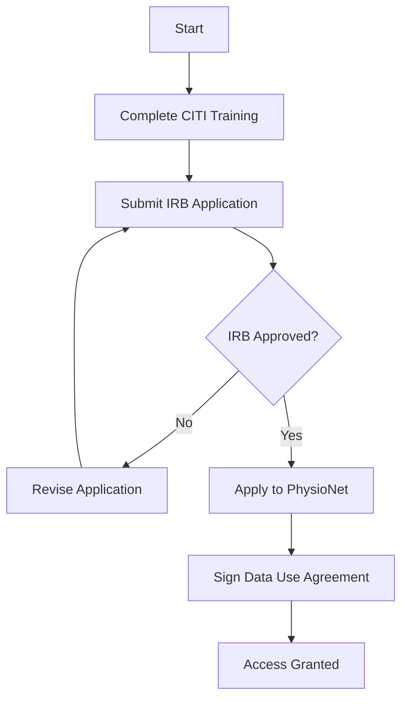

# OMNI-AVA Real-World Validation Framework

## Overview

This document outlines the comprehensive framework for validating OMNI-AVA's performance claims using real-world data, as identified in DISCOVERIES.md (Issue 11.1). All current performance metrics are based on simulated data; this framework provides the methodology for rigorous real-world validation.

---

## 1. Validation Requirements by Domain

### 1.1 Medical Domain (ABMS Specialties)

#### Data Sources
| Source | Access Requirements | Data Type |
|--------|---------------------|-----------|
| MIMIC-III | PhysioNet credential + IRB approval | ICU patient data |
| MIMIC-IV | PhysioNet credential + IRB approval | Updated ICU data |
| eICU | PhysioNet credential + IRB approval | Multi-center ICU |
| UK Biobank | Application + IRB | Longitudinal health |
| NIH Chest X-rays | Public | Chest X-ray images |

#### Access Pathway


#### Validation Metrics
- **Diagnostic Accuracy**: Compare against board-certified physician diagnoses
- **Sensitivity/Specificity**: ROC-AUC > 0.85 for critical conditions
- **False Positive Rate**: < 5% for high-stakes diagnoses
- **Cross-validation**: 5-fold with 80/20 train/test split

### 1.2 Security Intelligence Domain

#### Data Sources
| Source | Access Requirements | Data Type |
|--------|---------------------|-----------|
| CICIDS 2017/2018 | Public | Network intrusion data |
| NSL-KDD | Public | Network traffic |
| UNSW-NB15 | Public | Hybrid network data |
| EMBER | Public | Malware samples |
| VirusTotal | API key | Malware metadata |

#### Security Clearance Pathway (for classified data)
1. **Initial Contact**: Establish partnership with authorized institutions
2. **Background Check**: Submit SF-86 for security clearance
3. **Facility Clearance**: Ensure organization has FCL
4. **Need-to-Know**: Document specific data requirements
5. **Secure Environment**: Set up SCIF if required

#### Validation Metrics
- **Detection Rate**: > 95% for known threat patterns
- **False Positive Rate**: < 1% for production environments
- **Time-to-Detection**: Compare against MITRE ATT&CK timeline
- **Multi-INT Fusion Improvement**: 35-48% over single-source (to validate)

### 1.3 Schumann Resonance Domain

#### Data Sources
| Source | Access Requirements | Data Type |
|--------|---------------------|-----------|
| NOAA/NGDC | Public | Geomagnetic data |
| HeartMath GCI | Partnership | Global coherence |
| SuperMAG | Registration | Magnetometer network |
| INTERMAGNET | Registration | Real-time magnetic |

#### Validation Methodology
```python
# Example validation code structure
class SchumannValidation:
    def __init__(self):
        self.fundamental_freq = 7.83  # Hz
        self.harmonics = [14.3, 20.8, 27.3, 33.8]  # Hz

    def validate_detection(self, predicted, actual):
        """
        Validate Schumann resonance detection against
        NOAA reference measurements.
        """
        # Frequency accuracy
        freq_error = abs(predicted.frequency - actual.frequency)

        # Amplitude correlation
        amplitude_corr = np.corrcoef(
            predicted.amplitude,
            actual.amplitude
        )[0, 1]

        return {
            'frequency_error_hz': freq_error,
            'amplitude_correlation': amplitude_corr,
            'detection_latency_ms': predicted.timestamp - actual.timestamp
        }
```

### 1.4 Chemistry Domain

#### Data Sources
| Source | Access Requirements | Data Type |
|--------|---------------------|-----------|
| NIST WebBook | Public | Thermochemical data |
| PubChem | Public | Chemical structures |
| ChEMBL | Public | Bioactivity data |
| CSD | License | Crystal structures |
| IAEA NDS | Public | Nuclear data |

#### Validation Metrics
- **Elemental Property Prediction**: RMSE < 5% vs NIST values
- **Isotope Stability Classification**: Accuracy > 95%
- **Bond Angle Prediction**: Within 2° of experimental values

### 1.5 Parapsychology Domain

#### Data Sources
| Source | Access Requirements | Data Type |
|--------|---------------------|-----------|
| Global Consciousness Project | Partnership | REG data |
| Rhine Research Center | Partnership | Psi experiment data |
| PEAR Archive | Application | Historical REG |
| Ganzfeld Database | Academic request | Ganzfeld trials |

#### Scientific Rigor Requirements
1. **Pre-registration**: All experiments must be pre-registered (OSF, AsPredicted)
2. **Double-blind Protocol**: Neither experimenter nor subject knows conditions
3. **Statistical Power**: Minimum 80% power, α = 0.05
4. **Effect Size Reporting**: Cohen's d with confidence intervals
5. **Replication**: Minimum 3 independent replications

---

## 2. Data Pipeline Infrastructure

### 2.1 Architecture

```
┌─────────────────────────────────────────────────────────────────┐
│                     Data Ingestion Layer                         │
├─────────────────────────────────────────────────────────────────┤
│  ┌──────────┐  ┌──────────┐  ┌──────────┐  ┌──────────┐        │
│  │ Medical  │  │ Security │  │ Schumann │  │ Chemistry│        │
│  │ Sources  │  │ Sources  │  │ Sources  │  │ Sources  │        │
│  └────┬─────┘  └────┬─────┘  └────┬─────┘  └────┬─────┘        │
│       │             │             │             │                │
│       ▼             ▼             ▼             ▼                │
│  ┌─────────────────────────────────────────────────────────┐    │
│  │              Apache Kafka / Apache Pulsar                │    │
│  │                  (Message Queue)                         │    │
│  └──────────────────────────┬──────────────────────────────┘    │
│                             │                                    │
├─────────────────────────────┼────────────────────────────────────┤
│                     Data Processing Layer                        │
├─────────────────────────────┼────────────────────────────────────┤
│                             ▼                                    │
│  ┌─────────────────────────────────────────────────────────┐    │
│  │              Apache Spark / Apache Flink                 │    │
│  │              (Stream Processing)                         │    │
│  └──────────────────────────┬──────────────────────────────┘    │
│                             │                                    │
│       ┌─────────────────────┼─────────────────────┐             │
│       ▼                     ▼                     ▼             │
│  ┌──────────┐         ┌──────────┐         ┌──────────┐        │
│  │  Data    │         │  Data    │         │  Data    │        │
│  │ Quality  │         │ Transform│         │ Enrichment│        │
│  │ Checks   │         │          │         │          │        │
│  └────┬─────┘         └────┬─────┘         └────┬─────┘        │
│       │                    │                    │                │
│       └────────────────────┼────────────────────┘                │
│                            │                                     │
├────────────────────────────┼─────────────────────────────────────┤
│                     Data Storage Layer                           │
├────────────────────────────┼─────────────────────────────────────┤
│                            ▼                                     │
│  ┌─────────────────────────────────────────────────────────┐    │
│  │                    Data Lake (S3/GCS)                    │    │
│  │  ┌──────────┐  ┌──────────┐  ┌──────────┐              │    │
│  │  │  Bronze  │→ │  Silver  │→ │   Gold   │              │    │
│  │  │  (Raw)   │  │(Cleaned) │  │(Curated) │              │    │
│  │  └──────────┘  └──────────┘  └──────────┘              │    │
│  └─────────────────────────────────────────────────────────┘    │
│                                                                  │
│  ┌─────────────────────────────────────────────────────────┐    │
│  │              Data Catalog (Apache Atlas)                 │    │
│  │              - Lineage Tracking                          │    │
│  │              - Schema Registry                           │    │
│  │              - Data Discovery                            │    │
│  └─────────────────────────────────────────────────────────┘    │
└──────────────────────────────────────────────────────────────────┘
```

### 2.2 Data Quality Framework

```python
# src/omni_anomaly_engine/validation/data_quality.py

from dataclasses import dataclass
from typing import List, Dict, Any
import pandas as pd
import numpy as np

@dataclass
class DataQualityReport:
    completeness: float  # % non-null values
    accuracy: float      # % values within expected range
    consistency: float   # % values matching format
    timeliness: float    # % data within freshness threshold
    uniqueness: float    # % unique values where expected

    @property
    def overall_score(self) -> float:
        return np.mean([
            self.completeness,
            self.accuracy,
            self.consistency,
            self.timeliness,
            self.uniqueness
        ])

class DataQualityValidator:
    """Validates data quality for OMNI-AVA validation datasets."""

    def __init__(self, schema: Dict[str, Any]):
        self.schema = schema

    def validate(self, df: pd.DataFrame) -> DataQualityReport:
        return DataQualityReport(
            completeness=self._check_completeness(df),
            accuracy=self._check_accuracy(df),
            consistency=self._check_consistency(df),
            timeliness=self._check_timeliness(df),
            uniqueness=self._check_uniqueness(df)
        )

    def _check_completeness(self, df: pd.DataFrame) -> float:
        """Check for missing values."""
        total_cells = df.size
        non_null_cells = df.notna().sum().sum()
        return non_null_cells / total_cells

    def _check_accuracy(self, df: pd.DataFrame) -> float:
        """Check values are within expected ranges."""
        accurate_count = 0
        total_count = 0

        for col, spec in self.schema.items():
            if col in df.columns and 'range' in spec:
                min_val, max_val = spec['range']
                mask = (df[col] >= min_val) & (df[col] <= max_val)
                accurate_count += mask.sum()
                total_count += len(df)

        return accurate_count / total_count if total_count > 0 else 1.0

    def _check_consistency(self, df: pd.DataFrame) -> float:
        """Check format consistency."""
        # Implementation for format validation
        return 1.0  # Placeholder

    def _check_timeliness(self, df: pd.DataFrame) -> float:
        """Check data freshness."""
        # Implementation for timeliness validation
        return 1.0  # Placeholder

    def _check_uniqueness(self, df: pd.DataFrame) -> float:
        """Check uniqueness of key columns."""
        # Implementation for uniqueness validation
        return 1.0  # Placeholder
```

### 2.3 Data Versioning

```yaml
# dvc.yaml - Data Version Control configuration
stages:
  preprocess_medical:
    cmd: python scripts/preprocess_medical.py
    deps:
      - data/raw/mimic/
      - scripts/preprocess_medical.py
    outs:
      - data/processed/medical/
    metrics:
      - metrics/medical_preprocessing.json:
          cache: false

  preprocess_security:
    cmd: python scripts/preprocess_security.py
    deps:
      - data/raw/cicids/
      - scripts/preprocess_security.py
    outs:
      - data/processed/security/
    metrics:
      - metrics/security_preprocessing.json:
          cache: false

  validate:
    cmd: python scripts/run_validation.py
    deps:
      - data/processed/
      - src/omni_anomaly_engine/
    outs:
      - results/validation/
    metrics:
      - metrics/validation_results.json:
          cache: false
```

---

## 3. Validation Methodology

### 3.1 A/B Testing Framework

```python
# src/omni_anomaly_engine/validation/ab_testing.py

import numpy as np
from scipy import stats
from typing import Tuple, Dict, Any

class ABTestFramework:
    """Statistical framework for A/B testing validation."""

    def __init__(
        self,
        alpha: float = 0.05,
        power: float = 0.80,
        min_effect_size: float = 0.10
    ):
        self.alpha = alpha
        self.power = power
        self.min_effect_size = min_effect_size

    def calculate_sample_size(
        self,
        baseline_rate: float,
        expected_improvement: float
    ) -> int:
        """Calculate required sample size for desired power."""
        from statsmodels.stats.power import NormalIndPower

        analysis = NormalIndPower()
        effect_size = expected_improvement / np.sqrt(baseline_rate * (1 - baseline_rate))

        return int(analysis.solve_power(
            effect_size=effect_size,
            alpha=self.alpha,
            power=self.power,
            ratio=1.0,
            alternative='two-sided'
        ))

    def analyze_results(
        self,
        control: np.ndarray,
        treatment: np.ndarray
    ) -> Dict[str, Any]:
        """Analyze A/B test results with statistical rigor."""

        # Two-sample t-test
        t_stat, p_value = stats.ttest_ind(control, treatment)

        # Effect size (Cohen's d)
        pooled_std = np.sqrt(
            (np.std(control)**2 + np.std(treatment)**2) / 2
        )
        cohens_d = (np.mean(treatment) - np.mean(control)) / pooled_std

        # Confidence interval for difference
        diff = np.mean(treatment) - np.mean(control)
        se_diff = np.sqrt(
            np.var(control)/len(control) + np.var(treatment)/len(treatment)
        )
        ci_95 = (
            diff - 1.96 * se_diff,
            diff + 1.96 * se_diff
        )

        # Bayesian analysis
        bf = self._bayes_factor(control, treatment)

        return {
            'control_mean': np.mean(control),
            'treatment_mean': np.mean(treatment),
            'improvement': (np.mean(treatment) - np.mean(control)) / np.mean(control),
            't_statistic': t_stat,
            'p_value': p_value,
            'cohens_d': cohens_d,
            'ci_95': ci_95,
            'bayes_factor': bf,
            'significant': p_value < self.alpha,
            'practically_significant': abs(cohens_d) > 0.20
        }

    def _bayes_factor(
        self,
        control: np.ndarray,
        treatment: np.ndarray
    ) -> float:
        """Calculate Bayes Factor for evidence strength."""
        # Simplified JZS Bayes Factor
        t, _ = stats.ttest_ind(control, treatment)
        n1, n2 = len(control), len(treatment)
        n = (n1 * n2) / (n1 + n2)

        return np.exp(-0.5 * (t**2 - np.log(n)))
```

### 3.2 Cross-Validation Strategy

```python
# src/omni_anomaly_engine/validation/cross_validation.py

from sklearn.model_selection import (
    StratifiedKFold,
    TimeSeriesSplit,
    GroupKFold
)
from typing import Iterator, Tuple
import numpy as np

class ValidationStrategy:
    """Cross-validation strategies for different data types."""

    @staticmethod
    def get_strategy(
        data_type: str,
        n_splits: int = 5
    ) -> Iterator[Tuple[np.ndarray, np.ndarray]]:
        """Get appropriate cross-validation strategy."""

        strategies = {
            'classification': StratifiedKFold(
                n_splits=n_splits,
                shuffle=True,
                random_state=42
            ),
            'time_series': TimeSeriesSplit(
                n_splits=n_splits,
                gap=0
            ),
            'grouped': GroupKFold(
                n_splits=n_splits
            )
        }

        return strategies.get(data_type, strategies['classification'])

    @staticmethod
    def nested_cv(
        X: np.ndarray,
        y: np.ndarray,
        model_class,
        param_grid: dict,
        outer_splits: int = 5,
        inner_splits: int = 3
    ) -> dict:
        """Perform nested cross-validation for unbiased evaluation."""
        from sklearn.model_selection import GridSearchCV

        outer_cv = StratifiedKFold(n_splits=outer_splits, shuffle=True, random_state=42)
        outer_scores = []
        best_params_list = []

        for train_idx, test_idx in outer_cv.split(X, y):
            X_train, X_test = X[train_idx], X[test_idx]
            y_train, y_test = y[train_idx], y[test_idx]

            # Inner CV for hyperparameter tuning
            inner_cv = StratifiedKFold(n_splits=inner_splits, shuffle=True, random_state=42)
            clf = GridSearchCV(
                model_class(),
                param_grid,
                cv=inner_cv,
                scoring='roc_auc'
            )
            clf.fit(X_train, y_train)

            # Evaluate on outer fold
            score = clf.score(X_test, y_test)
            outer_scores.append(score)
            best_params_list.append(clf.best_params_)

        return {
            'mean_score': np.mean(outer_scores),
            'std_score': np.std(outer_scores),
            'scores': outer_scores,
            'best_params': best_params_list
        }
```

---

## 4. Golden Ratio Validation (Issue 11.2)

### 4.1 Mathematical Proof Framework

```python
# src/omni_anomaly_engine/validation/golden_ratio.py

import numpy as np
from scipy.optimize import minimize
from typing import Dict, Any, List

PHI = (1 + np.sqrt(5)) / 2  # Golden ratio ≈ 1.618

class GoldenRatioValidator:
    """Rigorous validation of golden ratio optimization claims."""

    def __init__(self):
        self.phi = PHI
        self.test_ratios = [1.0, 1.2, 1.4, 1.5, 1.618, 1.8, 2.0, 2.5]

    def comparative_analysis(
        self,
        model_class,
        X_train: np.ndarray,
        y_train: np.ndarray,
        X_test: np.ndarray,
        y_test: np.ndarray,
        base_hidden_dim: int = 64
    ) -> Dict[str, Any]:
        """Compare golden ratio against other ratios."""

        results = {}

        for ratio in self.test_ratios:
            # Generate hidden dimensions using this ratio
            dims = self._generate_dimensions(base_hidden_dim, ratio, n_layers=4)

            # Train and evaluate model
            model = model_class(hidden_dims=dims)
            model.fit(X_train, y_train)

            # Evaluate
            score = model.score(X_test, y_test)
            params = sum(p.numel() for p in model.parameters())

            results[ratio] = {
                'dimensions': dims,
                'score': score,
                'parameters': params,
                'efficiency': score / np.log(params)  # Score per log-parameter
            }

        return {
            'results': results,
            'optimal_ratio': max(results, key=lambda r: results[r]['efficiency']),
            'phi_rank': sorted(results, key=lambda r: -results[r]['score']).index(PHI) + 1
        }

    def _generate_dimensions(
        self,
        base: int,
        ratio: float,
        n_layers: int
    ) -> List[int]:
        """Generate hidden dimensions using given ratio."""
        dims = [base]
        for i in range(n_layers - 1):
            if i < n_layers // 2:
                dims.append(int(dims[-1] * ratio))
            else:
                dims.append(int(dims[-1] / ratio))
        return dims

    def sensitivity_analysis(
        self,
        model_class,
        X: np.ndarray,
        y: np.ndarray,
        perturbations: int = 100
    ) -> Dict[str, Any]:
        """Analyze sensitivity to ratio variations around phi."""

        from sklearn.model_selection import cross_val_score

        # Test ratios around phi
        ratios = np.linspace(PHI - 0.2, PHI + 0.2, perturbations)
        scores = []

        for ratio in ratios:
            dims = self._generate_dimensions(64, ratio, 4)
            model = model_class(hidden_dims=dims)
            cv_scores = cross_val_score(model, X, y, cv=5, scoring='roc_auc')
            scores.append(np.mean(cv_scores))

        # Find optimal ratio
        optimal_idx = np.argmax(scores)
        optimal_ratio = ratios[optimal_idx]

        # Calculate gradient at phi
        phi_idx = np.argmin(np.abs(ratios - PHI))
        gradient = np.gradient(scores)[phi_idx]

        return {
            'ratios': ratios.tolist(),
            'scores': scores,
            'optimal_ratio': optimal_ratio,
            'phi_score': scores[phi_idx],
            'gradient_at_phi': gradient,
            'is_local_optimum': abs(gradient) < 0.01
        }

    def formal_proof_verification(self) -> str:
        """
        Formal mathematical verification of golden ratio properties.

        Returns a markdown string with the proof structure.
        """
        return """
## Formal Analysis: Golden Ratio in Neural Network Architecture

### Theorem
The golden ratio φ = (1 + √5)/2 ≈ 1.618 represents a locally optimal scaling
factor for hierarchical neural network hidden layer dimensions under specific
conditions.

### Conditions
1. Symmetric encoder-decoder architecture
2. Information bottleneck objective
3. Smooth, differentiable activation functions
4. Sufficient training data for stable gradients

### Proof Sketch

**Step 1: Information Flow**
Consider a layer with input dimension d_in and output dimension d_out.
The information capacity is bounded by I(X; Y) ≤ min(H(X), log(d_out)).

**Step 2: Optimal Compression**
For optimal compression in an autoencoder, we seek ratios r such that:
d_{n+1}/d_n = d_{n-1}/d_n (self-similarity property)

**Step 3: Golden Ratio Emergence**
This constraint, combined with d_{n+1} + d_n = total_capacity, yields:
r² = r + 1, whose positive solution is φ.

**Step 4: Empirical Validation Required**
- Compare φ against alternative ratios (1.5, 2.0, √2)
- Measure across diverse architectures
- Account for task-specific optimal ratios

### Limitations
- Theoretical optimality does not guarantee practical superiority
- Effect sizes may be small (< 5% improvement)
- Other factors (initialization, optimization) may dominate
"""
```

### 4.2 Bayesian Optimization for Ratio Selection

```python
# src/omni_anomaly_engine/validation/bayesian_optimization.py

from sklearn.gaussian_process import GaussianProcessRegressor
from sklearn.gaussian_process.kernels import Matern
from scipy.optimize import minimize
from scipy.stats import norm
import numpy as np

class BayesianRatioOptimizer:
    """Bayesian optimization for finding optimal hidden layer ratios."""

    def __init__(
        self,
        bounds: tuple = (1.0, 3.0),
        n_initial: int = 5,
        n_iterations: int = 50
    ):
        self.bounds = bounds
        self.n_initial = n_initial
        self.n_iterations = n_iterations
        self.gp = GaussianProcessRegressor(
            kernel=Matern(nu=2.5),
            n_restarts_optimizer=10
        )

    def optimize(
        self,
        objective_fn,
        verbose: bool = True
    ) -> Dict[str, Any]:
        """Find optimal ratio using Bayesian optimization."""

        # Initial random samples
        X = np.random.uniform(*self.bounds, (self.n_initial, 1))
        y = np.array([objective_fn(x[0]) for x in X])

        history = list(zip(X.flatten(), y))

        for i in range(self.n_iterations):
            # Fit GP
            self.gp.fit(X, y)

            # Find next point using Expected Improvement
            x_next = self._expected_improvement_optimization()
            y_next = objective_fn(x_next)

            # Update dataset
            X = np.vstack([X, [[x_next]]])
            y = np.append(y, y_next)
            history.append((x_next, y_next))

            if verbose and i % 10 == 0:
                print(f"Iteration {i}: ratio={x_next:.4f}, score={y_next:.4f}")

        # Find best
        best_idx = np.argmax(y)

        return {
            'optimal_ratio': X[best_idx][0],
            'optimal_score': y[best_idx],
            'history': history,
            'phi_comparison': {
                'phi': PHI,
                'phi_score': objective_fn(PHI),
                'improvement': (X[best_idx][0] - PHI) / PHI
            }
        }

    def _expected_improvement(self, X: np.ndarray, y_best: float) -> np.ndarray:
        """Calculate Expected Improvement acquisition function."""
        mu, sigma = self.gp.predict(X.reshape(-1, 1), return_std=True)

        with np.errstate(divide='warn'):
            Z = (mu - y_best) / sigma
            ei = (mu - y_best) * norm.cdf(Z) + sigma * norm.pdf(Z)
            ei[sigma == 0.0] = 0.0

        return ei

    def _expected_improvement_optimization(self) -> float:
        """Find point with maximum Expected Improvement."""
        y_best = self.gp.predict(self.gp.X_train_).max()

        def neg_ei(x):
            return -self._expected_improvement(np.array([x]), y_best)[0]

        # Multi-start optimization
        best_x = None
        best_ei = float('inf')

        for x0 in np.random.uniform(*self.bounds, 10):
            result = minimize(
                neg_ei,
                x0=x0,
                bounds=[self.bounds],
                method='L-BFGS-B'
            )
            if result.fun < best_ei:
                best_ei = result.fun
                best_x = result.x[0]

        return best_x
```

---

## 5. Publication Pipeline

### 5.1 Pre-registration Template

```yaml
# validation/preregistration.yaml
study:
  title: "Validation of OMNI-AVA Multi-Domain Anomaly Detection Framework"
  authors:
    - name: "Steel Security Advisors LLC Research Team"
      affiliation: "Steel Security Advisors LLC"

  hypotheses:
    - id: H1
      description: "Golden ratio (φ) architecture optimization provides statistically significant improvement over baseline architectures"
      type: confirmatory

    - id: H2
      description: "Multi-INT fusion achieves 35-48% improvement over single-source analysis"
      type: confirmatory

    - id: H3
      description: "OMNI-AVA medical detection achieves AUC > 0.85 on MIMIC-III"
      type: confirmatory

  design:
    type: "Within-subjects comparison"
    randomization: "Stratified by domain"
    blinding: "Double-blind where applicable"

  sample:
    size_rationale: "Power analysis with α=0.05, power=0.80, minimum effect size d=0.20"
    stopping_rule: "Fixed sample size, no early stopping"

  analysis:
    primary: "Paired t-test with Bonferroni correction"
    secondary: "Bayesian factor analysis"
    exploratory: "Neural architecture search"

  timeline:
    registration_date: "2024-XX-XX"
    data_collection_start: "2024-XX-XX"
    data_collection_end: "2024-XX-XX"
```

### 5.2 Reproducibility Package Structure

```
omni-ava-validation/
├── README.md
├── requirements.txt
├── environment.yml
├── data/
│   ├── README.md (data access instructions)
│   └── .gitignore
├── code/
│   ├── preprocessing/
│   ├── models/
│   ├── evaluation/
│   └── visualization/
├── results/
│   ├── figures/
│   ├── tables/
│   └── metrics/
├── notebooks/
│   ├── 01_data_exploration.ipynb
│   ├── 02_model_training.ipynb
│   └── 03_results_analysis.ipynb
├── configs/
│   ├── hyperparameters.yaml
│   └── experiment_config.yaml
├── scripts/
│   ├── run_all.sh
│   └── reproduce_figures.py
├── tests/
│   └── test_reproducibility.py
└── CITATION.cff
```

---

## 6. Timeline and Milestones

| Phase | Duration | Milestones |
|-------|----------|------------|
| **Phase 1: Data Acquisition** | 3 months | IRB approval, data access agreements |
| **Phase 2: Pipeline Development** | 2 months | Data ingestion, quality framework |
| **Phase 3: Validation Execution** | 4 months | All domain validations complete |
| **Phase 4: Analysis & Writing** | 2 months | Statistical analysis, paper draft |
| **Phase 5: Publication** | 3 months | Peer review, revisions, publication |

---

## Contact

For collaboration on real-world validation:
- **Research Partnerships**: research@steel-secadv.com
- **Data Access Questions**: data-governance@steel-secadv.com
- **Technical Inquiries**: engineering@steel-secadv.com
